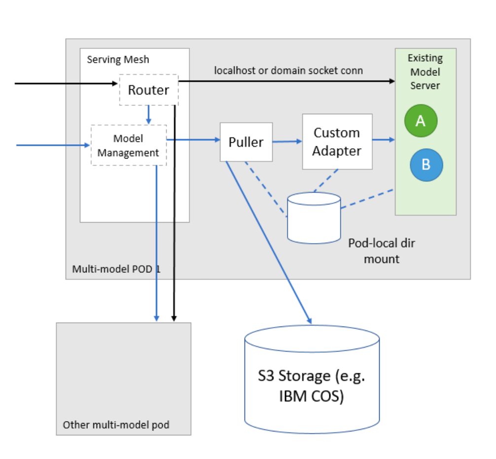

modelmesh: Distributed Model Serving Framework

* high-scale
* high-density
* frequently-changing model use cases

能和已有的或者用户构建的 model servers 一起工作，给推理模型的运行时，扮演一个分布式的 LRU cache

这个 [pdf](https://github.com/kserve/modelmesh/files/8854091/modelmesh-jun2022.pdf) 里能看到支持的特性和设计的细节

为了完整的k8s纸上的部署和管理 ModelMesh 的集群和模型，可以参考 ModelMesh Serving  repo： 包含了一个分离的 controller 并提供了 K8S CRD 的管理，管理 serving runtime 和 inference services。有通用的模型repository存储的管理，可以和已有的 OSS model server 集成

## 介绍
* 成熟、通用的模型 serving 管理、路由层
* 给生产级别的高扩展，高密度和高频率改变的模型使用场景
* 主要给“模型当做数据”(什么特点？比较大？而且有很多版本？）的场景，而非“模型当做代码”
* 尤其在模型之间的使用变化（使用情况、频率？）很大的场景下
* 支持了很多 IBM Watson AI 云服务、app，包括助手、Discovery，NLP

## 背景
* 2015 年，IBM NLC 是第一个 Watson 云服务，提供了完整的端到端的训练和serving 用户提供的数据
* 原始的架构包括产生一个专门的容器来服务每个训练好的用户模型
* 问题
  - 增长到万级别的模型，无法很好地 scale
  - 免费的计划 - 很多很少使用或者被浪费了
  - 导致大量的内存代价 =》 硬件代价 =》 成本高
  
* 调度系统能力有限 =》严重地影响了性能和稳定性
* 所有服务的模型都有单点故障(每个只有一个 container）
* 大规模宕机后，启动、恢复的时间过长
* 在 k8s 之前，serverless 是普遍存在的

## Model-mesh
* 新方法
  - 每个 container 可以服务多个模型
  - 让冬眠(dormant)的模型可以被“paged out”，即席地加载
  - 代价比同时服务所有的模型要低几个数量级
  - 与 "serverless" 基础架构很类似（knative, cloud functions, ...)
  
* 哲学
 - 让规模化服务线上模型和特定的推理逻辑、技术解耦。隐藏了所有的（通用）考虑
 - 只做一次这些事情，做好

## 关键的设计目标
* 可扩容性
  - 不仅从管理的模型数量，而且从这些模型的使用容量上
  
* 性能
  - 最小化运行时请求的 latency
* 效率
  - 优化可用的计算资源
* 灵活性
  - 语言、ML-框架无关，可以使用自己的推理 API
  - 适配到不同的使用场景下，大小、性能的折衷等
* 简化集成，缩短展现业务价值的时间
  - 缩小服务提供者的要求、考虑的点
  - 应该是即插即用
* 运维简单
  - 最小化搭建和后续运维的需求、考虑
  - 配置和调优自动化
  
* 弹性(Resiliency)并且最小化“cache misses”的代价
  - 即考虑可用性有考虑对延迟的影响

## 架构

* Model-mesh 是单个的 docker 镜像，和“model 运行时”的 container运行在一个 Pod 里，部署并扩展，作为单个 self-contained 逻辑上的 k8s deployment，被当做一个标准的 K8S 服务来消费

## 数据模型
"Models" 有唯一的 id，被假设为无法被修改的

* 通常包括一个完整训练完之后的静态的产出物
* 包括一个训练号的 NN 的权重，或者其他用来预测或者推理的产出物。包括字典或者其他数据结构，来做前后处理
* 他们放置在共享的数据仓库里，可以拉取到内存里。模型之间不需要一致，尤其是消费的内存都不需要一样

"V-models" 是可修改的别名，指向单个的具体的模型：
* 可以被寻址
* 目标模型可以被动态更新
* 用来做线上模型的版本管理

## 已经可用的 ML 框架集成
* 可以和现有的模型服务一起工作，支持模型的多租户和动态重配置已经加载的模型 -- 自研的或者第三方的

* Built-in 适配器，可以和架子上的 models server 配合：
  - TF
  - Nvidia Triton ( TF 1&2, PyTorch, ONNX)
  - Seldon MLServer (包括 scikit-learn, XGBoost, LightGBM)
  - Intel OpenVino Model Server

## 贡献到 KServer 开源项目里：[modelmesh-serving](https://github.com/kserve/modelmesh-serving)
* ModelMesh Serving: 使用 k8s 原生的管理层来配套 model-mesh
* ServingRuntime CR 来指定每个模型的 server 配置
* 基于 Go 的controlner 来编排不同种类的 modelmesh 部署，都在同一个服务 endpoint 之后
* Models 可以被服务并被通过 Predicator 的 CR 来管理（会被 KServe 的已有的 InferenceService替代） - 映射到 mm 模型和 vmodels
* 给特定的 ServingRuntime 的 Pods 只会被有需要它的 Predictors 时才会被启动
* 提供通用的抽象的运行时无关的存储处理（用来获取模型）
* 提供内置的和已有的标准的 OSS 模型服务器集成后的方法，通过 injected adapter 来做
* 支持 KServe V2 REST API，通过可选的的注入的 proxy container

## KServer ModelMesh Serving Architecture
model-mesh 如何在KServe 里工作：

## 针对已有的 Model Server 的适配器模式
* Puller 是被自动注入，然后作为 KServe 的一部分
* 否则，adapter 或者 model server 需要负责拉取模型数据
* ID 注入容许直接推理路径而无需关注传递给 adapter ？ 没懂，噢是约定了路径了，Puller 拉取到约定的路径

注意上图里的管理面和数据面 API

注意：这些图覆盖的只有核心的 model-mesh container，没有包含如何被管理和暴露给 KServe 的

## APIs
Model-mesh 使用 gRPC 并基于三个逻辑上的服务 APIs 和两个逻辑上的服务边界（内部和外部）：
1. 内部模型管理 SPI(internal) # 指不需要干预的，是自动做的
   - 两个主要的方法：loadModel 和 unloadModel
   - 由内部的“模型运行时”容器实现 - 从存储里加载指定的模型到内存，准备好服务
2. 外部的模型管理 API (external) # 指跟业务相关的，被调用的接口。类似我们的 MR
   - 由 model-mesh 暴露的，提供方法来注册和取消注册新模型到平台里，创建、更新、删除 vmodels
3. 运行时推理 API (both）
   - 单个或者多个任意的 gRPC 服务定义，新的或者已有的
   - 包裹了推理的逻辑来调用已经加载好的指定id模型
   - 由内部的“model runtime”容器来实现，自动、透明地被外部的 model-mesh 服务暴露出去
## Internal SPI

## Internal SPI 的要求和保证
要求：
* 必须支持并发（多线程）的 API 请求 # 不再是强要求 -- 查看 “基于延迟的 autoscaling
* 必须能相对精确地测量加载的模型的大小 # 目的是尽量放更多的模型在一个卡上
* 加载的模型能一直可用，除非被显式调用 unloadModel 卸载（没有驱逐或者无须 cache management)
* 推理、调用 API 必须从 gRPC meta 数据参数（payload 无关的 header）里读取目标 modelId，是幂等（可重试）

保证：
* 不会有超过最大值的 loadModel 请求并发在途中
* 模型调用请求只会在已经加载了的模型上

## External API
是由 model-mesh grpc-service 来暴露的。所有的方法都是幂等的

* registerModel (modelId, modelInfo, loadNow, sync)
  - 返回当前结果
* unregisterModel(modelId)
  - removes/unregisters model from the service
* getStatus(modelId)
  - returns one of NOT_LOADED, LOADING, LOADED, LOADING_FAILED, NOT_FOUND
* ensureLoaded(modelId, sync, lastUsedTime)
  - ensure model is loaded, optionally with specified last-used timestamp; returns current status
* setVModel(...), deleteVModel(...), checkVModelStatus(...)

* Plus, 所有的推理 API 方法都是由配置好的 model server 容器暴露的
## 和消费者服务集成
* 调用的是 model-mesh 暴露出来的 API 方法
## model ID 抽取和注入

## 特性 - Cache 管理和 HA
* 集群里的实例都被当做一个内部的分布式的 LRU cache，而可用的 model server 容器填满了注册好的模型
* 运行时的请求可以到任意pod里，会被转发（按需）到有目标模型的容器里
* 如果目标模型没有被记载，会立马触发一个加载（在看起来最优的实例上），请求会被延迟直到加载完成
  - 自动做的 - 如果多个请求在同时到达，只有 exact intended number of copy loads 会被触发
  - 这样避免额外的 churn、load
## 特性 - Cache 管理和 HA
管理有**多少特定模型**的拷贝被加载，在哪里，什么时候，都是在框架里自动完成的。包含：
- 确保所有”最近“使用的模型至少有两个副本
- 扩展到超过，只有当确定的请求阈值超出了 - 一个模型在足够的load下可以在每个集群实例里有一份拷贝
- 缩小到大于2到2，从2到1是基于启发式 load 和最近使用的时间来做的 -- 最忙的实例优先
- 主动**加载**最近没被用的模型，如果有空余空间或者替换最近没怎么被使用的加载的模型 # 为什么要替换？万一不划算

## 快速开始

1. 在这个 modle-runtime.proto gRPC 服务接口里，Wrap  模型的加载和调用逻辑
   * runtimeStatus()
   * loadModel() - 从背后的存储，加载指定的模型到内存里，阻塞的
   * unloadModel() - 卸载掉
   * 推理的接口，可以有多个，应该是幂等的接口。可以参考 predictor.proto 来作为一个简单的例子
   
2. 构建一个镜像，在 8085 或者 unix domain socket 上暴露服务

3. 扩展
4. 部署服务
   * registerModel() 和 unregisterModel() 来注册或者删除掉集群里的模型
   
   
## 问题
1. loadModel() 背后的 cache 机制看看？
2. registerModel() 时怎么处理的存储的问题？
3. ServingRuntime CR 来指定每个模型的 server 配置:  这个配置里有什么？

