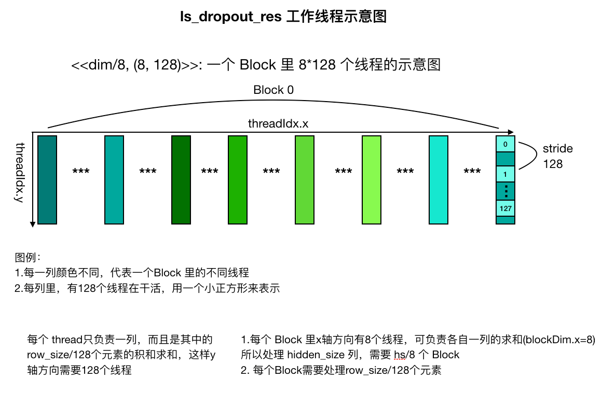

## 总结：
对于每个Block 而言，除了上述的信息，里面具体求和，分为这么几步：

step 1: <8, row_size> 合并为 <8, 128>，合并 row\_size/4 (所有线程都执行)

step 2: <8, 128> 合并为 <8, 32> ，合并4次(只需要1/4的线程执行)

step 3: <8, 32> 通过 warp shuffle 操作，合并为 <8, 1> （只需要8个线程执行存储）

```
// row_size = bs*seq_len
// dim = hidden size
template <typename T>
void launch_ls_dropout_bias_bwd(T *in_grad, T *bias_grad, const T *out_grad,
                                const uint8_t *mask, int row_size, int dim,
                                float ratio, cudaStream_t stream) {
  dim3 grid_dim((dim - 1) / 8 + 1); // 说明每个 block 里处理8个，而且 bias_grad 总共 dim 个
  dim3 block_dim(8, 128); // 总共 8*128=1024 个线程，其中 x 方向 8个，y 方向 128个
  // 所以对于in_grad，每个 thread 里要负责： row_size*hidden_size/(gridDim*blockDim) = row_size/128
  ls_dropout_bias_bwd_kernel<<<grid_dim, block_dim, 0, stream>>>(
      row_size, ratio, in_grad, bias_grad, out_grad, mask, dim);
}

__global__ void ls_dropout_bias_bwd_kernel(
    const int row_size, const float ratio, float *__restrict__ in_grad,
    float *__restrict__ bias_grad, const float *__restrict__ out_grad,
    const uint8_t *__restrict__ mask, const int hidden_size) {
  const float scale = 1.f / (1.f - ratio);
  // every block generate 8 bias result
  __shared__ float tile[8][129]; // block 内部共享，总共 8 * 128(129-1) 个元素

  cg::thread_block b = cg::this_thread_block();
  cg::thread_block_tile<WARP_SIZE> g = cg::tiled_partition<WARP_SIZE>(b); // 把当前 block 细分为每 32 个线程一组

  int col_idx = flat_2dim(blockIdx.x, threadIdx.x, 8); // 每个 block 里处理8个，这样总共处理 dim(hidden_size) 个
  int stride = hidden_size * 128; // 为啥？可能因为有 128 个线程
  float local_sum = 0;

  // Step1: 每个 block 里计算出[8][128] 个局部求和后的值，放到 block 内共享的空间里
  int idx = flat_2dim(threadIdx.y, col_idx, hidden_size); // 每一行里处理 hidden_size 个
  // r 代表 block 内部 y 轴。那么 row_size 就是 y 轴最大长度，而 hidden_size 就是x 轴最大长度
  for (int r = threadIdx.y; r < row_size; r += 128) { 
  // 为啥 r 的步长取 128 ？ 因为 gridDim = hidden_size/8, 而 blockDim=(8, 128), 所以可以认为 gridDim*blockDim.x = hidden_size, 所以另一个维度 row_size 是由 threadIdx.y 负责，总共128个
  // 所以每个 thread 要负责 
    float val = out_grad[idx];
    val *= scale * static_cast<float>(mask[idx]);
    local_sum += val;
    in_grad[idx] = val;
    idx += stride;
  }

  tile[threadIdx.x][threadIdx.y] = local_sum; // 
  __syncthreads();


  // Step2: 把 [8][128] 个 reduce 到 [8][32] 个，需要每隔4个求和
  float sum = 0;
  // 当前 block 内部的 thread id : 0-8*128-1
  int tid = threadIdx.y * blockDim.x + threadIdx.x; // 为啥不用 g.thread_rank()? 不行，这个是更细粒度的。block 内部的 id 无法直接获取，需要这样计算下
  int x = tid >> 7;  // [0-7] 不就是 threadIdx.x 么
  int y = tid & (127); // [0-127] 不就是 threadIx.y 
  if (y < 32) { // 只有1/4的线程执行
#pragma unroll
    for (int i = 0; i < 4; i++) {
      sum += tile[x][y + i * 32];
    }
  }
  __syncthreads();

  // Step3: 把 [8][32] 个 通过 thread group 里提供的不需要共享内存的 shfl_down 来 reduce 到 [8][0] 个
  for (int i = 1; i < 32; i <<= 1) sum += g.shfl_down(sum, i); // 把 [1-31] 都累加到 sum 上，此时 y == 0 就是32个数的和。而其他人拿到的是部分的和

  if (y == 0) tile[0][x] = sum; // 总共有8个，算是第一行吧
  __syncthreads();

  if (threadIdx.x < 8) { // 会有 128 个线程执行
    int pos = flat_2dim(blockIdx.x, threadIdx.x, 8);
    bias_grad[pos] = tile[0][threadIdx.x]; // 就是上面的 tile[0][x]
  }
}

```

在 half 版本里，idx 还是和原来一样，只不过需要限制 idx  不要超过 total_size/2
## 问题
1. `ls_dropout_bias_bwd_kernel<<<grid_dim, block_dim, 0, stream>>>` 里，shared bytes = 0,但实际上内部又申请了，这样也行？那 shared bytes 有啥作用？
