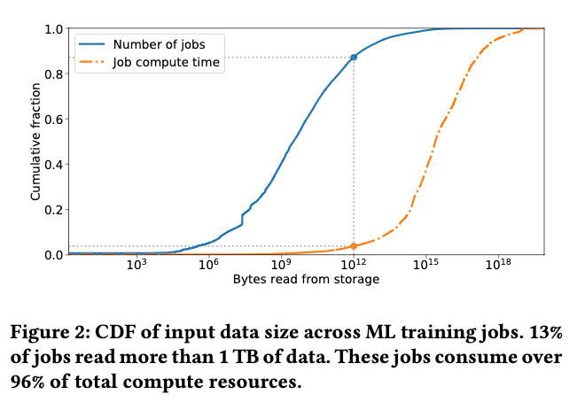

1. 在解决的是什么问题？模型训练时，如何实现一套好的数据(前)处理的框架，实现高效、易用、保序性
2. 为何成功，标志/准是什么？性能高，而且能自动调优：并行、caching、static optimization，optional non-deterministic execution
3. 在前人基础上的关键创新是什么？使用静态优化（图优化）和动态调优并行和buffer参数
4. 关键结果有哪些？性能很好
5. 有哪些局限性？如何优化？
6. 这个工作可能有什么深远的影响？

## 1 摘要
输入需要高效处理：读入大量数据，应用复杂变换，把数据搬运到GPU上，同时需要和计算与通信重叠来达到最优性能。提供了一套 tf.data 的 API，能够
高效运行，让用户只关心在数据处理的逻辑上，而且用户定义的算子，可以组合、重用。


而且公司内统计以及有其他论文里的数据，说明处理数据的时间占比很大，大约有20%的job，花了1/3的计算时间在输入数据处理上

决定并行的最优粒度和prefetch的数量也是比较难的，因为取决于负载的特点和可用的硬件资源.

GPU  和 TPU，是针对 ML计算中常见的线性代数做了优化的，但是对常见的数据处理操作支持的比较少。因此输入数据通常在 CPU 上处理，然后通过高效的传输到加速器上，来填满加速器的计算能力。由于**加速器相比 CPU 而言代价
更高**，让加速器在高利用率运行就很重要。

我们设计了 tf.data，是一个给ML任务构建和执行高效输入数据处理的数据管线。它提供通用的OP来参数化用户定义的函数，可以跨 ML 不同领域组装、复用。受关系型数据库，**声明式集合库**和数据并行大数据系统的启发，tf.data APIs
由**无状态数据集**组成，它是给用户用来定义了输入管线、有状态的迭代器的抽象。能够产出一系列元素，维持数据集里的当前位置。这些抽象让用户可以聚焦在他们输入管线上的应用逻辑，让管线高效运行留给 tf.data 运行时。tf.data
内部把输入管线数据集当作图，使用**图改写的方法来静态优化**。而且它能自动调整例如并行度和数据预取buffer大小等参数，这对于大部分 ML 用户而言，手工调整是非常有挑战的。

我们的评估表明：

1. 输入管线的性能对端到端训练时间影响非常大
2. tf.data 能通过软件管线，并行，静态优化来达到提高效率的目的
3. tf.data 的动态优化，避免了手工调整性能相关参数

例如，发现引入管线、并行后，Res50 上训练时间减少了10.4倍。之后应用更多优化，比如缓存和静态优化，进一步加快了2倍。

我们进一步证明，tf.data 的 auto-tuning 和专家手工优化的性能相当。

tf.data API和运行时开源了。在Google内部，他们在2017年开始就用起来了。能处理不同的数据模态，包括文本，图片，视频。

我们分析了公司内部各种不同特点的任务，分析出了百万个真实 ML 任务的输入 pipeline 特点，识别出了数据处理这块未来的工作。发现输入管线上使用的处理集合在不同 job 之间差别很大。对于75%的任务，**处理后的数据集
大小比从存储拿到的数据集大小要小**。说明预处理通常会降低数据的大小。最重要的是，发现**一摸一样的输入管线会在不同任务之间重新执行**，说明缓存处理之后的数据集会是一个非常有用的方法来提高 ML 输入数据处理的性能和效率。
我们也发现其他未来研究方向，比如靠近存储处理数据，输入数据数据与模型训练分开来避免 host 资源成为瓶颈。

## 2 输入数据需求
原始输入数据，比如图片、视频和文本文件，都会经过离线和在线预处理，然后再给模型训练用。离线数据处理包含从原始数据提取特征，验证数据，转换为二进制格式，比如 Avro，Parquet，或者 TFRecord，来让数据输入的吞吐更高。
批计算框架例如 Spark、Beam、Flume 都是适合离线处理。而一些数据处理，比如norm，可以 离线做，但也需要在线做的转换。比如图片模型需要依赖数据增强(data augmentation)，例如随机扭曲图片，提高精度。数据增广成倍增加了原始数据集的大小，
让输出存储到中间文件代价较高(prohibitive)。我们的工作聚焦在线上数据预处理，是作为 ML 训练任务里输入管线的一部分

输入管线可以概括为三个阶段：
1. extract
2. transform
3. load(ETL) process



这个图的横坐标，没法给到 job compute time 用吧？

第一阶段从存储系统读取数据。机器学习任务通常在大数据集上训练。图2说明13%的任务，在我们分析的百万任务里，读取了至少1TB的输入数据。这意味着不少训练任务来说，输入数据
在内存里放不下(不能这么算吧，看着夸张，但实际上是个循环，是累加起来的，实际只考虑一次 batch 的情况即可)。而且，超过96%的计算资源，花在了读取超过1TB数据上。(好像跟我们的情况不一样?)

第二阶段转换数据到一个可以给 ML 训练计算用的格式。这个转换是给输入数据做变换，比如采样、重新排列，过滤数据来获得最相关的feature子集。训练图片模型时，常用的时做裁剪，调整大小，镜像反转，模糊图片。对于文本的管线，
训练样本通常需要分组并基于序列长度做batch。

第三阶段会把数据加载到加速器设备里，执行训练计算。

ML 训练对输入数据管线有特殊要求，总结如下并介绍了为什么没有被其他系统解决好

### 数据有序
ML 训练和其他并发执行数据处理的平台(MapPreduce, Spark, DryadLINQ)不一样，对记录交付的顺序有要求。最常见训练算法是继承自随机梯度下降，他会用伪随机的方式访问输入样本。经验上来说，
当算法在样本上进行多轮(epochs)计算之后，收敛性会更快，每个epoch里需要使用不同的随机排列。为了通过向量化和减少通信来提高系统效率，输入管线通常把连续的样本拼接到一起成为在单个步骤中处理（batch）.
即使增大 batch，也不会改变通信量（梯度）

最终训练模型的参数跟输入样本被处理的顺序是相关的。为了帮助debug，尤其是在不同硬件架构之间移植模型，tf.data 需要能够根据给定的种子，产生提前决定好的随机结果。这个feature对debug友好，但对高性能而言，
确带来一些限制，因为元素处理时序上的变化会导致处理需要阻塞。因此，尽管 tf.data 默认是确定性的顺序，用户可以关闭它来减缓最慢的那条数据对性能的影响。

由于端到端训练计算和单独一个 epoch 可能会耗时很久。为了提供在被强占情况下的保序性 -- ML 训练任务的数据处理过程需要是可以保存进度的。

### 性能
单个训练步骤会消耗一批输入元素，更新模型权重。通常，计算过程在加速器上，比如 GPU 或 TPU，他们会高效计算浮点数的向量运算，尽管这个计算也能在多核 CPU 上跑。理想情况下，数据处理和训练计算是流水式串联在一起的，尽量
减少训练计算因为等待下一批数据处理而被阻塞的情况。

输入管线负责从存储读取原始数据，转换为模型需要的输入 feature。例如，原始图片分类模型的输入是一个 protocol buffer，包含 JPEG 编码的图片，输入管线必须把原始图片转换为稠密三维floating point数组。个过程中，输入管线
需要提取并解码 JPEG，提供额外 affine 、colorspace 等变换来增广训练数据。这些都是 CPU 密集型的。必须有效利用可用的 CPU 资源。

### 易用性
为了强调灵活性的重要，我们对ML job的分析，把转换分为几个类别：例如从存储读取数据，缓存，批处理，洗牌，记录了每个job使用的转换的不同组合。发现尽管10个常用的转换占据了75%的任务，但是依然后1000种组合的长尾。除了支持繁多的输入
管线种类，我们也需要pipeline框架处理好性能和易用性之间的平衡。优化输入管线需要知道如何结构化操作、调整性能相关的参数，如并行度和管线 buffer 大小。因此我们让 tf.data 可以自动调整优化输入管线。

在设计 tf.data 之前，评估了已有的 input pipeline 设计，发现没有符合上述需求：

1）PyTorch DataLoader API 易用性很好（提供了 Python 接口），但是在关键路径上依赖于 Python -- 尽管使用多进程来绕过了解释器锁的瓶颈 -- 假设输入数据符合 uniform random，不满足对性能的要求，尤其是有几 T 数据需要处理。
2）MXNet的 DataIter API使用原生 C++ 实现，比 PyTorch 性能高，但是需要用户添加C++ 插件来处理心的预处理 schemes。
3） DALI API 让一些预处理比如图片解码，可以 offload 到 GPU 上。这个部分地满足对性能的要求，但是缺乏**灵活性**来高效支持异构的预处理和不同类型的加速器。

在下一章，展示 tf.data 的编程模型，基于 chaining higher-order functional transformations来做的，受 LINQ 启发。一个数据处理系统提供了类似的编程模型，包括 DryadLINQ， Spark 和 Naiad。第6张详细讨论他们。
由于编程的原因，我们没有考虑他们，因为实现和 C++ TF 代码不匹配，会严重影响性能。而且，这些系统都是给优化数据并行处理做的，在每个batch里有大量独立的数据。这导致顺序产出结果时，就很困难或者不高效。当使用类似 Spark 的流式数据处理
时，然后通过内存 buffer 传递给 ML 框架，效率就不高，因为需要额外的拷贝。训练的负载，我们分析过每一步的时间少于1ms的场景很常见，大部分负载的 step time 少于 10ms。而且内存带宽是瓶颈的情况下，性能会显著下降。通过直接把 tf.data 集成
到 tf里，共享线程池和内存分配器，避免了这个开销。

## 3 设计与实现
### 3.1 数据集合迭代器

tf.data DATASET 代表了输入管线作为一个（潜在无限）元素序列的无状态定义。一个数据集可以是源数据集，或者是转阿欢后的数据集：转换一个或多个输入数据集到新的元素序列。数据集的元素是**静态类型**的，可用的数据集元素包括tensor(有特定的元素类型和可选的形状)和
组合类型(例如tuples，可选项和嵌套的数据集)。源和转换后的数据集，形成一个表达树，代表了整个输入管线。表1展示了 DATASET 接口。

```
Method || Description
-----------------------
make_iterator || creates a new iterator over the dataset.
serialize || converts the dataset to a serialized expression.
element_spec || returns the type signature of dataset elements

```
Table 1: Dataset interface

tf.data 包含源数据集，支持常见文件类型；实现了可以被用户定义的函数(UDF)参数化的转换功能函数。UTFs **可以用 Python 写，tf.data 使用 TF 的 Autograph 库来转换为 dataflow 图**。表2 展示了最常见的 tf.data 转换。

```
Method || Description
-----------------------
batch | Concatenates multiple ements into a single element.
cache | Stores the input data in memory
concatenate | Concatenates two datasets
from_file | Reads elements from a file, e.g. TextFileDataset.
from_tensors | Creates a singleton dataset from data in memory
filter | Returns elements matching a predicate
flat_map | Maps elements to datasets and flattens the result
interleave | Like flat_map, but mixes outputs from input elements # pytorch 没有
map | Transforms individual elements
prefetch | Adds a buffer to pipeline input production
reduce | Reduces a dataset to a single element
repeat | Produces the input dataset multiple times.
shard | Selects a subset of elements from the dataset. # 这个 pytorch没有
shuffle | Randomizes the order of elements.
unbatch | Splits input elements on the 0th dimension
zip | Combines elements of multiple datasets into tuples
```

Table 2: Common tf.data source and transformed datasets.

tf.data ITERATOR 代表了当前便利数据集的状态。迭代器通过 `get_next` 提供了对数据集里元素的顺序访问，它返回一个类型元素或者错误状态，比如 EOF。在 tf.data 里，iterator 接口的实现是类型安全的，所以多线程并发调用 get_next 是安全的，可以提高吞吐，但代价是没法保证确定性。
接口里也有 save 和 restore 方法来支持 checkpointing

iterator 接口(Table 3)抽象了元素如何被创建，包括内部 buffer 和并行的细节。在使用优化之前，数据集和对象迭代器之间有一对一的关系，但是3.3节的优化会利用迭代器抽象来改变底层数据集的图，优化元素产生的过程，但是依然保持同样的接口。

```
Method || Descripption
get_next | Returns the next element, or raises EOF.
save | Writes the iterator state to a file
restore | Reads the iterator state from a filee
```

Table 3: Iterator interface

图3里的例子展示了一个训练的循环，使用了  tf.data 作为输入管线来读取文件里的元素，使用用户定义的处理逻辑来处理每个元素，把梳理后的元素结合到一起组成 mini-batch
```
ds = tf.data.TextFileDataset(["a.ttxt", ...])
ds = ds.map(parse).batch(batch_size=10)
for elem in ds:
    train_step(elem)
```

Figure 3: parse is a user-defined function for data preprocessing.

### 3.2 Parallel and Distributed Execution
为了高效利用 Host 资源，tf.data 提供可以让软件 pipeline 和 计算与i/o并行执行的转换。Prefetch 转换操作，能够用内部的buffer来**解耦合生产者和消费者**(主要是大家的速度可以不一样了)，让他们的计算重叠。
输入管线可以使用这个转换来**重叠**host计算、host到设备的传输和设备的计算。map 有个可选的参数，指定了使用用户定义的计算来并行处理输入元素的并发度。 interleave 转换提供
类似的可选参数，可以指定从输入元素中并行获取数据时的并发度。特别地，interleave 转换可以通过交替从多个文件里读取数据来并发I/O(原来是这个意思，刚还在想 interleave是啥意思)。
默认情况下，tf.data 以确定性顺序转换每个元素。然而，由于确定性会导致队头阻塞(队头的请求未被处理)，并行的 map 和 interleave 转换提供一个选项来容许非确定性的顺序，这个会以
无法复现的代价来获得更高的性能。


为了说明上述转换过程，我们再来看看图3里的例子。假设从文件里读取元素需要5ms，使用用户定义的逻辑需要2ms，而batch10个数据需要1ms。加速器会在每个迭代开始前，空闲 (5+2)*10+1 = 71ms。


```
ds = tf.data.Dataset.from_tensors(["a.txt", ...])
ds = ds.interleave(tf.data.TextFileDataset, cycle_length=2, num_parallel_calls=2)
ds = ds.map(parse, num_parallel_calls=10)
ds = ds.batch(batch_size=10)
ds = ds.prefetch(buffer_size=1)
for elem in ds:
    train_step(elem)
```

图4里的 tf.data 输入管线和图3里的在语义上是等价的。然啊后，它使用了：

1. interleave 和 map 里使用可选的 `num_parallel_calls` 参数来并行I/O 和 计算。
2. prefetch 来重叠输入管线的计算与训练的计算

因此，图4里的输入管线可以最大以 max(5\*10/2, 2\*10/10, 1) = 25ms 来产出一个 batch（假设有足够低的消费者），而且输入管线的计算（下一个batch）会和加速器上训练的计算重叠（当前 batch）。
如果训练计算超过25ms，那么每个迭代里当迭代开始时，数据就已经准备好了。在3.3.2 里描述了自动调优的并行和buffer大小。

虽然 interleave 主要用来并行 I/O，它也可以用来做任意输入管线（在输入数据的不同分片上操作）的并行执行多个拷贝。发现这个机制能有效加速主要由顺序变换如filter和unbatch造成的瓶颈。

除了单个主机执行环境下的高效处理，tf.data 也设计为分布式 ML 训练计算的常见，比如多主机（每个主机上有加速器）上数据的并行同步处理。这种设置下，每个主机有一个 tf.data 输入 pipeline，提供数据
给挂载到host上的加速器。为了提供每个epoch里干净的分割，输入数据可以在多个文件间分片，shard 转换确保不同主机在数据上操作u不同的分片。分片的输入管线之间不需要通信。

### 3.3 自动优化
tf.data 的函数时编程模型，使得对单个输入管线，可以有多个不同实现。自动静态和动态优化可以提高性能和可用性。

#### 3.3.1 static optimizations

运行时，tf.data 可以在任意数据集上reflect expression tree，然后用更高效的版本来替换。我们使用虚拟的数据集转换来实现静态的优化 。在表达式树上使用一套改写规则，来把改写后的 expression tree 再产出为
一个输出数据集。当前的实现使用了 TensorFlow 里的 GraphDef 协议作为表示层，然后用 Grappler 这个优化框架来操作这些 expression trees。我们使用MLIR 作为更丰富语义的表达，可以让我们重用其他领域里的优化

随着经验增多，我们创建了几个定制的转换，能够融合常见的邻接转换。比如：map + batch, shuffle+repeat, map+map，map+filter, filter+filter. 比如，map+batch 融合转换把 `d.map(f).batch(b) -> map_and_batch_(f,b)`
，函数上是等价的，但是融合后的实现，能够并行并流水线每个元素到输出batch，同时处理其他 batch 元素。融合里的很多优化受函数式语言启发。比如 map+map 融合后，把 `d.map(f).map(g)` 表达为 d.map(g*f). 这个消除了一次遍历
每个元素的过程。而 `g*f` 可以继续被 Grappler 里标准优化过程优化，比如算数优化和死代码消除

tf.data 静态优化还包含 Map 向量化。它能把 `d.map(f).batch(b)` 转化为更高效的 `d.batch(b).map(pfor(f))`。转换后，pfor(f) 是把 f **并行**应用到了每个 batch 的一部分上。这会通过把所赐单个元素的操作转换为一次批量操作
而增加效率(比如 tf.matmul() 变为 tf.batch_matmul())。利用了高效的 batched op. 也能减少框架带来的开销

#### 3.3.2 Dynamic Optimizations
tf.data 提供配置参数比如 map 转换的并行度和 prefetch 转换的 buffer 大小。这些配置取决于输入元素（比如原始图片大小）和可用的资源。

为了避免用户手工调整，tf.data 运行时包含一个自动调优机制，可以以最小化期望的输入管线延迟，来分配 input pipeline 里各部分的 CPU 和 RAM 资源。后面我们把产出一个元素的耗时叫做 output latency


## 问题
1. 数据增广，如何提现到 POD 里的？一个 batch，bs=2，那么增广后，会变成4比如？
2. 处理后的数据集大小比从存储拿到的数据集大小要小. 这个在 CV 里成立嘛？因为图片解码，势必要比原图大，而且给到模型的，是 R、G、B、Gray 的三色吧？

## 启发
1. CDF 的图，能用在我们分析allreduce速度，swap速度这种上面嘛？可以看出有百分之多少的 job，把时间花在了 allreduce、输入数据上
2. 还有哪些团队，对数据输入效率有需要？我们是否能修改 pytorch，然后收集这些数据上来？
3. 输入数据集中，有不少操作是相同的，那可以缓存处理好的数据，提高效率、性能
4. 大部分任务的执行时间都很短，会在1s内结束，所以优化异步传输，节省那100ms很有必要。
5. 知道 UP 上最近一周 Top3 的网络结构和各自的耗时情况
6. 我们还能告诉用户，你的训练，读取了多少数据（几T）,耗了多少W。可以只针对大型任务进行分析，对长尾可以做累加
7. interleave 这个语义，或许可以用起来？比如数据集在两个ceph集群里，如果超时，就从另外一个地方获取

## TODO
1. 看看开头摘要、第一张里介绍的，受声明式集合库和数据并行大数据系统的启发。看看是哪些
## 参考文献
Grappler: TensorFlow 2019. TensorFlow Graph Optimizations

MLIR: A Compiler Infrastructure for the End of Moore's Law.
