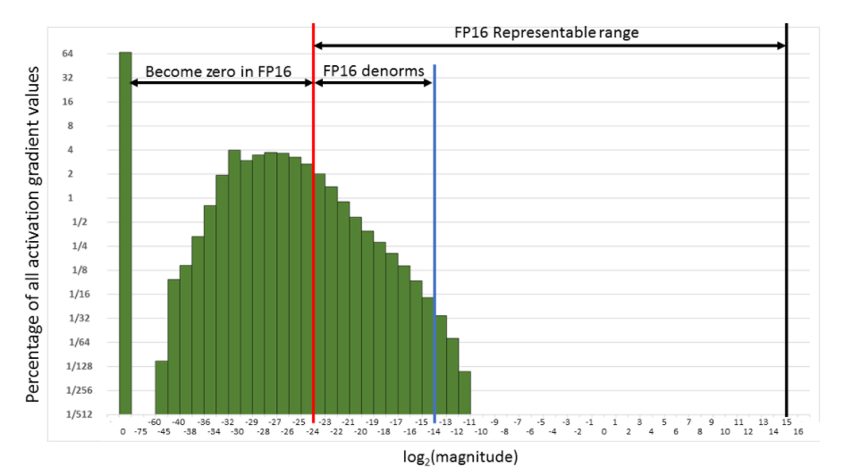

**loss scaling 的作用是保留住微小的梯度值**

下图是 Multibox SSD 网络在使用 FP32 训练过程中的激活值梯度的维度的直方图。x 和 y 轴都是对数形式的。



从上图可以看到FP32 里的31%的值，如果转换为 FP16，会变成0。而只有 5.3% 是非零。而FP16的可表达范围里大部分都是没有被梯度用到的值。因此我们想到可以变化梯度的值来占用更多的范围，这样可以在fp16下为非零。


amp.initializer loss_scale=1

## TODO
1. How does dynamic scaling work?
2. 整个流程，为啥 backward 时不需要 unscale ？

## FAQ
### 1. overflow detected, skipping step, reducing loss scale: 
这个在 AMP 机制启用后的前几个 iteration 遇到是正常的，因为 AMP 刚开始会尝试较高的 loss scale。AMP 的机制就是会自动调整到合适的 scale。但是遇到 NaN 的 loss 是不正常的。而且这类报错不应该连续地密集出现。此时可以关注下 AMP 使用到的 loss 的值是多少

比如这个例子：
```
Gradient overflow.  Skipping step, loss scaler 0 reducing loss scale to 32768.0
Gradient overflow.  Skipping step, loss scaler 0 reducing loss scale to 16384.0
Gradient overflow.  Skipping step, loss scaler 0 reducing loss scale to 8192.0
Gradient overflow.  Skipping step, loss scaler 0 reducing loss scale to 4096.0
Gradient overflow.  Skipping step, loss scaler 0 reducing loss scale to 4096.0
Gradient overflow.  Skipping step, loss scaler 0 reducing loss scale to 4096.0
Gradient overflow.  Skipping step, loss scaler 0 reducing loss scale to 2048.0
Gradient overflow.  Skipping step, loss scaler 0 reducing loss scale to 2048.0
Gradient overflow.  Skipping step, loss scaler 0 reducing loss scale to 4096.0
```
从上面看到 reducing to 4096, 2048 出现了好几次，所以肯定是减少到2048,又增加到了 4096。意味着 gradient overflow 并没有连续出现

### 2. 如果多卡训练，其中一个出现 overflow 会怎样？整个程序挂掉还是？
如果溢出，就会把梯度设置为 0.

### 3. 其他还有哪些情况导致梯度为 NaN 或者 overflow 的？
数据里有 NaN 的值


