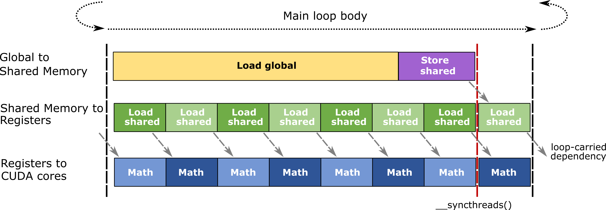

本文来自于：[Optimizations](https://github.com/NVIDIA/cutlass/blob/master/media/docs/efficient_gemm.md#optimizations)

## 层次结构（Hierarchical Structure)
基本的三层嵌套循环计算矩阵乘可以被分块、分片来匹配硬件上的并行，显存局部性，并行编程模型。在 CUTLASS 里，GEMM 被下面的循环嵌套来映射到 NV 的 GPU 里去。

GemmK 和 TileK 的区别
```
for (int cta_n = 0; cta_n < GemmN; cta_n += CtaTileN) {                            // for each threadblock_y   } threadblock-level concurrency
    for (int cta_m = 0; cta_m < GemmM; cta_m += CtaTileM) {                        //   for each threadblock_x }

        for (int cta_k = 0; cta_k < GemmK; cta_k += CtaTileK) {                    //      "GEMM mainloop" - no unrolling 为什么？
                                                                                   //                      - one iteration of this loop is one "stage"
            
            for (int warp_n = 0; warp_n < CtaTileN; warp_n += WarpTileN) {         // for each warp_y          } warp-level parallelism
                for (int warp_m = 0; warp_m < CtaTileM; warp_m += WarpTileM) {     //    for each warp_x       }
                
                    for (int warp_k = 0; warp_k < CtaTileK; warp_k += WarpTileK) {       //     fully unroll across CtaTileK。指 Cta 内部的分片
                                                                                   //        - one iteration of this loop is one "k Group" 后面没提到呢
                    
                    
                        for (int mma_k = 0; mma_k < WarpTileN; mma_k += MmaN) {    // for each mma instruction } instruction-level parallelism
                            for (int mma_n = 0; mma_n < WarpTileN; mma_n += MmaN) {    // for each mma instruction}
                                for (int mma_m = 0; mma_m < WarpTileM; mma_m += MmaM) {  // for each mma instruction}
                            
                                    mma_instruction(d, a, b, c);                       //          TensorCore matrix computation
                                } // for mma_m
                                
                            } // for mma_n
                        }  // for mma_k

                    }   // for warp_k
                } // for warp_m
            } // for warp_n

        } // for cta_k
    } // for cta_m
} // for cta_n

```

这个 tiled loop 嵌套瞄准了一下几个上的并行：

* threadblocks (number of blocks)
* warps, and (number of threads)
* CUDA and Tensor Cores (?)

它利用了下面的这些显存局部性：

* shared memory and
* registers

下图是上述结构的数据流动图。这是被 CUTLASS 呈现出的层次化 GEMM 计算。每个 stage 描绘了一个嵌套级别 tiling，对应的是 CUDA 执行模型里的一层并行和一层显存层次，从左到右越来越细粒度

从上图可以看到Blocked GEMM 一切分之后，第二个stage Thread Block Tile 已经是一个 SM 里的，可以内部线程使用 Shared Memory，而 Warp Tile 是调度的最小单位粒度，此时已经用了寄存器，而 Thread Tile 粒度是利用具体的 CUDA or Tensor Cores。Epilogue Tile 是从 Register 读取到 SMEM 里，然后可以继续用 CUDA Cores 来计算，然后最终放到 Global Memory 里
## Epilogue(结语、收场白、尾声、后记）
reg -> shm -> global memory

上面的代码只涉及了矩阵乘法 **C = AB**，结果保存在threadblock 里的每个线程的寄存器里。把每个输出分块（tile）里的逻辑元素映射到每个线程里去的规则，选择了让矩阵乘法**计算效率最高**的方法，但是不会导致高效、global memory 的合并load和store

epilogue 是单独的一个阶段：线程通过 shared memory 交换数据，然后通过使用高效的 striped 访问模式访问主存来协作。它也是 lienar scaling 和其他可以利用矩阵乘积结果作为输入的逐元素操作可以方便计算的阶段

CUTLASS 定义了多个典型的 epilogue 操作，比如 linear scaling 和 clamping，但其他设备侧函数调用算子可以被用来执行自定义的操作。

[源码里说](https://github.com/NVIDIA/cutlass/blob/master/include/cutlass/epilogue/threadblock/epilogue.h#L32-L37)：
Epilogue 是给 threadblock 粒度的，使用 Tensor Ops 来运算GEMMs。

epilogue 通过 shm 来重新安排矩阵乘的结果去匹配 global memory 里的 canonical tensor layouts。Epilogues 支持转换和规约操作

shm 资源是在 warps 之间分时使用(time-sliced)


### Tile iterator
那上述重新安排后的写入如何实现？

Tile iterator 就是用来在 epilogue 里面，进行输出tile的访问和写入到 global memory 里的操作

比如 predicated\_tile\_iterator 满足： ReadableTileIterator | PredicatedTileIterator | ForwardTileIterator

## 优化

上面描述的层次结构提供了高效的 CUDA 执行模型和 CUDA/TensorCores 之间的映射机制。下面描述的是为了获得巅峰的性能，所有的设计空间的东西，最大化并发和尽可能利用好数据局部性

### 1. Pipelining
分块的结构要求在每个 CUDA 线程，进行大量的 register 存储分配。累加器元素通常占据了一个线程的所有寄存器预算中的大部分。因此，occupancy -- 并发线程的数量，warps，和线程块 -- 相对和其他 GPU 负载而言，**是低的**。这样限制了 GPU 的掩盖显存延迟和其他上下文切换到其他同一个SM里并行(warp 级别却没有这种上下文切换的成本？）的线程导致的暂停(stalls)

为了减轻显存延迟，CUTLASS 使用 **软件实现的 pipeling** 来让同一个线程里的显存访问和其他计算操作重叠。CUTLASS 用下面介绍的双 buffering 来实现

* Threadblock-scoped shared memory tiles: 在shm里申请了两个tiles。一个是从当前矩阵操作里读取数据，另外一个tile可以用来给mailoop 里下次迭代，从主显存里加载数据
* Warp-scoped matrix fragments：在寄存器里，分配两个 fragments. 一个用于当前矩阵计算时传递给 CUDA 和 TensorCores，其他是用来给下一次 warp 级别的矩阵运算接收shm的fetch

下面的图介绍了高效、流水的 在 CUTLASS GEMMs 里的 mainloop 主体.



### 2. Threadblock Rasterization（光栅化）
为了最大化重复利用在最后一级缓存（离core更远的L2），CUTLASS 定义了几个函数来影响从 threadbblocks 到GEMM 问题的逻辑划分。这些映射会因此发射 threadblocks 来把划分后的GEMM问题打包了两个维度的区域，以此来增加同一时刻访问global memory里同一个 tiles 的可能性（有点像把同一块活，分派给两个线程的感觉）

几个函数定义在：[cutlass/gemm/threadblock_swizzle.h](https://github.com/NVIDIA/cutlass/blob/master/include/cutlass/gemm/threadblock/threadblock_swizzle.h)

### 3. 并行的规约

#### Split K - 在 threadblocks 之间进行规约
矩阵乘法计算暴露了 O(MN)个单独进行的内积计算上的并行度。对于足够大的问题规模，一个 CUTLASS 里的 GEMM 内核或许可以达到理论上最大的计算吞吐。但是对于小问题规模，threadblocks 数量会因为太少而无法高效占用整个 GPU。

作为救助(recourse)，在内积计算过程中执行的规约让更多线程可以并发执行来依旧利用好大的 threadblock 级别的 GEMM tiles 的吞吐收益

CUTLASS 通过把 GEMM 划分为 K 个维度，给每个分片启动额外的线程来实现了跨 threadblocks 的并行规约（那这些 threadblocks 之间不需要同步？不然又得通过 gm）。因此我们在 CUTLASS 内部把这种策略定义为 ”parallel reduction splitK“。这种策略需要执行 2 个(种) kernels：划分后的 K GEMM，和batched reduction

分片为K 的 GEMM 类似于一种 batched strided GEMM。没有让用户指定每个batch的规模，而是问整体的问题规模和应用在 K 维上给 A 和 B 操作上的分片的数量。举例，m=128，n=128，k=4096，分片=16，会有 16 个 batched strided GEMMs，每个 batch 上是 m=128, n=128, k=256。PartitonedK 也允许一些 k 不能被分片数量整除的场景

比如 m=128, n=128, k=4096, partiton=20, 会导致 20 个 batched strided(?) GEMMs。首要的 19 个 batches 是 m=128, n=128, and k=4096/20=204, 最后一个 batch 是 m=128, n=128, k=220

batched reduction kernel 把 partitonedK GEMM 问题的输出（C) 当做输入，沿着 K 维度进行规约(所以是某个方向，而不是两个方向）。用户必须管理 workspace 显存来存储中间结果

#### Sliced K - 在跨 warps 之间进行规约

类似 split-k 的场景，sliced-k 瞄准的是在更小的 M 和 N 维度但更大的 K(人为设置？）维度下，提高 kernel 的效率。在 thread-block 级别，CtaTileN 和 CtaTileM 这两个参数通过把工作划分到 warps 之间来暴露并行度。更大的 warpTiles 暴露了更高的指令级别(instruction-level parallelism: ILP)并行和重用，但是同时限制了在每个 threadblock 上运行的 warps 数量，这会降低效率(reduces efficiency)

为了提高这种场景下的效率，把 warpTiles 沿着 ctaTileK 来划分，能通过让更多 warps 在一个 CTA(compute thread array(thread blocks)) 上并行执行来提高硬件利用率（why？）。 Sliced-k 内核把一个 threadblocks 上的计算，不仅分解到 CtaTileN，CtaTileM 维度，还有 CtaTileK 的 warps 里。因此，sliced-k 引入了一点微小的开销：在参与的所有 warps 最后，进行规约。因为每个 warp 计算只用到了 CtaTileK 上的一小块(slice)，因为每个 warp 只有规约钱的部分和( sliced K - reduction across threadblocks 也一样？）


