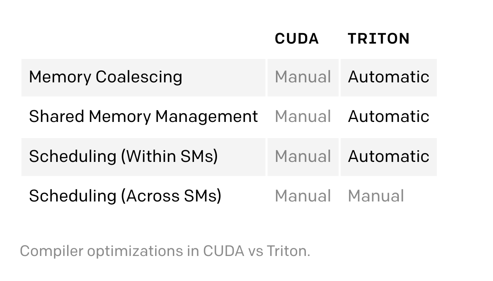

## The Challenges of GPU Programming
现代的GPU架构大致可以画风为三块： DRAM、SRAM、ALU，在优化 CUDA 代码时，每一块都需要考虑到

* 从 DRAM 里进行显存传输，必须合并为一个大事务(large transactions)，来利用好现代显存接口的大带宽. (主存)
* 数据被重复利用前，必须人工放到SRAM里去，管理起来减小获取时的 memory bank conflicts (缓存)
* 计算必须被分块，仔细调度，既有 SM(streaming multiprocessors)内的，也有之间的调度。以便于提高指令/线程级别的并行度，使用好特定目的的 ALUs(比如 tensor core) (计算单元)

同时考虑这些元素很复杂，即使对有多年 CUDA 编程经验的人。Triton 的目的是完全自动利用这些优化，让程序猿关注于并发代码的高级逻辑。Triton 目标是能广泛使用，所以没有自动化调度跨SM的部分，这样让一些重要的算法考量(比如 tiling，SM之间同步)留给开发者。

下图展示了 cuda 和 triton 两个编译器里所做优化的不同：

## 编程模型
Triton 和 Numba 非常相似：Kernels 都是被定义为装饰之后的python函数，然后使用基于网格之上各自有不同 program_id 的实例来并行执行。然而，如下面代码所示，差异点在于：Triton通过 blocks 里的运算来暴露实例间的并行--维度都是2的幂的小数组--而非单个
的指令多线程(Single Instruction Multiple Thread)的执行模型(CUDA 提供的)。这样 Triton 可以高效抽象走在 **CUDA thread blocks 内部(SM内部)**的并行相关的所有问题（仿存合并，共享内存上的同步和冲突，tensor core 调度）

虽然这样对于一些并行计算（比如逐个元素）没有特别帮助，但是能极大简化更多复杂 GPU 程序的开发。

考虑下面fused softmax kernel的例子，每个instance 处理给定tensor里的不同行。标准的 CUDA 实现下，很难写，需要显示在不同的线程之间做同步，因为他们在并行处理同一行。但是使用Triton，这种复杂度就消失了，每个kernel instance加载对应的行，顺序处理，类似 NumPy 一样的原语。

注意 Triton JIT 把 X 和 Y 当作指针而非 Tensor，我们觉得维护低级别的显存访问控制对于解决一些重要的数据结构有很大帮助（比如block-sparse tensors）

重要的是，目前这种softmax实现能让 X 里的整行都在计算过程中在 SRAM 里，让数据重用最大化(< 32K columns)。这个和 PyTorch内部的 cuda 实现不同，它使用临时的显存来让实现更通用，但是更慢（如下文）。这里想说明 Triton 不是就更好，而是说它简化了通用目标库里的特定条件下的更高效的kernel的开发过程

## 矩阵乘法

专门有这篇[讲解原理]()的，其中的图如下：

如上图，如果按照平常的 row-major 顺序来写，需要加载 9+81=90块到SRAM里，来计算最开始的9个输出的blocks结果，但是如果按照分组的顺序，只需要加载 9\*3+9\*3=54块。所以计算出同样个数的结果（9）下，需要访问的块少了很多。这个特性跟 Triton 无关，只是说在B的行数不是特别大的情况下，可以用这种方法，本质是某一行拿出来后，可以服用2次。

## 高级别系统架构

## 编译器后端
发现使用 Triton-IR 的 blocked program representation 表达后，能够让编译器自动执行很多重要的优化。比如通过查看block级别的计算密集的算子(tl.dot)，就可以把数据自动拉取到 shared memory 里，使用标准的liveness 分析技术，可以分配/同步

比如下图，是编译器根据 block 里各种变量的生命周期分析来管理共享显存(的生命周期)

另外，Triton 程序可以高效地自动并行：

1. SM 之间并行：并行执行不同的kernel 实例
2. SM 内部并行：分析每个 block 级别算子里的iteration space，来充分划分到不同的 SIMD 单元里(thread 级别？)

## TODO
1. 它的网站里，介绍了两类优化速度的方法及对应的限制：Polyhedral Compilation 和 Scheduling languages(Halide)
## 问题
1. 第一个示例代码里，add函数是有 grid 个示例？每个示例内部，idx 是说要从start一直到 arange(BLOCK)吗？
2. 看看它提到的softmax处理时的优势？感觉是 tl.max(x, axis=0) 这一行里，直接实现了对给定的小矩阵里的一整行做max
