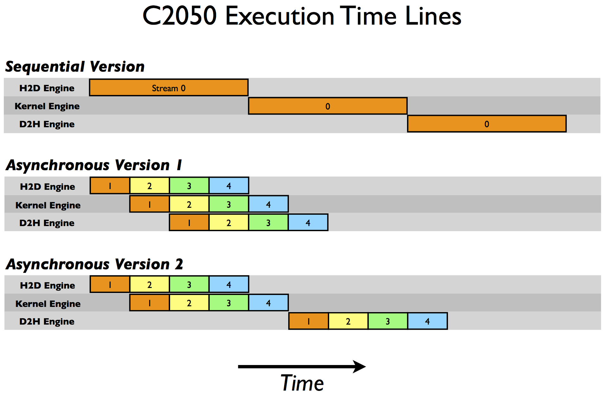

本文是这篇[Overlap data transfers cuda](https://developer.nvidia.com/blog/how-overlap-data-transfers-cuda-cc/)
## CUDA Streams
CUDA 里，一个 stream 是在 GPU 上执行的顺序是按照主机上**发射顺序来执行**的一系列操作。一个流里的操作是**保证按照预定顺序执行**，但不同流里的操作可以重叠，而且有可能的话，会并发执行

## default stream

所有的设备操作（kernel和数据传输）在CUDA中属于某个流。如果没有指定流，会使用默认流(也叫 null stream)。它跟其他流不一样，因为是在设备上**同步执行**(synchronizing)的流：只有当所有在它之前发射的任意流（同一个设备）上的操作都完成后，默认流中的操作才会开始。
而且默认流中的这个操作必须完成，其他后续操作（同一个设备里的任意流）才会开始。

所以默认流用在对性能要求不高的场景下，因为它会带来隐式地与其他流的同步。

### per-thread default stream

所以2015年发布的CUDA 7 里，引入了**新的选项**来让主机上每个线程粒度使用单独的默认流，把per-thread default stream 当作常规的流(不会和其他流里的操作同步)。参看[GPU Pro Tip: CUDA 7 Streams Simplify Concurrency](https://developer.nvidia.com/blog/parallelforall/gpu-pro-tip-cuda-7-streams-simplify-concurrency/)。

这个 per-thread default stream 的特点：

1. 让每个主机线程有一个默认流。所以不同主机线程上发射的命令可以并发执行
2. 这些默认流是常规流，所以其他非默认流里的命令可以和 per-thread default stream 并发执行

如何开启？两种方法选一个：

1. nvcc --default-stream per-thread
2. `#define CUDA_API_PER_THREAD_DEFAULTL_STREAM` before including CUDA headers (cuda.h or cuda_runtime.h)。 是在编译最开始就决定的开关

### cudaStreamNonBlocking (非blocking 非默认流)

Non blocking: all operations in non-default streams are non-blocking with **respect to the host code**.

createStreamCreate(cudaStreamNonBlocking) 这种创建的流:

1. 如果是两个，那他两个之间就完全独立的，所以
2. 它 legacy default stream 之间**不会**有隐式同步

```
cudaMemcpy(d_a, a, numBytes, cudaMemcpyHostToDevice);
increment<<<1,N>>>(d_a)
cudaMemcpy(a, d_a, numBytes, cudaMemcpyDeviceToHost);
```
上述代码，从设备侧来看，三个操作都是发射到同一个（默认）流，所以会按照发射顺序来执行。从主机侧看来，数据传输是阻塞或说同步的传输，而 kernel 发射是异步的。所以第一行的 host到设备的数据传输是同步的，CPU 线程会在 h2d 传输结束后再执行到第二行。
当kernel发射后，CPU线程会执行到第三行，但是这个传输因为设备侧要保证执行顺序(default stream)，所以不会开始执行。

可以看到上述提到的 kernel 发射这个操作是异步的。

## Non-default stream
非默认流需要显示创建。

为了在非默认流里:

1. 发射数据传输，需要使用 cudaMemcpyAsync(stream1) 函数（是说必须？），它在主机侧是非阻塞的，控制流会在传输过程发射后立即回到主机。
2. 进行 kernel 计算，需要指定 stream 标识符里的第四个执行参数配置（第三个是分配共享设备显存）：`increment<<<1, N, 0, non_default_stream1>>>(d_a)`

cudaStreamCreate()

## Synchronization with streams
由于非默认流里的所有操作都是非阻塞的（从host侧代码看），所以会需要需要让host code 和流里的操作同步的情况。有几个方法：

1. cudaDeviceSynchronize()：粒度最大，会阻塞到设备上之前所有发射的操作都完成。这个粒度非常大，所以对性能影响很大
2. cudaStreamSynchronize(stream1)：等待单个指定的 stream1 里所有操作执行完 
3. cudaStreamQuery(stream1) 与2的差别是它不会阻塞 host 侧运行，只是去查询，而不是等待所有操作执行完 
4. cudaEventSynchronize(event), cudaEventQuery(event) 跟2，3类似。
5. cudaStreamWaitEvent(stream, event, flags). 会让 stream 里的工作直到event完成后，再开始执行。也支持device级别的同步：把stream=NULL。

是不是数据传输操作也行？像下面的

## Synchronous/Blocking
host 和 device 之间通过 cudaMemcpy() 进行数据传输时，是同步的。意味着只有之前的 CUDA 调用结束后，当前同步操作才能开始，而且直到这个同步传输完成后，后续的CUDA 调用才能开始(指同一个 stream里)。而对于同类的数据传输，无论有多少stream，只要是类似的
同方向(host -> device) 传输，都会是上述情况。原因是 PCIE 这里某一时刻只能有一个这种传输

```
cudaMemcpy(d_x, x, N*sizeof(float), cudaMemcpyHostToDevice);
cudaMemcpy(d_y, y, N*sizeof(float), cudaMemcpyHostToDevice);

saxpy<<<(N+255)/256, 256>>>(N, 2.0, d_x, d_y);

cudaMemcpy(y, d_y, N*sizeof(float), cudaMemcpyDeviceToHost);
```

比如上述的4行代码，第三行只有前两个操作都完成了，才能执行到，但因为kernel 发射是异步的，所以第三行会立马发射完，控制流返回到CPU(并不会等kernel执行完)，此时执行到第四行，但因为数据传输的blocking/synchronous 特性，所以会等待前面的 kernel 操作执行完，才能执行。

## CUDA events
CUDA Events are **synchronization markers** that can be used to: Time asynchronous tasks in streams. Fine grained synchronization within a stream. inter stream synchronization: let a stream wait for an event in another stream

* Time asynchronous tasks in streams


```
cudaEvent_t start, stop;
cudaEventCreate(&start);
cudaEventCreate(&stop);

cudaMemcpy(d_x, x, N*sizeof(float), cudaMemcpyHostToDevice)

cudaEventRecord(start) # Captures in event the **contents of stream** at the time of this call. 此刻应该是空的
saxpy<<<256, 256>>(N, 2, d_x, d_y); # 这记录这一个 kernel 的开销？
cudaEventRecord(stop) # 此刻是在执行 saxpy

cudaEventSynchronize(stop); #  它会阻塞 CPU 执行，直到指定的事件**完成**. 为啥不需要同步 start ？因为stop被记录了，那说明start肯定也被记录了。Event好处是不需要在 Host 和 Device 间同步了。GPU记录了  stop，就说明kernel 已经执行完了。
float milliseconds = 0;
cudaEventElapsedTime(&milliseconds, start, stop);
```
## 数据传输和kernel计算重叠进行(concurrent copy and execution)
所以想要达到重叠进行，就不能用默认流。方法就是把整个任务切成小块，有数据依赖的块放到同一个 non-blocking stream里，这样 数据传输和计算是顺序的。然后对于不同块，**用不同stream**，这样传输第2块时，不影响计算第一块
需要注意的是有些古老的GPU，可能只有一个 Copy Engine，并没有给两个方向(h2d, d2h)的拷贝各自一个 engine



cudaMemcpyAsync() 需要执行在非默认流（因为默认流是阻塞的），

多个 stream 之间 synchronizes 是指串行

## 问题
AllReduce 内部会全部分段还是一整个传输呢

## TODO
1. NCCL 里的基本概念：ring, CTA, communicators 以及实现

## 资料
1. [How to Overlap Data Transfers in CUDA](https://developer.nvidia.com/blog/how-overlap-data-transfers-cuda-cc/)
2. 
