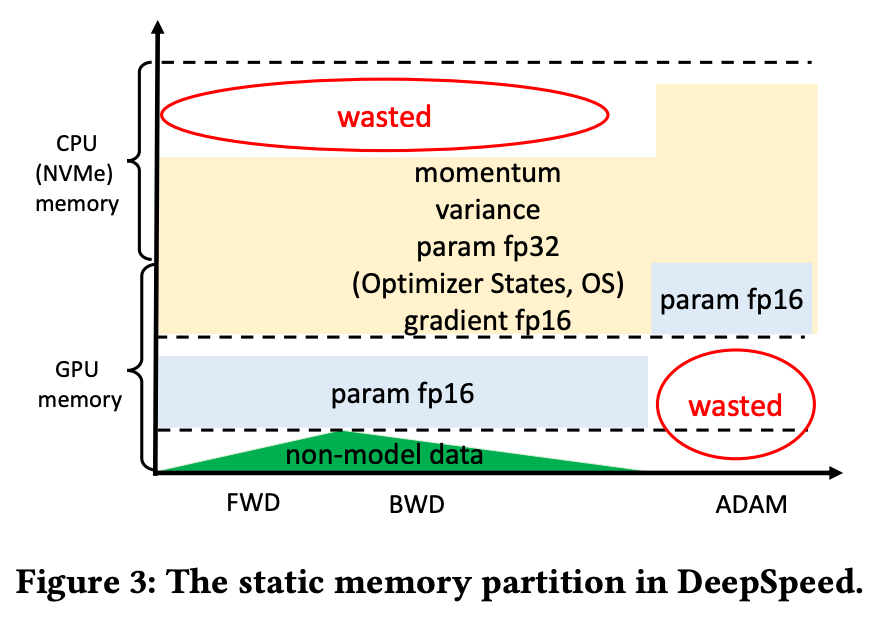
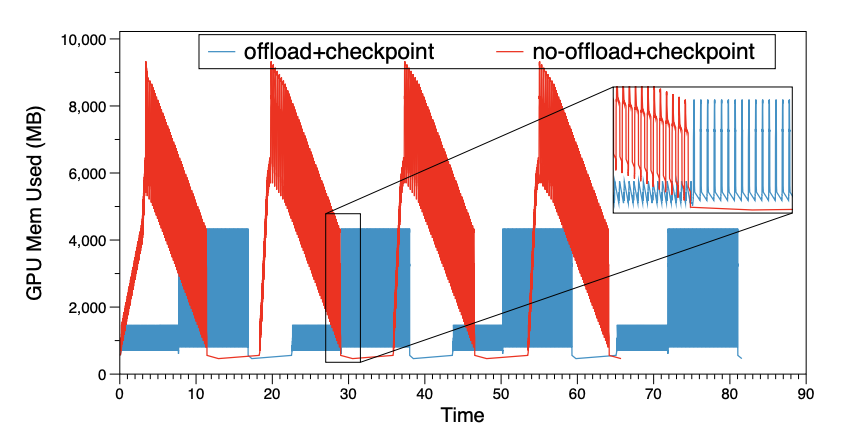

1. 在解决的是什么问题？主要是解决训练过程中的显存峰值，能够进行削峰处理。补齐 DS 在某些情况下的短板，比如 CPU 版本 Adam，可能GPU上还有剩余；Tensor级别 swap 没有高效利用 PCIe 的带宽，也没有 prefetch 机制
2. 为何成功，标志/准是什么？单机8卡下能训 50B 的语言模型，而在8卡上，能达到的 TFlops 更高
3. 在前人基础上的关键创新是什么？更高效地利用异构显存： chunk based 而非 tensor based memory management。动态地做显存的 offload，而非 DS 那样静态
4. 关键结果有哪些？
5. 有哪些局限性？如何优化？
6. 这个工作可能有什么深远的影响？

## TODO
看从 6 开始的设计部分

## 1. 介绍
Megatron，ZeRO，都是在 GGX-2 超级计算机上，有 1.5TB DRAM 和 3.84 TB  NVMe SSD，同主机 GPU 之间有 NVLink，配置要求很豪华。而 4-V100 GPU 上，ZeRO-Offload 只能到 6B。

本文把训练时管理的数据分为两类：

1. 模型数据，包含参数，梯度和优化器，由模型定义决定的
2. 非模型数据：各个 op 产生的中间结果(activation 和零时 tensor)。它根据训练任务的配置而改变，比如 batch size

已有的 ZeRO 把内存静态划分后，放到了 CPU 和 GPU 里，而且没有考虑非模型数据(因为只实现了特定的optimizer 的 offload 版本)。这种静态划分有几个弊端：

1. GPU 或 CPU 内存不够满足对应的模型数据，就会 crash，尽管此时其他设备（GPU/CPU）上还有空间。因为不能说 CPU 版本 Adam 优化器里的内存再细分
2. tensor粒度的传输，通信不高效

Patricstar 的方法：

1. 使用 chunks，同样大小的连续块来组织 tensor 的数据
2. chunks 在异构内存空间里的分布是根据 tensor 状态动态编排的。

通过复用不会同时存在的 chunks，Patrick-Star 可以进一步降低模型的内存占用。

首先是通过 warm-up 迭代来收集运行时的 GPU 显存信息，基于这些信息，使用高效的 chunk 换出策略和设备感知的 operator 放置策略来减少 CPU-GPU 间数据传输的大小

目前可以和 ZeRO Redundancy OPtimizer 协作

主要的贡献：

1. 从零实现，开源
2. 可以和 ZeRO 共存，chunk-based collective communication 模式可以降低 GPU 间带宽要求(all-reduce/gather的粒度更大)，提高带宽利用率
3. 在 8个 v100，共240G 显存，120G 显存的 CPU。可以训练 12B GPT 模型
4. 更高效，在 8x GPU 上比 DeepSpeed，达到超线性 （DS 在卡数多时高效）。这里是不是对比的维度是对自己更有利的

## 3. 相关工作

Activation checkpointing(recompute) 和 Offload，提到了 Capuchin，但是没提 DTR

## 4. Motivation

当 DS 里 CPU 内存比较低(1.5TB -> 240G)，能放下的模型就变小了，降低到4B。此时虽然异构系统里总显存达到 272 G。但是 4B 模型的理论最大内存应该就 72G。而且计算效率也降低了

下图为 DeepSpeed 里静态显存的划分工作

可以看到:

1. 由于 Adam 实现在 CPU 上，那么即使 GPU 有空闲，显存也无法利用起来（放不下 Adam）
2. 而模型数据都在 GPU 里，所以 CPU 的内存有空闲，也用不上

而且 Adam CPU 版本下，有 4M 的数据(fp16 param, fp16 gradients) 要在 CPU 和 GPU 之间传输

下图为 6B 类似 GPU的模型训练时，在 Pytorch里的 memory 情况：

尽管蓝色部分是使用了 offloading 优化和 checkpointing 技术，但依然会有接近 5G 的峰值显存占用。而且激活值 offload 会降低训练速度。ZeRO Offload 为了避免 CPU 和 GPU间传递大量数据造成的计算延迟，提出了延迟一步的参数更新方式，打破了同步的限制，但
理论上并不与 Adam 算法一致

## 5. Design Overview
下图是设计该要，展示了模型是两个 chunk 大小，而 GPU 上只有一个 chunk 的情况

## 启发
1. 参数在forward 之后，就没用了（没用 checkpoint 机制），可以丢掉 
2. 这个方法能用到 CV 里吗，激活值比较大？
3. 与 DTR 相比，这篇更容易实现

## 问题
1. chunk based，会不会牵扯没必要 swap 的 tensor?
2. 什么时机开始，提前换入？如果只是 Model pre fwd hook，感觉效率并不高？换出的东西倒是有各种策略
3. non model 数据怎么处理？好像图里没管？

## TODO
1. 看 DS 的短板: 图三
2. 什么情况下 CPU-GPU 之间带宽利用率不高？ Tensor 比较小，然后移动粒度是 Tensor，这样比如某个 layer 里多个参数，就不是一个 batch 一起移动了，也没有预先载入(prefetch)的机制
3. 从6开始看

## 参考资料：
1. Optimization of collective communication operations. 里面有 all-gather，all-reduce 的通信量大小。all-gather: 2(p-1)/p*2M，reduce-scatter: (p-1)/px2M。p is parallel degree，M is parameter。broad cast 方法的开销：4(p-1)/p x 2M
