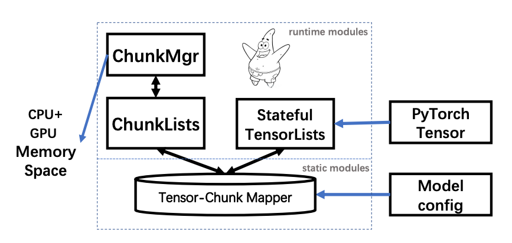

1. 在解决的是什么问题？主要是解决训练过程中的显存峰值，能够进行削峰处理。补齐 DS 在某些情况下的短板，比如 CPU 版本 Adam，可能GPU上还有剩余；Tensor级别 swap 没有高效利用 PCIe 的带宽，也没有 prefetch 机制
2. 为何成功，标志/准是什么？单机8卡下能训 50B 的语言模型，而在8卡上，能达到的 TFlops 更高
3. 在前人基础上的关键创新是什么？更高效地利用异构显存： chunk based 而非 tensor based memory management。动态地做显存的 offload，而非 DS 那样静态
4. 关键结果有哪些？
5. 有哪些局限性？如何优化？
6. 这个工作可能有什么深远的影响？

## TODO
看从 6 开始的设计部分

## 1. 介绍
Megatron，ZeRO，都是在 GGX-2 超级计算机上，有 1.5TB DRAM 和 3.84 TB  NVMe SSD，同主机 GPU 之间有 NVLink，配置要求很豪华。而 4-V100 GPU 上，ZeRO-Offload 只能到 6B。

本文把训练时管理的数据分为两类：

1. 模型数据，包含参数，梯度和优化器，由模型定义决定的
2. 非模型数据：各个 op 产生的中间结果(activation 和零时 tensor)。它根据训练任务的配置而改变，比如 batch size

已有的 ZeRO 把内存静态划分后，放到了 CPU 和 GPU 里，而且没有考虑非模型数据(因为只实现了特定的optimizer 的 offload 版本)。这种静态划分有几个弊端：

1. GPU 或 CPU 内存不够满足对应的模型数据，就会 crash，尽管此时其他设备（GPU/CPU）上还有空间。因为不能说 CPU 版本 Adam 优化器里的内存再细分
2. tensor粒度的传输，通信不高效

Patricstar 的方法：

1. 使用 chunks，同样大小的连续块来组织 tensor 的数据
2. chunks 在异构内存空间里的分布是根据 tensor 状态动态编排的。

通过 **复用不会同时存在的 chunks**，Patrick-Star 可以进一步降低模型的内存占用。

首先是通过 warm-up 迭代来收集运行时的 GPU 显存信息，基于这些信息，使用高效的 chunk 换出策略和设备感知的 operator 放置策略来减少 CPU-GPU 间数据传输的大小

目前可以和 ZeRO Redundancy OPtimizer 协作

主要的贡献：

1. 从零实现，开源
2. 可以和 ZeRO 共存，chunk-based collective communication 模式可以降低 GPU 间带宽要求(all-reduce/gather的粒度更大)，提高带宽利用率
3. 在 8个 v100，共240G 显存，120G 显存的 CPU。可以训练 12B GPT 模型
4. 更高效，在 8x GPU 上比 DeepSpeed，达到超线性 （DS 在卡数多时高效）。这里是不是对比的维度是对自己更有利的

## 3. 相关工作

Activation checkpointing(recompute) 和 Offload，提到了 Capuchin，但是没提 DTR

## 4. Motivation

当 DS 里 CPU 内存比较低(1.5TB -> 240G)，能放下的模型就变小了，降低到4B。此时虽然异构系统里总显存达到 272 G。但是 4B 模型的理论最大内存应该就 72G。而且计算效率也降低了

下图为 DeepSpeed 里静态显存的划分工作

可以看到:

1. 由于 Adam 实现在 CPU 上，那么即使 GPU 有空闲，显存也无法利用起来（放不下 Adam）
2. 而模型数据都在 GPU 里，所以 CPU 的内存有空闲，也用不上

而且 Adam CPU 版本下，有 4M 的数据(fp16 param, fp16 gradients) 要在 CPU 和 GPU 之间传输

下图为 6B 类似 GPU的模型训练时，在 Pytorch里的 memory 情况：

尽管蓝色部分是使用了 offloading 优化和 checkpointing 技术，但依然会有接近 5G 的峰值显存占用。而且激活值 offload 会降低训练速度。ZeRO Offload 为了避免 CPU 和 GPU间传递大量数据造成的计算延迟，提出了延迟一步的参数更新方式，打破了同步的限制，但
理论上并不与 Adam 算法一致

## 5. Design Overview
下图是设计该要，展示了模型是两个 chunk 大小，而 GPU 上只有一个 chunk 的情况

## 6 单个 GPU 上的设计
PS rutong PyTorch 和 异构内存之间的中间件一样。系统包含两部分：

1. 静态部分，训练前对模型做 **一个iteration的 fwd/bwd, optimizer.step来作为预处理**，通过模型结构来构建出 tensor 和 chunk 之间的映射关系(仅限于上文提到的模型数据，不包括中间值、激活值等)
2. 运行时部分，在训练时起作用。在训练过程中掌控了 PyTorch 的内存访问，通过把 tensor 重定向到 chunk-based 内存空间，使用 chunk manager 来管理异构的内存空间

### 6.1 预处理阶段
高效的 chunk-tensor 映射关系需要满足：

1. 增加tensor 访问的局部性
2. 减少峰值内存占用
3. 对并行友好

Chunks 把模型数据分为四类：

1. param fp16 列表
2. param fp32 列表 (后面这三个都是 OS)
3. momentum 列表
4. variance 列表

总共14M 字节，所以比 ZeRO-offload 里的最小16M 模型数据要少

Chunks 有相同的大小，所以不同 chunks 可以复用同一片内存，而且对并行训练中的集合通信友好(是大块、连续的？)

PS 不会分配 fp16 grad 列表，可以复用 param fp16 列表。在6.2里会介绍，我们消除了计算梯度时对参数的依赖。

### 6.2 训练阶段
这里主要介绍如何正确换入换出：设计了几个 tensor 的状态：

1. COMPUTE 意味着会在一些设备上计算：CPU 或 GPU
2. HOLD\_ 系列是说不会立马涉及到计算，但是 payload 必须维护在内存里。在 FWD 和 BWD 之后会用到。为什么还有个单独的 HOLD？不是 HOLD\_FWD/BWD 就行么。噢是专门给 OS tensor用的

一个 chunk 的可能位置取决于它所有 tensor 的状态。

1. 当 chunk 里所有的 tensor 都是 FREE 状态，那么此chunk的空间就可以被其他 chunk 复用。什么情况下会出这种？activation？backward 过程中的 parameter？
2. chunk 中任意一个 tensor 是 COMPUTE 状态，chunk 就需要放到所需的计算设备上
3. 如果没有 tensor 是 COMPUTE 状态，而只少有一个是 HOLD 状态，可以把chunk 放到异构设备空间里。等待被再次使用的 checkpoint？

参数被刚初始化后，会是 HOLD 状态。当某个 OP FWD 之前，PS 会通过 acess 函数知道，此时会换入到所需的计算设备里。

当 FWD 完，会调用 release 算法，设置 chunk 的 training\_stage 为 FWD，状态为 HOLD\_AFTER\_FWD，这样 tensor 可以被换到其他设备上。为什么 chunk 自己也需要存储这个 training_stage，而非共用一个

当 model 里所有算子计算完 FWD，所有 param fp16 tensor 都被设置为 HOLD 来保证 BWD 的正确执行。因为 activation checkpoint 的使用下，会在 BWD 时，从最近的 checkpoint 开始重计算。所以需要区分是 FWD 还是 BWD 之后的 HOLD 状态。对于 所有
tensor 都是 HOLD_BWD 的 param fp16 chunk，是不是就可以释放了?

下图是让 grad fp16 复用 param fp16 的示意图：

在某个 OP的 BWD 时，输出有两个：激活值的梯度，当前算子参数的梯度。当 OP 在计算前，会 access param fp16 tensor，所以这些 tensor
的状态又变为 COMPUTE。当 BWD 计算时，产出的 grad fp16 放在临时空间里。当计算结束，此时 param fp16 已经不需要了，此时就把 grad fp16
的数据拷贝到对应的param fp16参数的 tensor里，然后把状态从 COMPUTE 改为 HOLD\_AFTER\_BWD。之所以能覆盖，是因为确实不需要，后面优化器更新时，
里面有 param fp32，用它计算出参数，再更新到 param fp16 里去

ADAM 计算前，OS tensor(param fp32, momentum, variance) 被设置为 COMPUTE 状态。看到这里缺 grad fp32，这个可以从上面 BWD 时产出的 grad fp16
on the fly 的转过来，来节省空间。计算完，更新后的 param fp32 和使用过的 momentum,variance 等被设置为 HOLD 状态，param fp32 会被拷贝回对应的
param fp16 chunk 的位置

下图是 fp16 tensor 的转移图

PS 的实现对于 PyTorch 用户是透明的，PS 使用 hook 机制劫持了 PyTorch tensor 的访问。在一个算子执行前，参数的数据或梯度 tensor指向PS里的chunk。当算子结束，
tensor 的 payload 又指向假数据。这样 PS 不需要管理真正的 payload。

这里设计挺精妙的，只做了 cpu/gpu 之间的 swap，而不像 DTR 那样需要管理实际的 tensor 存储空间，就偏底层了

## 7. 扩展到多 GPU 

## 启发
1. 参数在forward 之后，就没用了（没用 checkpoint 机制），可以丢掉 
2. 这个方法能用到 CV 里吗，激活值比较大？无法节省激活值，OS 是大头，而且关键是它的销峰作用，对我们帮助较大
3. 与 DTR 相比，这篇更容易实现
4. lightseq 使用后，

## 优化
### 8.2 Device-aware Operator Placement

计算密集型操作：Linear，必须在 GPU 上
内存密集型：embedding ，占用训练时间比较小，所以swap的话比较划算。适合在CPU和GPU上运行
element-wise: Adam，可在 CPU 和 GPU 上进行

## 问题
1. chunk based，会不会牵扯没必要 swap 的 tensor?
2. 什么时机开始，提前换入？如果只是 Model pre fwd hook，感觉效率并不高？(可能因为是 chunk 粒度，所以摊薄了开销？而且次数显著变小)换出的东西倒是有各种策略
3. non model 数据怎么处理？好像图里没管？对，主要是激活值，以及其他零碎的显存
4. 每次都要处理的话，会不会效率较低？而且在 Pytorch/Python 层面。每次的开销，主要是记录当前参数（时刻）、显存大小
5. 运行时部分，如何掌管 PyTorch 对 tensor 的访问？只是以chunk为单位组织 tensor，然后把这波tensor进行 swap
6. 它和checkpoint 机制能混合用吗？

## TODO
1. 看 DS 的短板: 图三
2. 什么情况下 CPU-GPU 之间带宽利用率不高？ Tensor 比较小，然后移动粒度是 Tensor，这样比如某个 layer 里多个参数，就不是一个 batch 一起移动了，也没有预先载入(prefetch)的机制
3. 从6开始看

## 参考资料：
1. Optimization of collective communication operations. 里面有 all-gather，all-reduce 的通信量大小。all-gather: 2(p-1)/p*2M，reduce-scatter: (p-1)/px2M。p is parallel degree，M is parameter。broad cast 方法的开销：4(p-1)/p x 2M
