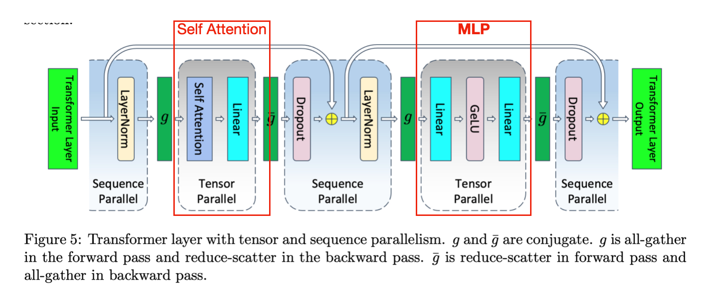

1. 在解决的是什么问题？减少激活值 recomputation
2. 为何成功，标志/准是什么？显著减少了激活值，但是有没有额外带来通信代价
3. 在前人基础上的关键创新是什么？ sequence parallelism 和 selective activation recomputation. 结合 TP 之后，这些技术几乎消除了重算激活值的需求。
4. 关键结果有哪些？1T 模型上，减少5倍激活值，而且重算减少了90%。比如GPT-3上的530B 参数，花了2240个A100，我们达到了 54.2%的模型Flops，比用之前纯计算的42.1%要快 29%！
5. 有哪些局限性？如何优化？
6. 这个工作可能有什么深远的影响？

## 1 介绍
LM模型在朝着T(万亿）模型参数扩展时，必须要用模型并行来把模型参数、激活值、优化器状态都需要分布式，才能放到目前的显存里。虽然模型并行 **线性** 地减少了每个设备上的参数量，比如当模型并行粒度增大2倍，每个设备上的参数减少一半。

Tensor粒度的模型并行增加了通信的要求，引入更小的、低效的矩阵乘法，这样把一个模型切分到大规模设备上就会很低效。因此，tensor-level 模型并行只限于**相对小的，而且有高速带宽的GPUs上**。因为把一个大矩阵运算切分了，所以会减少激活值显存(相对大）和参数的显存(相对小）

Pipeline 并行需要存储多个 microbatches 里的激活值来减少气泡。因此，它为了提高设备利用率(gradient accumulation)，只能帮助减少存储 **模型参数** 和 **优化器状态** 的显存，不能减少激活值。因此存储激活值很快成为一个关键的问题。

我们发现如果对一个 transformer layer 整个做重计算来节省缓存，那么引入的额外开销是 30-40%（说明fwd占1/3？）

nvidia-nemo is built on top of PyTorch and PyTorch Lightning

 在本论文里展示了可以帮助 **缓解激活值压力** 的创新技术，减少了重新计算激活值的开销。这两个技术是特定对 transformer 架构的，而且实现简单，没有或者**对计算效率有很小**的影响。我们将会在第二部分里详细描述其他减少大模型训练显存需求的技术，比如在 data parallel ranks 之间分片各种数据(ZeRO) 或者把数据 offload 到 cpu 内存。这些技术是对这里展示的补充，可以用来做更大的显存节省。但是总体而言有更高与本论文介绍的方法相比，实现代价高，对计算效率有更大的影响。分析、比较这些技术不在本论文范围里，是未来工作。

我们首先做一个简要的transformer架构的回顾，然后构建出一个 transformer 模型对存储激活值的近似公式。使用这个公式，可以研究不同的模型并行对激活值的大小影响。我们在 tensor parallelism的基础上引入 sequence parallelism 来对 **不利于**标准的tensor 并行的冗余激活值降低存储。展示了通过**选择**保存哪些激活值，哪些要重算，可以消除大部分的计算代价，而同时对与不额外计算的部分，只需要少部分显存。

## 2 相关工作

模型并行可以让多卡上训练更大的模型。模型参数和对应的优化器状态需要大量的显存，在单个 GPU 里放不下。即使单个现存里能放下（比如交换出去到主机内存里），由于计算次数巨大导致非常大的训练实践。因此需要并行，有两种形式的模型并行来分发模型参数到多个GPU上：

1. tensor parallelism: 每个层的参数被分发到不同的设备
2. pipeline 并行：模型沿着网络层的方向切分

最近一些研究证实结合这两种模型并行，可以训练到1T参数量。

模型并行的代替是与数据并行结合一些训练技术来训大模型。技术是基于在dp ranks之间切分优化器状态(OS)、梯度(G)、参数(P)。而且最近有插件可以使用 CPU off-loading 技术在少量机器上训练万亿模型。和模型并行相比，这些技术基于数据并行，没有那么高效(**为什么？**)，而且也**无法scale到大量的GPU**上([13], TODO1 里的？），因此更适合在资源受限的环境里做finetuning模型。本文只聚焦在模型并行优化上。分析这些技术不在本论文scope里

Megatron 里 TP 的手段是把 Linear OP 的权重进行行或者列拆分，这样能减少 Linear 的权重和激活值大小，

除此之外，Megatron-LM(19) 引入的 TP 可以帮助一定程度减少激活值显存。但是 transformer layer 里有一些不能在 tp ranks 之间切分的激活值。[9] 里提出的 sp 是可以把激活值在 sequence 纬度进行切分的，但是它和 ddp 类似，需要参数和激活值状态都在所有的设备上复制一份。而 Sagemaker， GSPMD 提出的显存高效的的 tp 版本可以把网络里的激活值在 hidden dimension 纬度上进行拆分，但主要劣势是其中的 layernorm 垮了多个设备，效率不高。S 里在每个 transformer layer 里需要做4次 reduce-scatter 通信。

我们的技术，把 tensor 和 seq 并行结合到一起，显著减少了激活值，而不需要额外的计算，通信和显存开销(神奇啊）
## 3
input tokens [b, s] 被输入到 [v, h] 的 word embedding, [s, h] 的 positional embedding, 两者结合起来（怎么做的？）后输出大小为 [b, s, h]，最终输出会被 output layer 转换到 [b, s, v]，然后和当前句子的下一个 token 算 cross-entropy loss。文里假设了 embedding 和 output layer 的权重是共享的

## 4 激活值

本文里只考虑近似值，比如 sbh+2sb，由于 h >> 2，所以简化为 sbh

### 4.1 每个 Transformer Layer 的激活值占用情况

(下面都是字节为单位算的，计算的都是某个 op 它的输入和中间算梯度所需的东西，比如 mask）

** Attention block **: 
Q,K,V 矩阵乘：他们的共同输入是 2*sbh

Q\*K 矩阵乘：需要保存 Q和K：2\*2bsh = 4sbh # [b, s, h] * [h, bs] -> 

Softmax: 输出的是 2as^2b # 这里算不清楚了

Softmax dropout: 只需要 as^2b 的 mask

Attention over Values (V) : 需要记录上一步 droput 的结果：2as^2b 和输入 value: 2bsh

上述总共是 11sbh(我算出来是8，不知道其他3个从哪里来的） + 5as^b

** MLP**
两个 linear 各自的输入是 2sbh 和 8sbh。 GeLU 的输入是 8sbh，droput 里需要 sbh。总共 19sbh。

** Layer Norm**
输入是 2sbh，总共有两个，所以是 4sbh

这样把上述三类加起来：每个层需要的激活值：sbh(32+5*as/h)

#### 4.2.2 Sequence Parallelism
TP 是针对 Linear 的，所以 Transformer 里的 Layer-norm 和 dropout 都是完整的，所以他们是在 TP group 里是一样的。所以上述等式2 里的 10bsh 就是这部分激活值，他们没法享受被 t 整除。

注意到非 tp 模式下，dropout 和 layernorm 都是对 (b,s,h)里最后一维进行操作的，所以跟 s 纬度无关。所以可以把这部分区域沿着 sequence 纬度切分。这种切分只会减少激活值。需要在 sp 和 tp 之间通过通信原语来转换。

tp 和 tp & sp 情况下使用的通信方式有什么不一样？ all-reduce vs reduce-scatter(对h纬度reduce 并切分) & all-gather(h纬度合并） 的差别；其实正好是等价的

另外 tp 是对参数做拆分，tp group 内部大家的数据都一样，而各自的参数不同，所以不需要同步梯度；但 sp 是对输入做了拆分（跟 ddp 的 B 纬度做拆分类似，但又有不同：LN 的参数一样，但是各自负责不同的数据 sharding，**合并**起来才是一个 batch），所以需要做[梯度 allreducel(默认，即 SUM)(layernorm, dropout 不需要)](https://github.com/NVIDIA/Megatron-LM/blob/5f9c870f9f24b482509699d206a9dbb00958f6fc/megatron/core/distributed/finalize_model_grads.py#L138), 而且给 module setattr(self.weight, 'sequence_parallel' 了）

## TODO
1. 看如何结合两类模型并行(tp, mp)就做到训练1T的: Efficient large-scale language model training on gpu clusters using megatron-lm (2021，貌似就是megatron-lm？）
2. 实现了 CPU offload 的插件，可以少量机器训万亿：Zero-infinity: breaking the GPU memory wall for extreme scale deep learning.

## 关于 all-gather , reduce-scatter, all-reduce
假设有 n 个人参与

all-reduce: 使用场景：大家手里都有一份梯度，现在希望对这些梯度进行求和

reduce-scatter: 去中心化计算上述求和过程：选出多个队长(t)，让他们各自分片负责自己区域的求和。队员把数据通过 ring 的方式接力棒式传给下游。此时除了队长是**接收**一次数据，其他人都是**发送**一次数据（类似接力赛）

all-gather: 队长负责把数据交换给其他队员：队长需要 **发送** 给 n-1 个队员，每个队员接收一次。

所以队员：发送和接收一次 M/t 大小的数据，而队长发送 `(n-1)*M/t` 数据，接收一次 M/t 大小数据 => `n*M/t` 数据

可以看下面的图：

## 问题

1. transformer 输入里(Fig 6)，输入切分是在哪里做的？答：第一层 transformer 是在 embedding 过程中，如果是 sp，那就对 embedding 在 h 纬度切分(不需要通信，split 即可）；如果是其他层，是在 MLP 里计算 dropout 前切分
