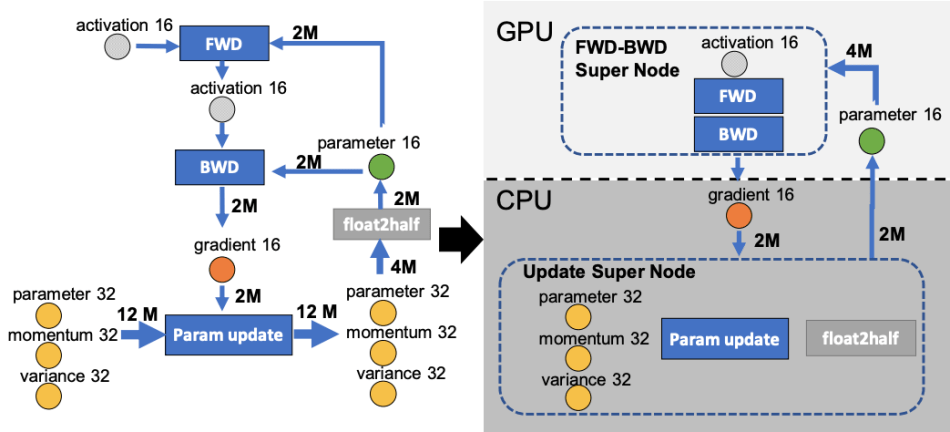

## 总结
1. 在解决的是什么问题？如何训练大模型，解决内存不够的问题
2. 为何成功，标志/准是什么？ 通过Offload 内存和算力到 CPU 上，能支持更大的模型，效果很好，比如1k个节点上支持 1T 的参数训练
3. 在前人基础上的关键创新是什么？最优化的 offload 策略：算力最少，效率最高，通信量最低：CPU 上的高效优化器实现，6倍的 SOTA；One-step delayed parameter update: 这样 CPU 计算和 GPU计算可以重叠
4. 关键结果有哪些？ 能训练更大的模型
5. 有哪些局限性？如何优化？是针对 NLP 里 模型状态和优化器占用内存最大，针对混合精度训练和 Adam 优化器设计的。而且**参数**依然需要存储在GPU 里一份，而且不能用 ZeRO-3（不然 cpu->gpu->网络，开销较大）。所以在大 batchsize 下效果才好。而且因为显存就那么大，ZeRO-Infinity 克服了这些局限. 
6. 这个工作可能有什么深远的影响？

如上图，核心是把原来都在 GPU 上的计算图，分成两部分：

其中为了让 CPU 和 GPU 的通信最小，2M，所以把梯度的32位参数更新放到了 CPU 上。这样会有： 12M + 4M = 16M 的显存节省(CPU 上有16M, 这样有 2M的fp16 参数， 是在GPU 上，也在 CPU 上)。这个就是最节省通信，最节省显存的唯一方法。

即把 fp32 的模型状态和 fp16 的梯度放在 CPU 内存里，在 CPU 上计算参数更新。fp16参数在 GPU 上也有一份，F 和  B 也都在 GPU 上。

### 在 CPU 执行上的优化

1. 实现了比 pytorch ADAM 更快的版本: a. SIMD 向量指令 b. Loop unrolling c: OMP multithread
2. 实现晚一步延迟更新参数的版本。不在训练早期用，因为那时梯度变化很大。能让 CPU 计算和 GPU 计算重叠起来。GPU 在算下一个迭代，而 CPU 在更新上一次的参数

## ZeRO offload 和 DTR，Capuchin 等 同类方法的差异
1. **CPU 上的计算**用的多：优化器和更新梯度都在这
2. 并没有把 Tensor，Activation 等放到 CPU 上

## 疑问：
1. 论文里提到的：first principle analysis 是啥？
2. 怎么证明的就是最优的？就是几个确定的下界限
3. 在 CPU 和 GPU 之间，如何做到让 CPU 和 GPU 之间通信量最小的？同2
4. 把梯度，优化器状态和优化器计算放到 CPU上，而其他 backward 和 forward 在 GPU上，为何就最终增加了10倍模型大小，而非5倍？
5. 为何在 CPU 上，执行的优化器计算后，就只是 O(M) 的计算量，而非 GPU 上的 O(MB). M: model size, B: batch size. 特意选取的，一个 batch 结束后，再计算梯度和参数更新
6. 试试这个在 POD 上的效果？
7. 可以单独用吗？
8. 有必要在 CPU 上开发 SGD 算法吗？比较难的是每个 batch 都需要算更新把？
9. One step Delayed Parameter Update 对收敛是否有影响？几轮迭代之后再引入，此时并不影响

## 其他参考
1. Distributed hierarchical gpu parameter server for massive scale deep learning: 2020 A hierarchical parameter server-based design to offload sparse parameters to SSD for creating a massive scale DL Ads system.
