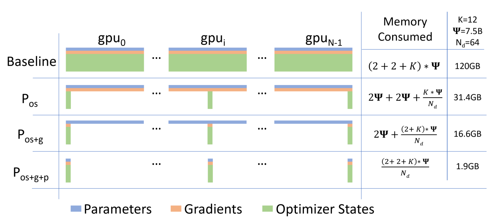

## 总结
1. 在解决的是什么问题？传统的 DDP 下，虽然多卡，但是每个卡上的显存和单卡相比，占用一样，并没有减少显存使用。最大只能训练到1.4B(32G)参数的模型
2. 为何成功，标志/准是什么？ 能支持更大的模型，效果很好，比如1k个节点上支持 1T 的参数训练
3. 在前人基础上的关键创新是什么？去掉了DP 模式下的内存冗余，而且把内存里生命周期短的 activation 和gradient等可以进行挪动来避免内存碎片
4. 关键结果有哪些？ 能训练**最大 13B** 的模型，比 T5 11B 还大 和 Megatron GPT 8.3B 还大，此时仅靠 ZeRO 就可做到，**不需要模型并行**
5. 有哪些局限性？如何优化？
6. 这个工作可能有什么深远的影响？

## Introduction

MP 优势：能减少激活值的大小
是不需要修改网卡或交换机

弊端：scale 能力有限，因为要求的通信量较大，只能在本机内部用 NVLINK 才划算

### 优化模型状态显存
思路是尽量跟 DDP 一样有好的计算/通信开销比，同时又能兼顾 MP 这样能把所需显存通过多卡来分摊。

ZeRO-DP(ZeRO powered DP) 有三个优化阶段，下图里是具体 7.5B setting下的例子，优化器是 adam，所以 K=12，Nd是64，即64卡的 DDP。

1. Optimizer States Partitioning (Pos): 在图里是4倍速度节省，和DP一样的通信开销(这里有疑问，DP里通信开销主要是all-reduce 梯度，明显图里优化器状态比梯度要大好多倍)
2. 增加 Gradient Partitioning (Pos+g): 8倍速度节省(比1又多了2倍)，和DP同样的通信开销
3. 增加 Parameter Partitioning (Pos+g+p)：内存减小与DP的粒度Nd就完全成正比了。保守估计通信开销增大50%

从上图可以看出来，每个 stage 下节省的显存，跟被 sharding 的份数，即 Nd 成正比。而

## 一些数字

Adam 里保存两类数据：
1. time averaged momentum
2. variance of the gradients to tcompute the updates.

尤其是在混合精度训练下，优化器所耗的内存会更大：AMP 下，forward 和 backward 时的激活值和参数都是 fp16 的，这样能用起来 tensor core 加速。但是优化器里是混合的：fp32 的参数和其他所有优化器状态

t参数的模型，DDP内存用量：

fp16 的**参数**和**梯度**：
parameters：2t 
gradients: 2t

优化器里需要存储： Adam optimizer states：12 t . 其中包括了 fp32 的参数、其他优化器状态:动量(momentum)和方差(variance)

所以结合上图，可以用来计算模型在各ZeRO stage 下的内存消耗。比如一个 1T参数量的模型，放到1024个卡上： (2+2+12)*1T/1024 = 16T = 16G

### 优化其他的状态显存
除了模型状态(Optimizer states, gradients, paramters)，还有激活值，零时缓存，无法使用的内存碎片。

1. 激活值：checkpointing 技术有帮助，但是对大模型效率不高，所以我们通过分片来解决的。同时在恰当时刻 offload 到 CPU
2. 临时缓存：定义了恰当大小，来获得显存和计算开销的平衡
3. 碎片问题，可以通过管理tensor的生命周期来避免碎片

## 7 ZeRO-DP 里的通信分析

zeRO-DP 里使用 OS+P，没有额外的开销
一般 all-reduce 分为两步：
1. reduce scatter: 分散到每个进程里做自己负责的那部分的 reduce 工作
2. all-gather: 每个进程 gather 所有其他进程 reduce 好的数据

而 zeRO-DP 里也是这样，reduce scatter 。这里没太看懂，为啥没有额外的开销，跟原来方法的不同在那里？为啥说上 OS+P，能节省8倍开销

## 启发
它就是分析了下内容使用，通过需要时多卡间通信来换来数据，这样每个卡可以减少冗余。思路很朴素

## 问题：
1. 节省了内存后，训练的速度也会变快？ 可能原因是数据分片，计算梯度、参数，计算优化器状态更新也都分片了？(并不是, 只是存储方面分片了，没有冗余的数据）而且内存管理更简单，所以管理内存的计算量也减小？
2. ZeRO DP 是不是只能用在 NLP 里呀，它的目标是优化NLP 里内存大头：Adam 优化器里的状态。否，也可以用在 SGD 里。因为 SGD 里 AMP 下，需要保存：
3. P2 里为什么说 ZeRO-DP 里的 Pos 节省 4倍内存，Pos+g 节省8倍？不是跟机器数量相关的么？
4. 为啥 Parameter Partitioning 的内存节省跟机器数量(DP degree) 相关呢？
5. ScatterReduce 是啥操作？ 是两个步骤
6. ZeRO 是不是除了节省内存外，还能提高训练效率？并不能
7. 如何实现？比如每个并行进程只负责更新自己负责的那部分梯度，那么优化器状态也能分片么，还是说计算自己负责的这部分梯度前，需要把优化器分片再聚合到一起？
8. 各个stage下通信开销怎么计算？
9. ZeRO-R 里临时缓存和tensor生命周期的具体实现

## 其他

可以参考 ZeRO 系列其他文章，里面也有提到 ZeRO, 比如 [ZeRO-Infinity](./../memory-efficiecy/ZeRO-Infinity.md)

