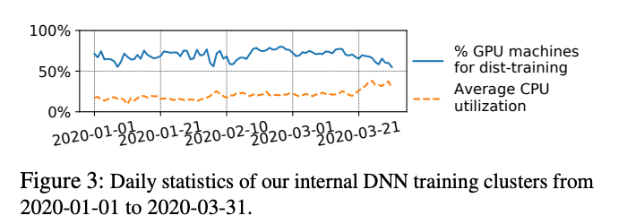
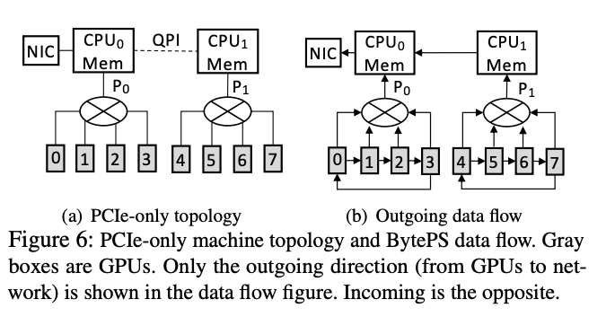

1. 在解决的是什么问题？allreduce 和 PS 下的通信效率问题。当不提供额外 CPU 机器，allreduce 被证明是带宽最优的。但是提供了额外的CPU机器用来做allreduce时，就不是了。
2. 为何成功，标志/准是什么？
3. 在前人基础上的关键创新是什么？充分利用了CPU、GPU这种异构的架构，利用了额外的**CPU及带宽**来提高效率。而且是统一的模式，既能allreduce，也能做PS用，理论上证明了高效
4. 关键结果有哪些？ BytePS 在通用场景下，给定任意数量的 GPU/CPU，有不同的PCIe/NVLink 配置后，依然是最优？而且快达到理论的峰值了
5. 有哪些局限性？如何优化？
6. 这个工作可能有什么深远的影响？

## 1. Introduction
BytePS 的架构，是通信最优的（和nccl allreduce 的带宽最优有啥区别？），理论和实践都是。allreduce 和 PS 在特定 GPU/CPU 配置下，才能达到理论最优。然而在其他更宽泛的条件下不是最优的，比如有额外的 CPU 资源，不是最优的。

传统 PS 里，参数是在 CPU server 上做聚合和参数更新的，B也特PS 把参数更新这个计算密集操作放到了 GPU 上做。而且我们使用了 pipeline 和 带优先级的调度，解决了多个 RDMD相关的性能问题。

BytePS 可以作为拿过去就能替换的方法来用，对精度一点影响都没有。

主要贡献如下：

* 利用额外的CPU和网络带宽，能够达到通信最优。提供的统一框架里，allreduce 和 PS 只是两种特殊场景
* 优化了机器间通信
* 提出 Summation Service，把梯度聚合放到 CPU，而参数更新还是在 GPU 上。这样解决传统 PS模式下瓶颈在 CPU 上的问题

## 2 背景

### 2.2 All-reduce
图一展示了三个节点，基于 ring 的allreduce。我们把它分解为 reduce-scatter 和 all-gather 两部分。Reduce-scatter 把整个 M Bytes 划分为 n 部分，使用 n 个ring，每个的起点和终点都不同，来
进行 n 部分的 reduce。每个节点发送 (n-1)*M/n ，因为对于自己作为头的ring，自己那块数据已经在，不需要发。


下一步，all-gather 需要把每个节点 reduce 的那部分数据，发送给其他的 n-1 个节点，发送 (n-1)*M/n

因此把上述两步结合起来，在 带宽  为 B 情况下，一个节点的耗时是 2(n-1)*M/nB，这种方式在一致的网络带宽和拓扑下，不需要额外资源条件下是最优的。

而实际情况下，需要 2(n'-1)*M/n'B' 的通信时间，其中 B' 是最慢的链路带宽，n' 是GPU 机器数量。

确实，16卡下，传输64M： 
```
2*(2-1)*64M/2*200Gb/s = 2.56 ms
```

与我实测的是吻合的

### 2.3 Parameter Server
包含两个角色：worker 和 PS。 work 在 GPU 上，执行 FP 和 BP，把梯度 push 给 PS。PS聚合后更新参数。最终 work PS 上最新的 参数，启动下一次。

PS上有两种放置策略。一种是 non-colocated mode, PS 进程在单独的 CPU 机器上。假设有 k 个 CPU 机器（假设CPU网络带宽和 GPU 相当），那么 模型被划分为 k 部分,每个 CPU机器存储 1/k。每次迭代下，每个 GPU worker 必须发送 **M** 
bytes，接收 M bytes（因为是全量的，dp 模式）. 每个 CPU 机器接收 `n*M/k`, 发送 `n*M/k`。


假设 k = n，PS理论上比 allreduce 快。因为上述每个机器接收 M，是每个机器发送和接收的下限。然而当k <= n/2 时，就会比 allreduce 慢。GPU 机器的网络带宽会因为 CPU 成为瓶颈而没利用起来。

另外一种模式是 colocated mode。在每个 GPU 机器上启动一个 PS进程，复用 CPU 资源。这种模式下，通信时间啊和 allreduce 一致

本文主要关注同步模式的训练。

## 3 Motivation and Architecture
### 3.1 Motivation

机会：在 GPU 生产集群，有空闲的 CPU 和带宽可用。我们统计了3个月里机器的使用情况，发现55-80% 的GPU机器至少被分配为一个**分布式训练**任务上的 GPU worker。那就说明有20%-45%的机器带宽没被使用，因为运行的
是非分布式的任务。集群里 CPU 利用率只有 20%-35%。这和微软的统计分析一致



our solution: BytePS, 完成一下目标：

1. 在任意数量额外 CPU 和带宽的情况下，是通信最优的(为啥是任意，不是要求 k>=n 吗)。机器内通信也是最优的？
2. 达到理论通信时间

### 3.2 架构概览
kkkkkk

### 4.2 Intra-machine communication(机器内部)
在通过 PCIe 链接，然后和网卡通信前，得先聚合/广播，否则 PCIe 会成为瓶颈

#### 4.2.1 PCIe-only Topology
下面的图里，是两个 NUMA CPU通过 QPI 连接，8个 GPU被分为两个组，连接到了两个 PCIe 交换机上(P0, P1)。网卡是 100Gbps，连接到了其中一个 CPU  上。


## 启发
1. 我们也可以统计，集群里执行8卡以上任务的占比，这些才会把 IB 充分利用起来
2. 我们也可以统计，集群里 CPU 利用率情况

## TODO
Analysis of Large-Scale Multi-Tenant GPU Clusters for DNN Training Workloads(ATC 2019)

