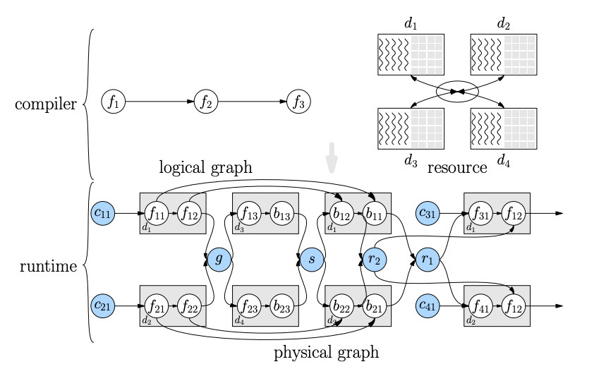
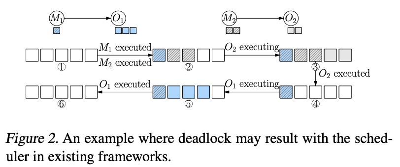
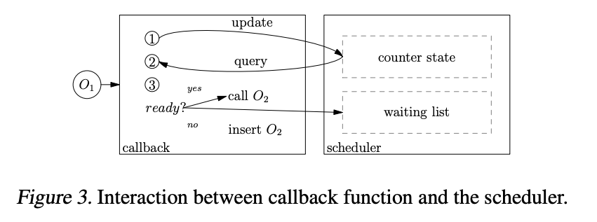
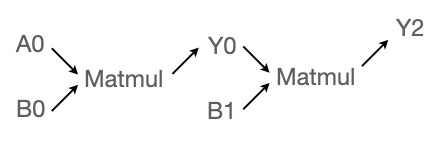
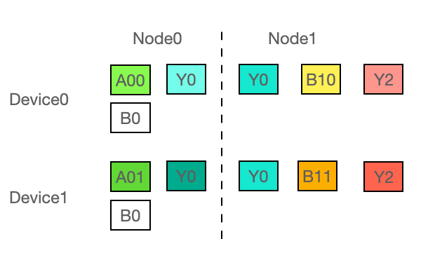
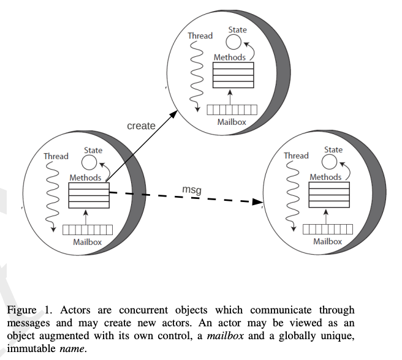
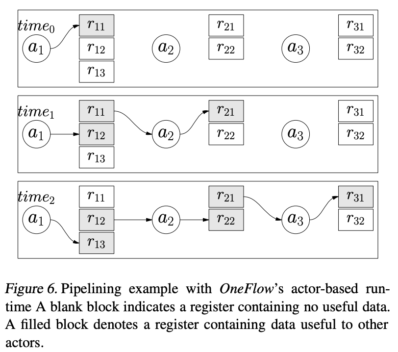
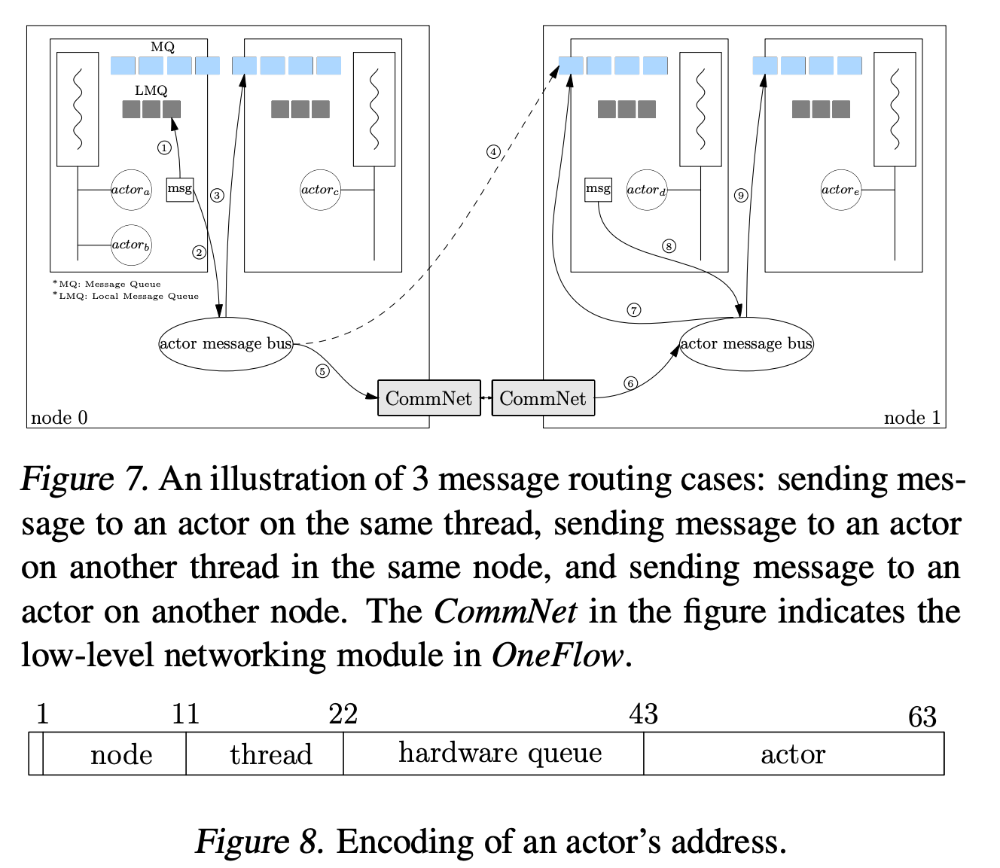
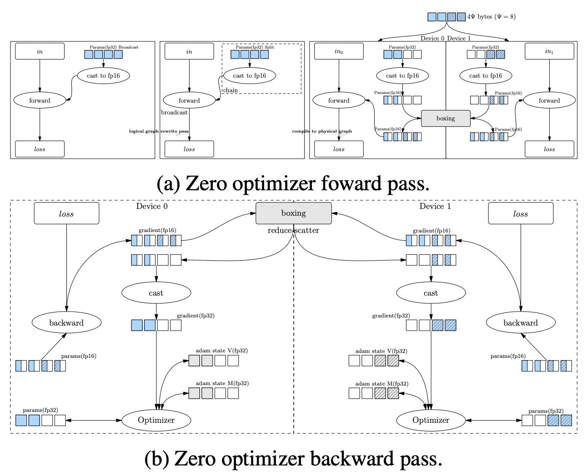

1. 在解决的是什么问题？现有 DL 框架在大模型上使用和实现复杂的问题
2. 为何成功，标志/准是什么？
3. 在前人基础上的关键创新是什么？ SBP 的分布式抽象和 actor 模型来简化依赖和执行的运行时关系: 能管理资源限制、数据移动和计算三种依赖
4. 关键结果有哪些？简单、整洁，效率比其他要高
5. 有哪些局限性？如何优化？
6. 这个工作可能有什么深远的影响？

## 介绍
最好情况下，一个 DL 分布式框架应该：

1. 给定任意的并行方案后，能自动生成物理的执行计划，减少手工编程的代价
2. 更高级的需求是：框架能找到在任意NN网络结构和硬件组合下，最佳的并行策略

但，已有框架甚至都不满足条件一，即灵活支持多种并行策略。这是我们想在本论文里解决的问题：创新地重新设计DL框架

一些新兴的开源项目开发了专用的系统或者定制了库来更好地支撑模型和pipeline并行。例如，点击预估里的 HugeCTR，Megatron-LM和DeepSpeed 面向 大规模预训练 NLP 模型。InsightFace
是给大规模人脸识别的模型并行。但这些都是给特定应用定制的，并不能组合起来来形成一个通用的方案

也提出了一些插件来增强一些主流的DL框架来至此更复杂的并行策略。

Tensorflow： Mesh-TensorFlow, GShard 提供 API 来做并行。GPipe

PyTorch: PipeDream

由于现存框架设计之初没有预见到如此复杂的并行，导致在上面增量开发会带来显著的额外系统开销，需要研究员花费大量时间

## 2 背景和动机
一个 DNN 通常被表达为一个**逻辑**的op组成的计算图，通常是手工或者自动被编译器转化到由优化后的kernels组成的**物理图**来在运行时执行。分布式训练中包含数据（参数、梯度、激活值）
的通信。由于主机间带宽是设备内部的一到两个数量级的差异，所以 DL 框架应该把数据搬用当作跟计算一样的一等公民

### 2.1 把负载划分到空间领域(Spatial)

比如上图中的三层的网络，虽然从编译器输入角度来看只有三个算子的逻辑计算图，它在编译后，实际运行时的硬件上跑，可能是上图中下半部分那样复杂：f1和f2算子是2路数据并行，执行在 d1 和 d2 上，而f3算子因为太大而无法在单机上执行，
被切分为两路的tensor 并行：在d3和和d4上模型并行。图里蓝色部分里，有一些是通信的算子：g(allgather), s(reduce-scatter), r1和r2都是all-reduce 操作



这个图不是很容易看懂：

1. 蓝色的是既有输入，又有通信算子
2. f的下标，无法区分出是数据还是模型并行
3. 通信算子，没有交代为啥是 all-gather、reduce-scatter
4. c31、c41 为啥放上去？r2是reduce完，再去更新参数？

### 2.2 把负载划分到时间领域(Temporal)

指如何安排算子来让硬件利用率最大化。通常性能提升的最好方法之一是让通信和计算尽可能重叠。

同一批次的 forward 和 allreduce 不能同时进行，但是数据加载和前处理可以和上一批次数据同时进行。反向传播和all-reduce 操作也是可以重叠的

### 2.3 管理复杂依赖
主流的 DL 框架里，数据和控制依赖都是用执行图里的边来表示的。在每个op执行结束后，调度器会更新剩余算子的依赖，找出依赖都被满足的算子来执行。

**由于资源共享而引起的依赖** 



调度器需要决定合适的执行顺序来避免多个算子共享同一个资源情况下导致的 OOM 错误或者死锁(主要是通信和计算的共享，因为目前 pytorch 里计算流是默认流)。
考虑图2里的例子。M1和M2是两个数据搬运的算子，服务于同一个设备上的两个计算操作：O1和O2。O1和O2不依赖于对方，而O1相比O2需要更多设备显存来执行。M1
和M2自身也需要一些设备内存来存储搬运的数据。M1和M2执行完之后，剩余显存只够执行O2，但此时O1和O2都在调度器的ready集合里。如果O1先执行，显存是不够的。
而系统可能会报 OOM，或者阻塞住调度线程(不太理解，应该是阻塞住当前这个O1操作把？)，而后者会导致死锁。为了避免这种风险，框架最好提前指定执行顺序（比如
在 TF 里添加**控制**这种依赖）。如果系统使用流水来重叠数据移动和计算，这个问题会变更严重，因为M1和O1可以同时执行：M1搬运下一片内存时，O1在计算上一片数据。
在编译期**规划好资源**，在运行时做好**流控**是执行稳定所必须的。对于动态shape，应该是不好做提前规划的

**由于数据搬运而导致的依赖**



已有的DL框架没有把数据移动当作图里的正常操作。因此，数据搬用和计算之间的依赖并没有被表示在计算图里。例如，TF 把节点内的数据搬运包装在了 callback 函数里，
需要时插入。因此，计算/控制依赖在图的边里表达，而数据依赖在回调函数里。在图3里，O2被包装在O1完成后的回调函数里。然而当O2有其他依赖，比如需要其他op的输出或者
控制依赖(control dependencies)，此时O1完成并不能就执行O2。此时回调函数应该告诉调度器O1执行完：然后调度器返回其他依赖也完成了，O2可以立马执行；否则O2
需要被插入到等待队列里。将来所有依赖都满足后，再调度。（那不能就直接放到等待队列里，让调度器判断？） 得看看这种情况出现的概率大不大？
上述例子里，框架需要把内部调度器暴露给用户来让插入的回调函数能正确和调度器交互（图里判断是否ready的过程）
但目前 DL 框架不太支持这种操作，没有哪个 DL 框架给用户暴露了调度的接口。理想情况下框架应该把所有依赖显示地在图里OP间呈现(包含数据移动)。一旦达成，在运行时执行图
就会被极大的简化。

上述例子不足：

1. 上一节里O1和O2是两个算子，这里看起来 O1 和 O2 都是计算算子，但是O2需要O1 进行数据搬运？（是通信还是内存拷贝操作呢）

### 2.4 总结
设计了 OneFlow，一个编译器可以自动产生一个物理的图来执行数据、模型和流水并行。编译器支持完整的分析各种依赖关系（比如资源、数据搬运和计算）。如何做到支持共享资源的依赖判断呢？如何支持数据里动态shape？如何知道计算时的资源有多大?
而且我们基于actor model 设计了简练的执行时，能够用一个一致的图里actor之间消息传递来实例化所有的依赖关系

## 3 编译器

假设每个算子都被赋予了一个属性叫 placement，标示在哪个节点（物理机器）和设备上，这个逻辑的算子会被部署上去。类似地，一个全局 tensor（一个逻辑op的输入或者输出）被映射到多个本地tensor上（比如逻辑op被放置的多个对应设备上）

### 3.1 指定每个Tensor和每个OP在分配的设备上的并行方式

设计的 SBP，是一个数学上的抽象层，指定一个全局 tensor 和对应的本地tensor之间的映射关系，包括：split(S)，broadcast(B)和partial-value(P)。比如图4展示了一个2x2的tensor被映射到2个本地tensor，其中有4种类型的 SBP mapping：
split(0), split(1), broadcast, partial-sum. 


从上图可见，split是指local tensor是沿着某个维度切分的，broadcast是指本地tensor是global tensor的拷贝。partial-value是指本地tensor和global tensor形状完全一样，而全局tensor是通过在所有本地tensor上执行逐元素规约操作（比如sum，max等）
得到的。

图5展示了在把逻辑图转换为物理图时，插入的 boxing op来完成数据搬运


### 3.2 Modeling Data Routing
模型的数据路由，主要讲自动插入通信的op来完成各种模型并行

### 3.3 Difference from GShard's Abstractions

partial-value 的好处是比立即reducing partital 的结果更高效. 有了 partial-value，oneflow 可以让系统选择最佳的时机来插入一个 boxing op（比如 reduce 或者 allreduce op）。
### 3.4 编程接口
编程接口的设计目标是让 op 的 API 和模型描述，在单卡和分布式版本下保持一样。而不同的分布式策略下，用户只需要设置一些tensor的placement和SBP的签名即可。

考虑图5里展示的例子，M1和M2分别使用数据和模型并行。

其逻辑图如下，就是两个 Matmul操作，只是涉及到数据并行和流水并行，而只需要在逻辑图上，设置每个Tensor的placement和SBP签名即可实现



下图里的代码展示了OF如何做到。

```
1 import oneflow as flow
2 P0 = flow.placement("cuda", {0:[0,1]})
3 P1 = flow.placementt("cuda", {1:[0,1]})
4 a0_sbp=flow.sbp.split(0) # data parallel
5 b0_sbp=flow.sbp.broadcast # 
6 y0_sbp=flow.sbp.broadcast
7 b1_sbp=flow.sbp.split(1) # model parallel
8 
9 A0=flow.randn(4,5,placement=P0,sbp=a0_sbp) # data parallel
10 B0=flow.randn(5,8,placement=P0,sbp=b0_sbp) 
11 Y0=flow.matmul(A0,B0) # 会自动推导出Y0的 SBP 签名 split(0)
12 
13 Y0=Y0.to_global(placement=P1,sbp=y0_sbp) # 要 allgather吧？是为了15行里能正确计算。 split(0) -> broadcast
14 B1=flow.randn(8,6,placement=P1,sbp=b1_sbp)
15 Y2=flow.matmul(Y0,B1)
```

问题： 

1. 用户自己写，得知道op上支持的操作类型，可能会写出不支持的SBP签名出来
2. 上述 L5 的 b0_sbp，这个是类似DP，初始化时，一个instance 初始化后，广播到其他人？其实只广播一次，后续只是通过 allreduce 来达成一致

上述的local tensor布局如下图，类似颜色代表是同一个global tensor的切分，相同颜色代表形状跟global tensor 一致。由于Y0涉及到跨主机传输，所以这里用了流水并行：M0和M1之间




## 4 运行时
我们在运行时使用了 actor 模型。每个op是一个很薄的 actor 封装，抽象了op的依赖和资源使用，把他们放到 actor 的状态里。Actor和其他人之间通过消息传递**而非函数调用**来交互。
一个 actor 状态会在它从其他人接收到消息后进行更新。actor model 可以优雅地解决很多现有 DL 框架里的多种问题



### 4.1 Actor 模型
有以下4个组件

Register: 简单地记录tensor的地址。有两类：in 即要被actor消费的tensor；out 即要被生产的tensor

Messages: 和其他之间进行交换信息来通信：req 消息是生产者发给消费者，告知消费者一个包含新产生 tensor 的 register 被产生了，可以读取了。ack 消息是消费者发给生产者，指示特定的 reigster 不再被消费者使用了

Actions: 绑定在 actor上的 op(比如执行一个 GPU kernel 或者数据搬运)

A state machine: 每个 actor 记录依赖是否满足


### 4.2 给一个op的输入和输出tensor(in、out register)的显示资源依赖计数器
每个 actor 分配了一个预定义数量的 out register，代表每个 actor 上固定数量的显存 quota。如果一个 actor 使用完了，下一个 action 就不会被调度，即使它的所有输入 tensor 都ok了，直到之前分配给 actor 的显存拷贝被回收。
为了达成这个目标，我们给每个register分配了一个计数器。in counter 被初始化为0，记录 in register 里拿着的可以被消费的 tensor 数量，而 out counter 里非零的初始化值代表空闲的显存 quota。每个 action 会让一些 out counter
变小。只有当一个 actor 的in  counter 符合预期的非零值（即输入tensor ready），out counter 是非0（有显存可用），才有可能触发一个操作。

那看起来 oneflow 里，永远不会出现 OOM？只会出现因为显存不够而 Hang 住，或者速度执行非常慢

已有的 DL 框架里，调度器只考虑 OP 的输入是否 ready，是就立马开始执行，不会考虑之后这个算子是否能成功获得要写入输出的显存。当op被调度后，只有当执行操作前，运行时才会尝试即时分配显存，此时会成功或者失败。通过 in和out counter，
oneflow 把资源可用当作了调度器的显示依赖，可以决定一个 OP 是否能成功执行。这样，编译期的资源规划和运行时的流控才成为可能。

上述提到的 in/out counter 有不同含义：输入 tensor 生命周期由它的消费者管理，所以消费者只需要记录有**几个** tensor 就行；而 out 是自己管理的，需要记录每个输出tensor的显存大小

** Reference counting with message passing** 

除了 in/out counter，还需要给每个 out register 额外一个初始化为0的 reference counter，表示寄存器在使用中，内容不能被修改(复用)。而这个引用计数可以根据消息传递的协议进行修改：

* 生产者发送 req 消息给一个消费者，会让与消息关联的 out register 的引用计数加一。而一个引用计数从0到非0的变化会让一个 out counter 减一。说的都是生产者 actor 这里
* 消费者接收到 req，知道一个 in register ready了，会让 in counter + 1
* 消费者用完in register 里的 tensor，会让 in counter -1，发送ack 给消费者，说消费完了
* 生产者接收到 ack 消息，会让关联的out register 的引用计数-1。如果引用计数减到0，说明对应的 out register 没有人用了，可以回收了

上面协议里，如果一个 out register 被其他人使用，那么引用计数就非零，所以会一直存在。利用这种互斥性(mutual exclusion property)，可以实现零拷贝机制：如果生产者和对应的消费者在一台主机上，消费者可以直接使用生产者的内存，
而不需要再单独拷贝一份。

### 4.3 应用：流水和背压机制(back pressure)



让 register 的 out counter 大于1，可以容许并行处理多个批次数据。每个actor独立运行，天然的形成流水线。同一个 register 上的多个批次，可以认为是传统 DL 框架里用到的双缓冲里的泛化版。图6里，actor1 有三个输出 register；
actor2 和 actor3 有两个 register(这里一个 register代表当前OP有可以执行一次OP所需的输出资源，可能是多个 tensor)

* 在 t0， a1 产出r11，而a2和3因为输入为0（in counters==0），而空闲
* t1，a2可以干活( in counters > 0 && out counters > 0)。而a1因为 out counter > 0 而可以再次执行一次 OP(是另一个微batch)
* t2，3个 actor 的 action 都可以被触发，因为所有依赖的register 都满足

本质上，actor-based 协议和 ATM(asynchronous transfer mode: 异步传输模式) 网络credit-based flow 控制方法是等价的。如果out reg都被使用(out counter == 0)，那 producer 就不能生产了。没有这种背压机制（现有的框架都没有），
消费者很快就会因为消费者很慢而OOM

现有框架里是怎么做 Minibatch 呢？

## 5 实现
**Actor 寻址和消息路由**


和 CUDA stream 类似，我们抽象其他硬件资源（比如网络和CPU）为FIFO 队列。保证不会因为共享资源而导致隐式依赖。例如，会为拷贝和计算引擎创建各自独立的 cuda stream。为了减少设备上下文切换(actor和设备队列在一个OS线程上，这个没太懂)，OF 给每个硬件设备队列创建了一个专门的
OS线程，actor使用相同的队列（或者硬件资源）是被绑定到相同的OS线程上（即图7里的 actora和actorb）。使用 actor，device，OS thread 和节点之间的静态绑定，OneFlow给每个 actor 分配一个唯一且层次化组织的64位地址（等价ID），如
图8。这样消息路由时带着接收者 actor ID 就够了。

在 OneFlow 里，所有运行在相同 OS 线程上的 actors， 共享一个 FIFO 消息队列。Actor接收消息时，消息先会被对应的 OS 线程放到队列里，然后不断 poll 队列，把消息分发给对应的 receiver（即花圈的case3）。同时每个 OS线程上还有一个本地消息队列。因为发送方把消息放到了
本地消息队列，由同一个OS线程上的接收方直接处理，无须OS线程poll(case 1)

**统一内部和节点间的 actor 系统**

引入了 actor message bus 这个抽象层，提供了统一接口来路由消息到接收者，无论接收者在相同还是其他节点。图7里，actora到actord的消息进过逻辑路径 2,4，但是实际路径是 2,5,6,7。这个抽象隐藏了底层网络通信的细节。(像隧道)

和已有框架不同，OF并不会在跨节点通信时在两边分别插入 Send 和 Recv op，编译器只会在消费方插入一个专门的网络 actor，来从生产者那里拉数据。图7里，节点1上的actore需要节点0上的actora；当产生物理图时，编译器产生actord，它的唯一职责是
从节点0拉取输出到节点1，这样actore就可以认为消费方在本机。


### 6.4 优化器并行

DDP 里的参数、梯度、优化器等模型状态可以通过分片到各种设备上来减少显存消耗，每个设备只需要保存分片后的部分模型数据。当需要整个模型时，使用all-gather。OF 可以更简单来实现。上图14是OF产生的两个设备的物理图，使用混合精度。首先转换OP（比如 fp16 cast）被插入。第二，
框架设置cast op的输入为 S（0）,cast OP 的输出为 B。编译器就能自动产生 forward 和 backward 的物理图。数据路由的op（搬运）会被自动插入。ZeRO-DP 的实现需要 2k 行 pytorch 代码，但是OF 只需要300行。

图14：在OneFlow 里并行优化器


上述图里是优化器状态+梯度+参数都 split 了。实际就是每个人负责存储某几个层，以及计算这几个层，它可以把所需数据从别人那里拿过来
### 问题
1. 依然是 SPMD？不会涉及到要把不同的函数分发到不同的设备上去
2. 那是根据物理图，去部署 op？ 可以看看现有框架怎么做的

## 启发
1. SBP 之后，需要通信的地方，是可以自动推导出来的. 连 AllReduce 也是，这个也是因为目前 SBP 这种模式下特点
2. 

## 参考资料
1. [UCLA: Actors](http://web.cs.ucla.edu/~palsberg/course/cs239/papers/karmani-agha.pdf)
2. [4minutes Actor Model Explained](https://www.youtube.com/watch?v=ELwEdb_pD0k)
