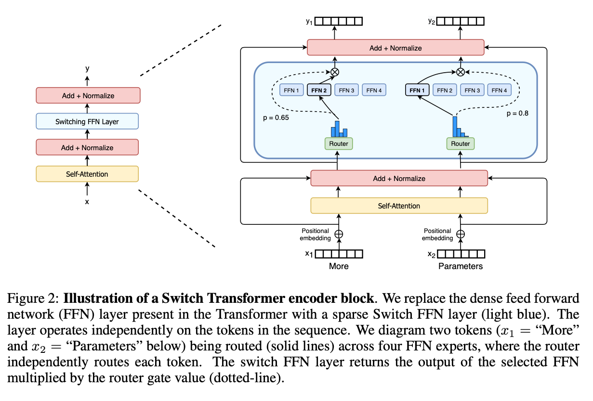
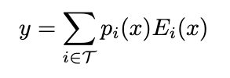
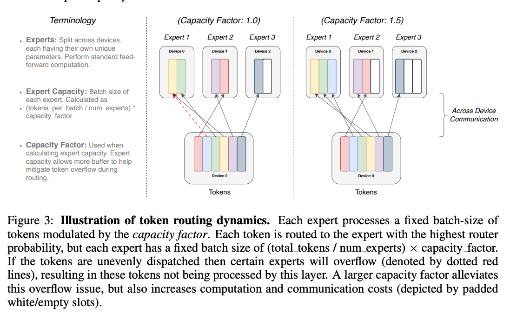
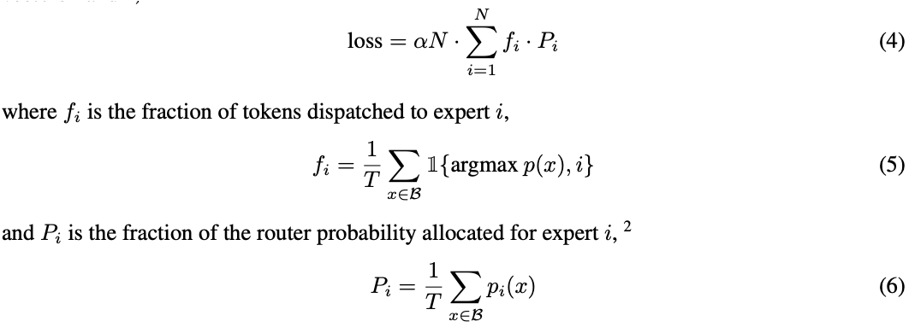

1. 在解决的是什么问题？解决 MoE 大规模应用里的一些障碍：复杂、通信量大，训练不稳定
2. 为何成功，标志/准是什么？
3. 在前人基础上的关键创新是什么？routing 策略简化，通信减少，计算量减小，缓和了不稳定，第一次在大规模稀疏模型上训练了低精度(bfloat16)
4. 关键结果有哪些？T5上，有七倍速度提升。
5. 有哪些局限性？如何优化？
6. 这个工作可能有什么深远的影响？

## 1 介绍
发现不仅在超级计算机上领先，即使是几个核的情况下也有收益。我们的大规模稀疏模型可以被蒸馏到小的稠密版本，保留30%的模型收益。贡献主要在这：

1. Switch Transformer 架构，简化并提高了 MoE在一个卡上
2. Scaling 特性和性能与 T5 对比，预训练方面有7倍速度提升，而每个 token 使用的 FLOPS 是一样的。
3. 稀疏预训练模型能成功蒸馏到专用、精调的稠密小模型。模型减少了99%，但质量依然能保留30%收益。
4. 提高的预训练与精调技术：a) 选择性使用 bfloat16 精度，b) 一种容许扩展到更大规模专家的初始化技术 c）增加的专家正规化，提高了稀疏模型精调和多任务训练
5. 在多语言数据集上的测试，发现101中语言上，91%的语言受益超过4倍加速，与 mT5 baseline 相比
6. 神经语言模型上的规模增大，来自于高效结合数据、模型、专家并行来创建1T参数的模型。这些模型与T5-xxl 基线比，提高了4倍预训练速度

## 2 Switch Transformer
ST 的指导设计原则是最大化一个 Transformer 模型的参数量，以一种简单、计算量高效的方式。

我们分布式训练设置下，稀疏激活层(Sparsely activated layers)把唯一的权重切分到不同设备上。这样，模型权重随着设备数量而增加，而每个设备上的显存和计算占用量不变（这个在17年就是这样的）

我们把稠密前向网络(FFN)层，用稀疏Switch FFN layer(亮蓝色)代替。这个层在序列的每个 token 粒度上独立进行。图里有两个 token (x1 = "More", x2 = 'Parameters')被路由(实线)到有
4个 FFN 专家上，路由独立给每个 token 路由。switch FFN 层返回被选中的 FFN 的输出乘以路由器门值(虚线)

### 2.1 简化稀疏路由 (Sparse Routing)
**Mixture of Expert Routing** 17年 Shazeer 提出的自然语言里的 Mixture-of-Experts 层，会把输入token路由到最好的 top-k 专家上，是从N个专家里选择的。路由的变量 Wr 产出 
logits h(x) = Wr*x ，会被softmax 标准化。专家i的 gate-value 是(下文就是指 softmax 之后大家的占比)：

topk ，假设 T 是选出的 topk 的下标，那么这个层的计算输出是每个专家输出的线性加权:

** Switch Routing** : 重新思考 MoE。当初17年 Shazeer 的结论是 k > 1 的专家是必须的，为了能让门函数有梯度。但我们使用了简化的策略，只路由给单个专家，我们发现这样模型质量有保证，
减少了路由的计算量，效果更好。这种k为1的路由策略被称为 Switch layer

Switch layer 的收益有三重：

1. 路由计算量降低
2. 每个专家的批量大小(expert capacity)至少减半(halved)，因为每个 token 不会发给两个专家了，只发给一个
3. 路由的实现简化，通信开销降低

图3 展示了使用不同专家容量的路由策略的差异

每个专家处理固定大小的 batch-size token，是 capacity factor 取模。每个 token 被路由到最高概率的专家上，每个专家有固定的batchsize： `total_tokens/num_experts * capacity_factor`.
如果tokens是不平均分配，那么有些专家会溢出(红色虚线)，导致这些token 不会被这层处理。大容量因子缓解这种溢出问题，但是增加了计算和通信开销（使用白色、空白的槽来对齐）

### 2.2 高效稀疏路由 (Efficient Sparse Routing)
我们使用 Mesh-Tensorflow (MTF) (Shazeer 2018)，它是一个库，有跟 Tensorflow 一样的语义和 API，带高效的数据分发和模型并行。它通过把物理的核抽象为逻辑的mesh 处理器。Tensor 和 计算能被分片到
命名的维度上，让模型在跨维度分片上非常方便。我们设计模型时脑袋里有 TPU，它需要静态声明的大小。下面描述具体细节：

** Distributed Switch Implement** 所有tensor 的大小都是静态在编译时决定的，但是计算是动态的，因为训练和推理时，路由策略是动态的。因为这个原因，一个重要的考虑是如何设置专家容量。专家容量
-- 每个专家计算的token数量-- 。好像这里说的都是 capacity factor 如何取值的问题

** 可微分的负载均衡 Loss **  原始的 17年 Shazeer 论文里，使用了一个单独的 balanced load across experts. 而 ST 里简化了这个过程，没有单独用一个 loss。

由于我们希望一批里的 tokens 在N 个专家里的路由是均匀分布(uniform)，所以希望希望路由给每个专家的概率是 1/N，而 tokens 也是1/N的概率分发到这个专家。上述等式4鼓励 routing 是均匀分布，因为只有这种情况下，
才能达到最小值。

### 2.3 组合到一起：ST

### 2.4 Training 和 Fine-Tuning 技术
训练不稳定问题，可能是因为hard-switching。而且低精度比如 bfloat16 会加剧router上 softmax 的这个问题。下面是困难和应对方法

** Selective precision with large sparse models** : 用 bf16 一方面节约计算，另外能节省通信开销

** Smaller parameter initialization for stability** : 

** Regularizing large sparse models** : 参数量很大后，在下游任务上可能会有 overfitting。

## 3 Scaling 属性
随着专家数量增加，计算量差不多是固定的，因为每个token上只选择一个专家。router计算的概率分布需要计算的专家数量增多，但这个也是计算复杂度为`O(dmodel*num experts)`。下文主要讨论固定计算量下，在 step basis 和time basis 上的scaling 属性。
### 3.2 Scaling results on a time-basis
固定训练时长和计算开销的情况下，一个人应该训练dense还是 sparse 模型？

## 4 下游结果
部署这种超大模型非常不方便。为了缓解，我们使用蒸馏来把稀疏模型蒸馏为小的稠密模型。

通过各种技术方法，最终达到只需要 1/20 的参数，就能保留30%的超大稀疏模型的能力。

7里看到，把 T5-Base 的权重从 Switch-Base初始化而来，使用混合了teacher和真值标签的loss后，性能达到最高。
## 5 使用数据、模型和专家并行来设计模型

** Reviewing the Feed-Forward Network(FFN) Layer : 

## 8 未来工作
1. 大模型的训练稳定性。虽然我们的稳定性方法在 Switch-Base, Large, C 上有效，但是在 Switch-XXL 上无效。未来可以试试 regularizers, adapted forms of gradient clipping
2. fine-tuning quality, FLOPS per token 和 参数量之间的依赖关系还没研究明白
3. 理想情况下，给定硬件配置（计算，显存，通信），一个人可以很快设计出一个最优模型。同时反之，能够帮助设计未来的硬件
4. 我们方法使用的是一致的，同构的专家，但未来可能会支持异构的专家。这样更灵活地可以适配：当希望更大计算量时，路由到大专家上--或许是为了处理难样本
5. 尝试 Transformer 的 FFN 层之外的专家层。附录 A 里，我们汇报了在 Self-Attention 层里面添加experts后，有性能增加。但是bfloat16下不稳定
6. 在新的或者跨多个模态情况下尝试 Switch Transformer

## 问题
1. 速度增大4倍、7倍、这个是为什么？

