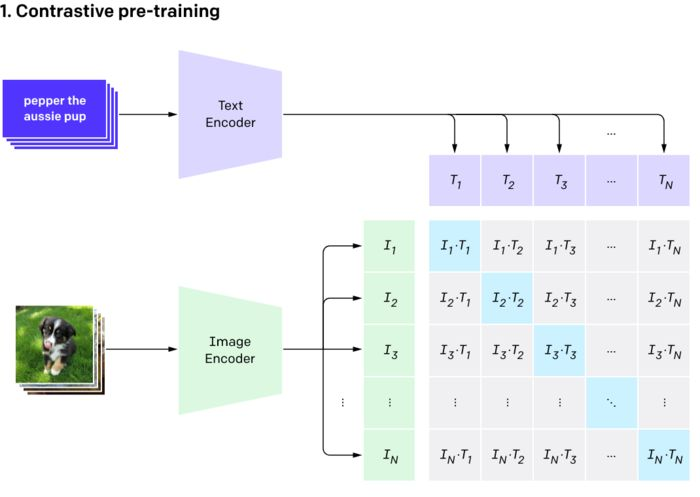

## What is CLIP?
是首个多模态(视觉和文本）的模型，解决机器视觉上的问题，在2021年1.5由 OpenAI 发布。"CLIP(对比性的语言-图像预训练)是一个在各种图片、文本训练对上的神经网络。给定一个图片，它在自然语言上用来预测出最相关的文本片段，没有直接在这个任务上优化过，类似 GPT-2 和 3里的 zero-shot能力"

* 它是在4亿图片文本对上训练的。图片文本对可以是图片它对应的标题
* "给定图片，可以预测最相关的文本片段": 给定CLIP 模型，它会返回最相关的标题或者是图片的总结
* “不需要直接优化特定任务，类似GPT2-3的 zero shot 能力” 大部分机器学习的模型学习的是特定的任务。比如图片分类狗和猫的分类器，在我们给定的任务上表现很好，但是通常不期望它能在分类树濑上表现好。但是一些模型，比如CLIP、GPT-2、GPT-3 倾向于他们没被直接训练过的场景（zero shot 学习）上也表现良好
* “Zero-shot 学习”是模型尝试预测它在训练数据里没有见过的类。比如在大量猫狗数据集上训练的模型，去检测浣熊。CLIP这类模型，因为使用了《图片，文本》对的信息，让它在 zero-shot learning 下表现良好--即使你正在找的图片和训练集图片差距很大，CLIP 模型也能给一个好的标题

它(CLIP) 是计算机视觉和自然语言处理之间的桥梁，而且是有很多灵活性、应用场景下

## How CLIP works
图片、文本都被 embedded，它是一种把信息映射到数学空间里去的方法。CLIP 模型包含两个encoder子模型：

* a text encoder: 可以把文本做embed
* an image encoder: 可以把图片做embed

在有监督的模型里，需要找到一个模型评估好和坏的方法

CLIP 模型也不例外

上图里，亮蓝色矩形代表图片和对应的文本。比如T1是第一个文本的 embedded 表示；l1 是第一张图片的 embedded 表示。我们希望 l1 和 T1，l2、T2 的余弦相似度尽可能高。而其他灰色的矩形代表图片和文本不匹配，所以希望这个的余弦相似度尽可能低。

CLIP在4亿图片上训练，花费了592张V100，训了一个月，花费了1百万美元。

一但训练好，就可以给图片encoder传一张图片来获得与图片最匹配的文本描述，反过来，可以传入一张文本描述来搜出一个张图。

## why CLIP is cool

一些优势：
* 通用性：把模型分类的知识扩展到了更广阔的事情上，通过文本里的语义信息。标准的分类模型完全抛弃了分类标签上的语义信息，只是枚举了场景背后的数字类别。CLIP 是搞懂了类别的语义
* 把文本、图片连接了起来。是“世界上最好的起标题的写手”
* 已经标签好的数据: CLIP 是在已经有的图片和标题上训练的，而其他sota的CV算法需要大量额外的人工标注
