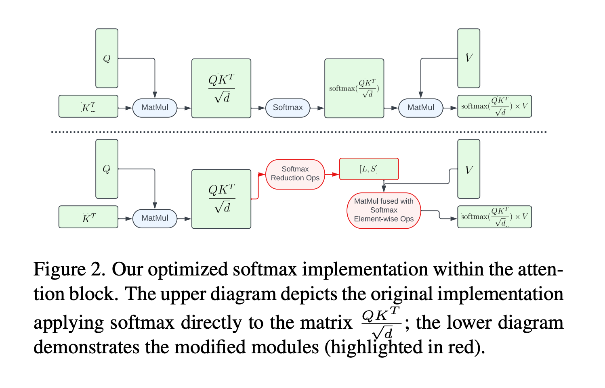

1. 在解决的是什么问题？一些给大的 diffusion 模型加速推理的方法。比如 sd 1.4 上不用 int8 量化，就能在**设备**上加速的方法
2. 为何成功，标志/准是什么？
3. 在前人基础上的关键创新是什么？
4. 关键结果有哪些？
5. 有哪些局限性？如何优化？ 都是一些实现上的提升，在GPU-powered 设备上，比如 Samsung S23 Ultra，512，20step是 11.5 秒
6. 这个工作可能有什么深远的影响？

## 摘要
我们提出了一些列优化方法，是目前截止最快的：512x512 的图，20 steps，无须 int8 量化可以跑到 12 秒。在 Samsung S23 Ultra 上 是 11.5 秒

Samsung S23 里使用的是 OpenCL，而设备是 QUALCOMM Andreno：

Compute Units 6, Maximum Frequence 1 MHz，设备显存是 5.40 GB

**设备侧的模型推理加速**
softmax： 有多种方法。
Winograd Convolution: 减少了乘法的次数，计算更快
Transformer: Reformer，使用了稀疏估计的方法；其他工作使用了 low-rank 或者混合的方式；而 FLashAttention 是利用硬件特性来加速的方法

## 3. GPU-Aware Optimization

### 3.1 Specialized Kernels: Group Norm 和 GELU
把 feature map 分解到更小的组里，正规化每个组。跟其他之前的方法不同，我们没有顺序地使用 reshape, mean, variance, normalize，而是设计了一个在 GPU shader 里唯一的 kernel，在一个 GPU 里执行，无须额外的中间 tensors

GELU: Gaussian Error Linear Unit

### 3.2.1 Partially Fused Softmax

### 3.2.2 FlashAttention
FA 的特点是仿存变少了，它的 kernel 是 register 密集性的。所以我们挑选了对于 dimension d=40 的 attention 矩阵。

### 3.3 Winograd Convolution
把卷积改为了一系列的矩阵乘法，关键是精心挑选了转换矩阵，让计算更加高效。但是增加了显存消耗，增大了数值误差，尤其是使用更大的 tile size 的时候

