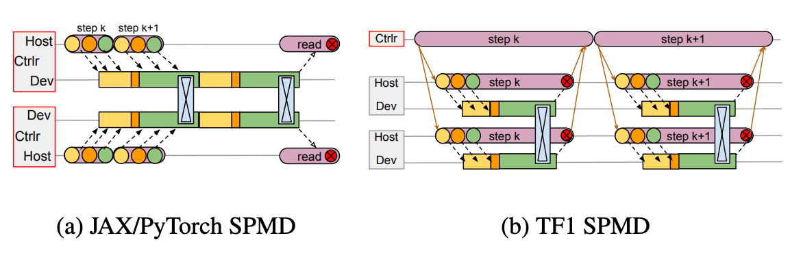
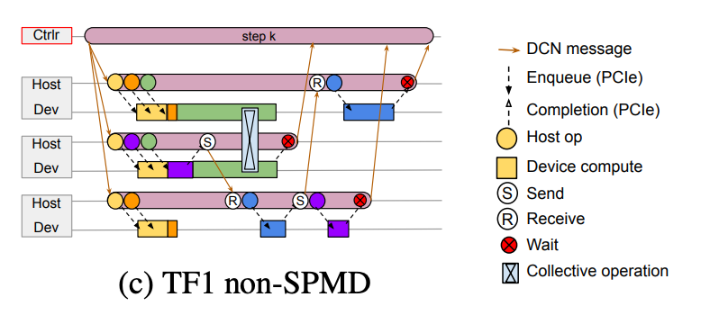
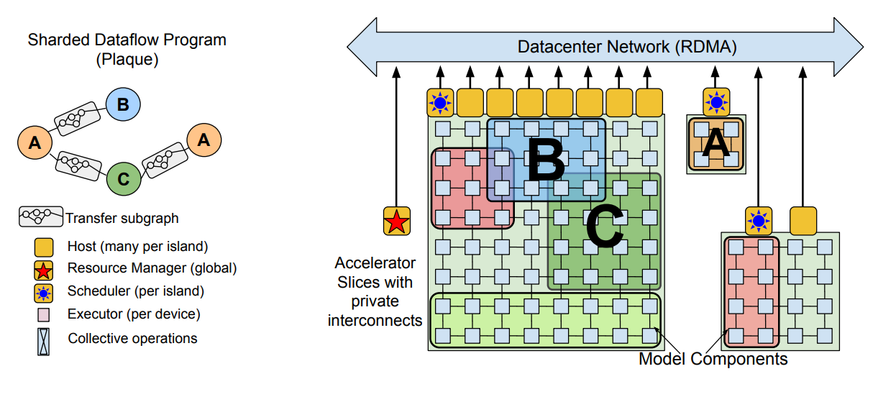
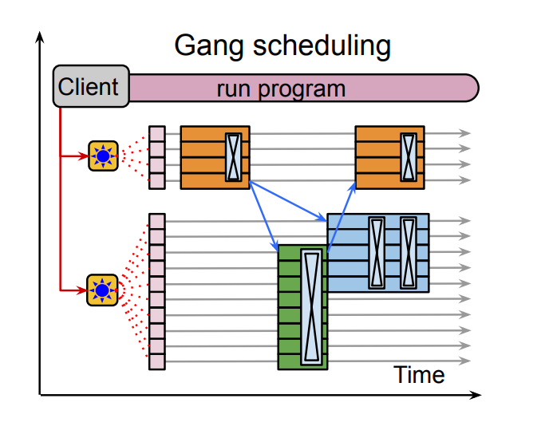

简单理解为目前的机器学习基础设施和框架，很难支持大规模、稀疏或者不规则的模型

1. 在解决的是什么问题？ 给加速器使用的大规模(上千万的卡)调度层
2. 为何成功，标志/准是什么？
3. 在前人基础上的关键创新是什么？sharded dataflow graph of a asynchronous operators that consume and produce futures. efficiently gang-schedules heterogeneous parallel computations。尽管有数据面的依赖，但控制流依然可以并行执行（asynchronous distributed dataflow)
4. 关键结果有哪些？
5. 有哪些局限性？如何优化？
6. 这个工作可能有什么深远的影响？

## 摘要
一个单一的控制器模型(a single-controller model)让表达复杂的新的并行模式更容易。

## 1. 介绍
本文认为目前的 ML系统设计的太特定于当前的负载，而无法扩展到未来的需求上。例如大部分都使用 一个程序，多份数据(Single Program, Multiple Data)的模型，这是受 MPI 启发出现的，所有的加速器都运行同样的计算，步调一致，通过 AllReduce 等集合通信来通信。如今有不少是需要流水并行以及 MoE的，虽然他们能构建在
MPI 之上，但是限制太多了。

另外，随着新一代加速器的产生，ML集群越来越异构了。把大量高速互联的同构加速器岛屿直接排他地提供访问是很贵的，经常是浪费了的，因为单个用户程序需要让所有加速器持续忙碌。这些限制让推动了研究员朝“Multiple program Multiple data”(MPMD)迈进，它可以通过把整个计算分为多个子部分，然后把子部分映射到小块岛屿的加速器上。为了增加使用率，
有很多 ML 硬件资源管理领域的研究。如在多个任务间，提供更细粒度的多路复用(multiplex)，让负载更弹性，提高容错。

最终，研究员开始在一个基础的模型上开始干活。这样一个基础模型上接很多不同的下游任务，希望他们一起训练。

本文提出的 Pathways，是client server 架构，让运行时能在多个 client 情况下，执行多个程序。它是第一个设计来实现透明、高效地跨多个 TPU pod 运行程序的系统，通过使用新的数据流执行模型，它可以扩展到上千个加速器。它提供的编程模型
让表达非 SPMD 计算非常容易，而且让集中式资源管理和虚拟化提高了利用率。

## 2. 设计动机
当前 ML 系统的限制。

目前的机器学习基础设施和框架，很难支持大规模、稀疏或者不规则的模型。

给  SPMD 模型用的分布式的 ML 系统，经常利用**多控制器**的架构，相同的client executable被直接运行在所有的主机上，在程序执行期间，会排他性地拥有资源。比如 MPI，PyTorch，现在的 TensorFlow 和 Flax。这种设计的核心优势是分发加速器计算时延迟很低，因为所有加速器上的代码都一样，
分发涉及的通信只需要经过相对快的 PCIe 链路。其他通信只通过集合通信，利用专门的互联方法如 NVLink 来发生，不需要经过宿主机内存。然而对于使用流水或者稀疏计算的负载，这种设计不好。任何涉及到超过集合通信的方法，都需要用户自己实现协调的原语。多控制器经常假设对硬件资源的排他性使用。这样不仅
把保证高利用率的责任推给了用户，而且让实现一些特性比如资源虚拟化和多路复用复杂化，而这些特性是构建高效集群的基础。

单控制器系统如 TensorFlow v1，提供非常普适的分布式数据流模型，包括优化了的图内控制流。一个 TF python 客户端构建一个计算图，把它交给运行时的协调者，它会把图分为几个子图给到每个worker，委托worker上的本地运行时做子图的执行。在 worker 间的协调是通过数据中心网络(Data Center Network)来进行数据和控制侧的消息传递。
尽管单控制器设计提供了更弹性的编程模型和资源的虚拟化，但是带来了设计挑战。

首先，多控制器系统只需要通过 PCIe 来分发加速器计算图，而通过DCN来分发的延迟，通常是比 PCIe 要慢多个数量级的。
其次，为了支持并发执行 MPMD 程序里的 SPMD 子计算图，每个子图都跨越一个共享集群里的部分加速器，运行时必须支持加速器上的 gang-scheduling(成组)调度. 这个对 TPU 非常关键，因为 TPU 都是单线程的，而且只能运行非抢占式内核，所以如果通信和计算如果不是用一致的顺序入队列，系统会死锁。即使对于 GPU 和其他能执行并行计算的加速器，
成组调度会有更高效的集合执行效果。因此单controller的系统，需要一个分布式的调度机制来安排不同程序的计算顺序。

最后，系统需要能在上千个加速器上执行计算，把共享表达和数据结构(shared representations and data structures)当作一等公民。例如，一个简单的表示 M 路分片计算和 N 路分片计算之间的数据流图，会需要 M+N个节点，M*N个边，很快就会笨拙、运转失灵。



从上图看到，Host 和 Device 上都有 controller，而 Host 通过 PCIe 与Device进行dispatch和通信(read wait)。而 TF1 的区别是它是单 controller，是个单独的。虽然 Host 上也有控制逻辑，但这个只是子图的，不涉及总的。所以这单个 controller 需要通过 DCN 消息与其他加速器通信，当子图执行完，需要通知 controller

TF v1 实现的选择，是专门用于单个，小规模，排他性拥有加速器的场景。这种过度导致很难用它来做当代或者未来的ML负载。虽然 TF 能够执行需要跨主机协调或者通过send 和 recv 算子的计算，host 侧的工作，比如分发加速器计算，只能在传输完成后，才能触发(?)。在设计大量跨主机传输的程序里，例如流水并行的程序，这些分发的延迟会累加，比如上图中的 step k 和 k+1 之间的空闲？
最终导致加速器利用率不高效。虽然 TF v1 的用户可以（低效地）通过使用控制边，实现单个程序上的一致顺序来做成组调度。缺乏中心的调度器，导致无法确保多个程序之间计算的一致性顺序(?). TF 会把整个分片的计算图 materialize，在shard的数量达到上千规模后，涉及引入潜在的计算图序列化和执行方面的开销，导致子计算图之间有上百万的图之间的边。




上图是 TF1 上跑 MPMD 程序的例子，每个 Host 上的跑的子图不一样，他们之间通过 Send/Receive 的 DCN 来通信

Pathways 结合了单个 controller 的灵活性和多 controller 的高性能(咋就没有对应的图了？有多 controller 的典范嘛). 选择单 controller 是因为觉得它能更好服务号创新和高效的ML计算：能利用好计算稀疏和异构，能够让集群管理系统提升分享和虚拟化资源的能力了。
我们的涉及和老的单 controller ML 系统的最大区别是使用了异步分发，来达到多 controller 的性能，支持集中资源管理和对成组调度的一等公民支持，使用了shared dataflow(啥意思？) 系统来高效协调。


## 3. 编程模型
提供的灵活编程模型。

我们实现了对 TensorFlow 和JAX 的支持，单本文只讨论 JA心 相关。JAX 用户可以用 Python 装饰器，显式包装标准的Python代码，来说明需要被编译为(可能是 SPMD)XLA 计算的片段。这些 XLA 计算通常是知道输入、输出类型和形状的，bounded loops, 有少数条件语句(看附录B)，因此很容易提前估算计算的资源。
我们把这类已知资源需求的计算叫做“编译后/好的函数”。Pathway 程序中，每个这类函数映射到单个（sharded）计算节点上。JAX无法扩展到多个 TPU pod 上，因为 JAX 程序运行在多controller 配置上，会使用 XLA 集合通信来传递数据(这是 JAX 的限制？)，这些目前在 TPU 上只能通过 ICI 实现（意思是无法跨Pod 使用？）。PW 可以作为 JAX 后端的替代品，让 JAX
代码可以无需修改，就能运行，只不过 SPMD 计算现在不仅能访问 locally connected TPU cores，也能访问系统里更多的核。因为PW 能通过 ICI 和 DCN 来通信，他让 JAX 程序第一次可以扩展到多个 POD 上（DCN 不是用来做集合通信的吧？），包含上千个 TPU 核

```
def get_devices(n):
    device_set = pw.make_virtual_device_set()
    return device_set.add_slice(tpu_devices=n).tpus
    
a = jax.pmap(lambda x: x*2., devices=get_devices(2))
b = jax.pmap(lambda x: x + 1., devices=get_devices(2))
c = jax.pmap(lambda x: x / 2., devices=get_devices(2))

@pw.program # Program tracing (optional)
def f(v):
    x = a(v)
    y = b(v)
    z = a(c(x))

    return (y, z)
    
print(f(numpy.array([1., 2.])))
```

Figure 2. Python user code example for PW running sharded computations(如何体现？是说2个设备，算一个算子？) across multiple islands(多个TPU 之间有数据流关联) of TPU

能够不用修改就运行 JAX 很方便，但无法解锁PW 的完整性能。PW 用户可以请求“虚拟设备”，可以限制设备类型，位置 或者互联拓扑，可以把特定的编译后函数放到这些设备上。系统可以自动处理数据移动和关联计算图的 resharding(啥意思？因为是运行时动态申请的虚拟设备，所以会涉及动态划分图？)

默认情况下，我会把每个编译好的函数转换为一个单独的 PW 程序，包含一个(sharded)计算，意味着一个用户想背靠背运行多个函数，那么需要 client 给每个函数单独的调用和RPC给协调者。我们因此也实现了一个 program tracer，上文中 Figure 2，
用户可以把一段调用了多个编译后函数的 Python 代码包裹起来。tracer 会产生一个单独的 PW 程序，每个单独的编译后的函数代表数据流图里的一个计算节点。

JAX的支持 traced 代码的转换哲学是一个我们想探索的研究方向的较佳匹配。例如，JAX 有个伙伴库叫 FLAX，用来表达分层的 DNN 模型，我们写了一个库来自动转换一个 FLAX 模型到流水化的 PW 程序上。另外 JAX 支持转化为向量化的"per-example" Python代码，产出高效的批量代码，这种转换对探索新的
数据独立的向量控制流比较友好，后面会简单讲到。

## 4. 
架构。如何用 shared dataflow 和 asynchronous gang-scheduling 来克服 ML 系统的限制。

PW 基于已有的系统构建，包括 XLA 来表达和执行 TPU 计算，TF 图和执行器来代表和执行分布式的 CPU 计算，Python ，JAX 和 TensorFlow APIs。通过使用这些技术，我们能关注在创新、协调的部分，同时可以让已有的代码以最小的改动跑起来。
### 4.1 Resource Manager




PW 后端包含一堆加速器集合，他们分为多个紧密关联的岛屿(上述图里每个岛屿有一个调度器)，顺序地通过 DCN 连接起来。PW 有一个"资源管理"者(全局唯一)，负责集中地管理跨岛屿的硬件。客户端可以申请特定2D或3D网格的虚拟分片，满足自己的通信模式。每个虚拟分片包含虚拟设备来让客户端表达计算如何布局到网格里。resource manager 为虚拟设备动态分配满足互联拓扑，内存大小要求的
物理资源设备

第一版 RM 实现只用了简单的启发式方法，尝试通过把计算铺平到所有可用设备上，记录一对一的虚拟和物理设备关系来静态平衡负载。未来可以使用更复杂的分配算法，例如考虑所有client计算的资源需求，同时兼顾当前系统的状态，来达到更好的分配策略。

PW 容许后端计算资源动态添加和删除，通过RM记录可用设备。通过单控制器设计容许的虚拟和物理设备之间的间接层，可以未来支持**透明地**挂起/恢复和迁移的特性，client的虚拟设备可以临时被回收或者重新分配而**不需要用户程序的配合**。只能说还没执行到，就可以替换为其他设备把？并不能适用于当前正在跑的计算。

### 4.2 客户端
用户想执行一个 traced program，会调用PW客户端库，它会首先把虚拟设备分配给还没有被执行过的计算(为啥不是RM)，注册计算到 resource manager，触发服务器后台编译计算。客户端会给程序构建一个设备位置不感知的 PW 中间表达(IR)，是一种定制的 MLIR 方言。这种 IR 会逐渐通过一系列标准的编译器pass
来lowered，最终产出为包含了物理设备位置信息的低级别表示。种低级别的程序考虑了物理设备之间的网络连接，包含了传输从一个计算源头分片到目标位置分片的数据传输操作，包含 scatter 和 gather 操作来交换数据。重复执行低级别的虚拟设备位置不会改变的程序是高效的，如果 RM 修改了虚拟和物理设备之间的映射关系，那么程序可以被重新 relowered。

client在老的单 controller 系统里很快会成为瓶颈，当他需要协调上千个单独的计算，而每个计算之间的数据传输分布在上千个加速器上。PW 使用分片的buffer 抽象(shared buffer) 来代表逻辑buffer，可以分不到多个设备上。这种抽象帮助 client 可扩展，可以把 bookkeeping 任务（包含引用计数）的开销摊薄到逻辑buffer粒度而非单独的分片。

### 4.3 协调的实现

## 5.实验

## 一些目前 AI 的短板
1. 目前的模型只能训练来做一件事。而 Pathways 容许训练**一个模型**来做成千上万种事。我们希望一个模型有不同的能力，按需调用，组合到一起来执行新的，更复杂的任务 -- 更接近大脑在多任务之间泛化的过程。

2. 目前的模型只关注于一个场景。而 Pathways 容许多场景。人们依赖多场景来感知世界。可以输入图片、文字或者语音。Pathways 可以容许多模态的模型，把上述三者结合起来。

3. 模型是稠密和不高效的。Pathways 可以让他们稀疏并高效起来。稠密意味着为了完成任务，整个神经网络都被激活，而不管任务是简单或复杂的。这个也不像人处理问题的方法。人脑里有不同的部分，都是给特定任务的，在特定事件下，我们只需要调用特定部分。即大脑里有上千亿神经元，但只需要少数一部分来干活。这样就可以高效和大容量了。比如 GShard 和 Switch Transformer

## TODO
1. 原来 NVLink 也有论文可看
## 参考资料
1. [Jeff Dean 在 Google Blog 上的：Introducing Pathways: A next-generation AI architecture](https://blog.google/technology/ai/introducing-pathways-next-generation-ai-architecture/)
