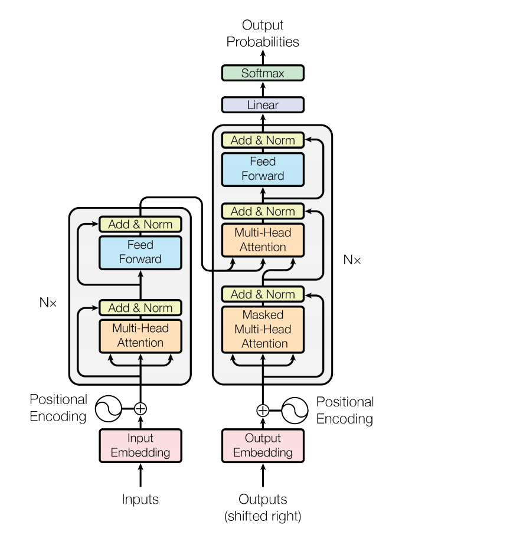
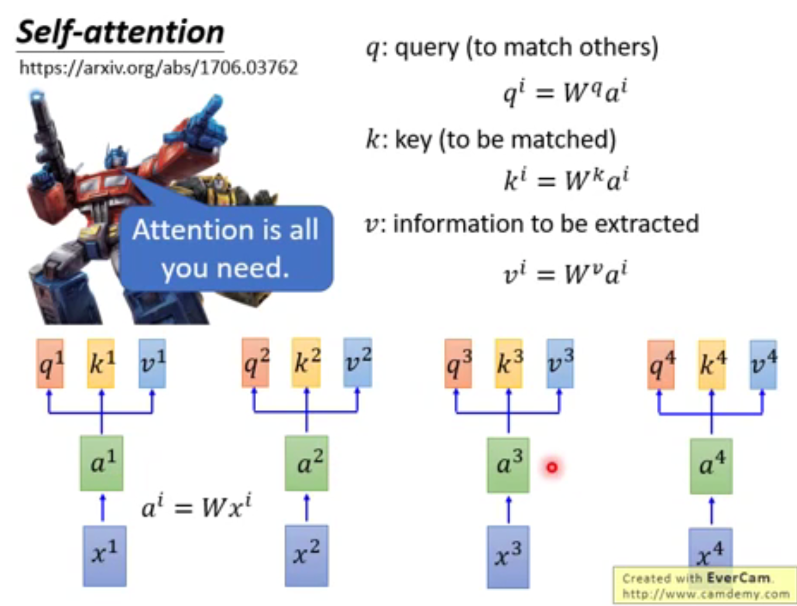

本篇主要是自然语言处理领域的进展

1. 在解决的是什么问题？在此之前，翻译领域的模型都是复杂的 RNN 或 CNN，里面包含 encoder 和 decoder。问题是并行化程度不高，训练所需的时间长
2. 为何成功，标志/准是什么？消除了重复，转而完全使用注意力机制，来刻画出输入和输出之间的全局依赖关系，这样并发度更高，训练所需的时间更短
3. 在前人基础上的关键创新是什么？提出了注意力机制，使用了 scaled dot-producted attention, parameter-free position representation. 核心：可以用 Self-Attention 来代替 RNN，目前 RNN 所做的东西已经被人用 Self Attention 实现过了。论文的意思是：你不需要 rnn，也不需要 cnn，只需要 self attention
4. 关键结果有哪些？泛化效果好，而且任一两个单词之间关联关系的计算是常量。
5. 有哪些局限性？如何优化？丧失了捕捉局部特征的能力。失去了位置信息
6. 这个工作可能有什么深远的影响？

## 2. 背景
在之前的 Convoluential Sequeuence，ByteNet 等方法，使用 CNN 作为基本的块。这种模式里，两个输入/输出之间的距离越远，越难计算出关联关系。在 transformer 里，可以用常数数量的 op 来计算出。

自注意力机制，有时候也叫做内部注意力机制，是一个为了计算序列的表征，而把此单一序列不同位置管理起来的注意力机制。

Transformer 是第一个翻译模型：完全依赖自注意力机制来计算输入和输出的表征，不需要使用 sequence aligned RNNs 或 卷积。

## 3. 模型结构

### 3.1 encoder & decoder

Transformer 遵循堆叠自注意力机制和 point-wise ，把 encoder 和 decoder 完全连接起来。

Encoder: 由6个一模一样的层堆叠而成。每个层里有两个子层：attention 和 position-wise fully connected feed-forward network. 在这每个 sub-layer 之间使用 residual 连接 和 layer norm (layernorm(x = x+f(x)))。所有layer，输出的维度是 dmodel = 512。

Decoder：也是同样由6个一模一样的6个层堆叠而成。除了跟每个encoder 一样的两个层之外，在中间插入了第三个层，用来在给 encoder 堆叠后的输出上进行多头注意力。同时也修改了attention 注意力子层来防止考虑后续的输入（只是前向？）: masked multi-head attention.

其中：

1. Input Embedding 操作：是把句子的输入变成一个个的单词向量, word embedding
2. Positional Encoding: 为了让 transformer 对位置/时间敏感. 因为 Transformer 不像 RNN 那样的循环结构，天然对不同时间步输入有先后顺序。而是所有时间步都是同时输入，并行推理的。 专门通过 sin, cos 来做位置编码的。注意这里是**矩阵加**的操作。为什么不是其他比如矩阵乘(加权)的操作?

### 3.2 Attention

其中 attention 部分的结构如下图，论文里从两种方案里选取的 scaled dot attention:

attention 函数: 是把一个 query 和 一堆 key-value 对映射到输出。这里的 query，key，value 都是矩阵。输出时把 value 进行带权重的求和。其中的权重是 Q * K

如上图左一，就是一个 scaled dot-product attention。而右侧是多头注意力机制：集成了多个 self attentinon。

最常用的注意力函数是两个：additive function 和 dot-product。本文用了后者，效率更高。

#### 3.2.2 Multi-Head attention

linearly project the q,ke,v h 次。使用不同的学到的映射到 dk, dv. 把最后的结果 concat 。如上图右侧

多头的作用：模型可以把不同位置的不同表现空间联合起来。

### 3.3 Position-wise Feed-Forward Networks
Two linear transformations with a ReLU activation in between:

FFN(x) =  max(0, xW1+b1)W2+b2

### 3.4 Embeddings and Softmax

### 3.5 Positional Encoding

Q K V 的矩阵乘里，Q, K, V 分别是什么？ 
是输入和不同矩阵相乘之后的结果。q 代表 query，要 match 其他人，比如要和 k1,k2,...kn 相乘。那也就说明 k : key, 要被其他人 match。V：information to be extracted.

## 问题
2. 是不是里面有 encoder、decoder，positional embedding 的介绍？
3. attention mechanism 到底是啥？
4. Transformer 就是 自注意力机制(self attention?) 不是，transformer  是 attention + 全连接的结合体
5. 3 Model architecutre 里，第一段： At each step the model is auto-regressive，这个是什么意思？前面产出的符号是后面的输入？
6. FFN 里，是一个全连接？算是有隐藏层吗？

## 参考资料：
1. [illustrated transformer](http://jalammar.github.io/illustrated-transformer/)
2. [B 站台大李宏毅](http://bilibili.com/video/BV1J441137V6?from=search&seid=3530913447603589730)
