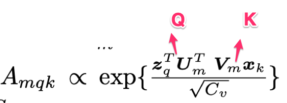

1. 在解决的是什么问题？self-attention 在 CV 里的应用--De(tection) TR(ansformer) 是 transformer 在 Detection 里的成功应用。但是它的收敛很慢（需要训很多 epoch）而且有限的feature spatial resolution。
2. 为何成功，标志/准是什么？比 DETR 的效果要好，尤其在小的物体上，而且epoch可以减小10倍。
3. 在前人基础上的关键创新是什么？ Attention 只考虑在给定的 reference 周围的一个采样结合上做
4. 关键结果有哪些？
5. 有哪些局限性？如何优化？
6. 这个工作可能有什么深远的影响？

## 1 介绍

DETR不仅需要很长的epoch 来训练，而且在小物体检测上表现不好，原因是小物体需要高分辨率，但 因为attention部分的计算复杂度是输入尺寸的平方，所以DETR处理大图片的效果不好

## 2 相关工作

### 高效的 Attention 机制

大概分为三类：

#### 1 预定义好的 sparse attention patterns on keys

#### 2 learn data dependent sparse attention

比如提出的 Locality sensitive hashing (LSH) based attention, 会把 key和query一起hash到不同的桶里去

#### 3 使用 attention 里的 low-rank properity

给size而非 channel 维度加上 linear projection

Deformable attention，属于第二种

### 检测里多尺度的 Feature Representation

检测里的主要问题是如何高效表示各种不同大小(vastly different scales)的物体。一般都是通过多尺度来做。本文提出的多尺度 deformable attention，自然就可以聚合多尺度的 feature map，无须 feature pyramid 网络的支持（所以是简化了？）

Deformable conv，缺乏给元素之间关系建模的机制(element relation modeling mechanism)

## 3 Transformer 和 DETR

query: 输出句子里的一个单词

a set of keys: 输入句子里的一些单词

multi head attention 模块会 adaptively 把 key(指value?公式里的 Wm'*X) 里的内容根据 attention weights （衡量 query-key 键值对兼容性）（ softmax(q*\*)) 来做聚合。为了让模型聚焦在来自不同表达子空间(representation subspaces)和不同位置的内容，不同 attention head 是以可学习权重来线性聚合(Linear)的。即多头的结果会合并。

这里看到输入只有两个: zq和x，分别是query 和输入的 表征(representation feature)，估计 Q=qm(zq)，K=km(x)?。上图中 Wm 和 Wm‘都是可学习的权重，如下图

而其中的attention weights是 Amqk，就是 softmax(Q*K/scale)：

上图中 Um和Vm都是可学习的权重，这俩都包含在上图第一个红框里了：qkv里

经过softmax 之后，Amqk就被搞成了概率的形式，他们的和是1。为了让 zq和xk表征里有位置信息，他俩通常会拼接或者加上 positional embeddings

在CV里，通常 Nq=Nk >> C(feature dimension) ，因为Nq和Nk就是像素，所以维度比C大？，所以计算复杂度是O(Nq\*Nk\*C)。因此复杂度是输入feature map大小的平方

### DETR

如下图，CNN backbone 抽取出的 feature map会经过一个标准的 Transformer(encoder-decoder)架构，来把输入变换为一个 object query 的集合。之后是3-layer的FFN来做bbox坐标的回归(b是4个元素，每个都在[0,1]里)。而linear层作为分类的结果

DETR里的transformer encoder，它的 query 和 key 都是输入的feature map。这里encoder的计算复杂度是 O(H^2\*W^2\*C)，说明是跟feature map的大小成平方关系

对于 DETR 里的 decoder，输入包括两部分：

1. encoder输出的feature map
2. N个目标的请求(object queries)，以可学习的positional embeddings (比如 N=100）

在decoder 里，有两类 attention 模块，即self和cross attention。在cross-attention 里，object queries 会抽取 feature map里的features。

