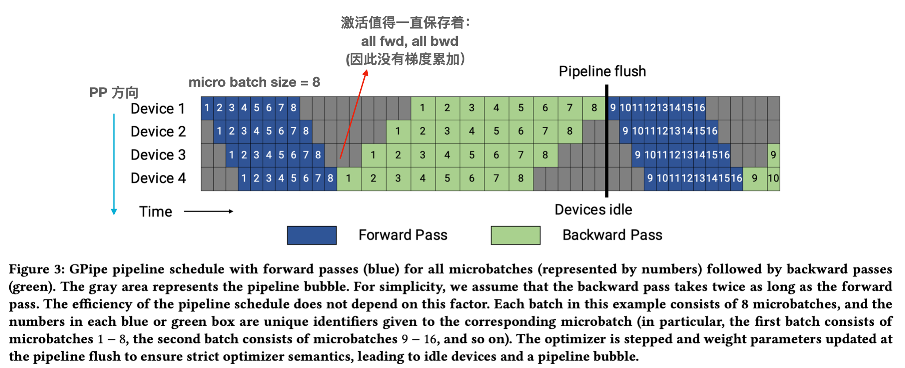
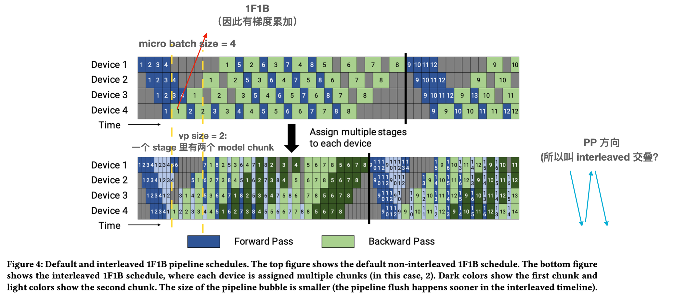

1. 在解决的是什么问题？给定大模型的 batchsize 情况下，如何结合3种并行技术来最大化吞吐，同时保证严格的优化器语义
2. 为何成功，标志/准是什么？训练吞吐更高
3. 在前人基础上的关键创新是什么？
4. 关键结果有哪些？
5. 有哪些局限性？如何优化？
6. 这个工作可能有什么深远的影响？

大语言模型在多个任务上有了业内领先的准确率。然而训练起来有两大挑战：

1. 单个 GPU 内存装不下：内存不够的问题
2. 训练模型需要的计算单元非常多，会导致训练时间巨长：计算不够问题

本文介绍如何组合多种并行方式：tensor，pipeline，和 data 并行。探讨了多种 pipeline 的实现，提出了一个调度，可以增加 10% 的吞吐。我们量化分析了 tensor，pipeline，data parallelism 上的折衷，提供了如何配置分布式大模型训练的直觉。

神奇的是，它就不用ZeRO，单纯靠 TP、PP、DP来获得比ZeRO更高的训练效率，它提到在 175 和 530 B 下比 ZeRO-3 高效 70%，原因是更少的跨主机间通信
## 1. 介绍
基于 Transformer 的语言模型，在 NLP 里有非常迅速的发展。同时，近期工作伸缩门大的语言模型是 zero  和 few-shot 场景下的高效学习者。

GPT3 在 512个 V100 上需要7个月
 
### 问题：
1. 咋理解提到的流水并行下， Layers 有多种分配方法？

1T 就是 一万亿

为啥 DS 只能到 36%的峰值算力，而它能到52%

关于如何配置分布式训练策略，我们提供了以下的指导经验：

1. 并行的策略会影响通信的数量，kernel执行时计算效率，还有 worker 由于pipeline flushes（气泡） 花在等待计算上的时间。例如，实验发现，tensor和流水线并行可能导致2倍的吞吐了下降，即使主机间有高带宽网络，但是大模型上必须用 pipeline
2. 流水并行里的调度策略会影响通信的数量，pipeline 气泡大小，存储激活值的内存。我们提出新的重叠的调度，可以提高10%的吞吐。【Gpipe】
3. 超参数比如 microbatch 大小对内存和kernel的算数效率有影响。我们的实验，microbatch 大小是问题相关的，最大可提升15%的训练吞吐
4. 规模变大后，分布式训练是**通信密集**的。当在 3072 个GPUs上训练一个T的模型时，我们的视线使用了高效的二分带宽法：892G/s给流水并行，13TB/s给数据并行

## 2. 各种并行策略
下面这三段应该是从别的论文里来的

### 数据并行：

数据并行通常工作良好，但是会有两个限制：

1. 因为数据总量恒定，所以随着机器数量增加，超过一定值之后，每个 GPU 上的 batch size 会变特别小，减少了 GPU 利用率，增加了通信开销(allreduce 梯度的 group 太大了?）
2. 最大可用的设备（GPU）数量有上限：是 batch size 个(此时每个卡上就一个输入数据了），所以大概几千甚至上万就到头了

### Tensor Parallel:(**layer 内部**的模型并行)

Tensor(layer 内部）模型并行：每个transformer 层内部的矩阵乘法会被划分到多个 GPU 上，可以用来克服上述数据并行的限制。尽管这种方法在模型最大到200亿参数，在 NV A100 服务器上正常工作，但是在更大模型上就不行了。因为需要划分到多个节点上，会导致两个问题：

1. TP所需的 all-reduce 通信代价在垮主机情况下急剧上升（相比同主机内部 NVLink 直连）
2. TP并行维度越高，会产生更多更小的矩阵乘法(GEMMs)，会降低 GPU 使用率

所以建议 2<=TP粒度<=4(这个从哪里来的？)

类似 Tensor IntraLayer Parallelism：

1. Mesh-TensorFlow
2. Megatron-LM: Training Multi-Billion Parameter Language Models using GPU Model Parallelism

### 流水线模型并行(Pipeline model parallelism)
不同的层分配到了多个 GPU 上。一个 batch 切分到更小的 microbatch 上(流水线上，batch越小，越能容纳更多，效率更高)，执行流是在这些microbatches 上进行流式处理的。Layers 可以有多种方式分配到 worker 上，不同的调度方法来做 forward 和backward。这些不同的选择会有不同的性能结果。为了保证严格的优化器语义，优化器步骤需要多设备间同步，会导致每个batch最后会进行 **pipeline flush**。此时无法执行新的 microbatch，只允许同一个 batch 里的 microbatch 完成，即一组 pipeline 里，每个 batch 级别都要先 warmup，然后再 cool down。最大情况下，50%的时间会花在 pipeline flush。microbatche 的数量和流水线大小的比率越大，**pipeline flush**的时间越少。所以为了更高的效率，经常用**更大的 batch size**。因此为了效率高，尽量会用更大的batch。本文里，引入了一个新的 pipeline 调度，提高了小batch下的pipeline调度效率

DAPPLE: A Pipelined Data Parallel Approach for Training Large Mode （2021）

GPipe: Efficient Training of Giant Neural Networks using Pipeline Parallelism(2019)

Pipelined Backpropagation at Scale: Training Large Models without Batches. （2021）

PipeDream: Generalized Pipeline Parallelism for DNN Training.（2019）

Memory-Efficient Pipeline-Parallel DNN Training.（2020）

PipeMare: Asynchronous Pipeline Parallel DNN Training. Proceedings of Machine Learning and Systems, （2021.）

上述方法可以结合使用，本论文主要想解答如下问题：
> 在给定batch size 情况下，为了保证严格的优化器语义，并行技术应该如何结合使用？

在单台多GPU的服务器上进行 tensor 并行，在多台主机之间进行流水并行和数据并行。3072个A100上，达到了e2e training 吞吐：163 teraFLOP/s per GPU，是52%的峰值设备吞吐，聚合吞吐：502 petaFLOP/s， 在 GPT 模型的1T参数上，16位精度。而 DeepSpeed，吞吐不大：37.6 petaFLOP/s, 36% 峰值算力，用了800 v100.

Megatron 1 换无法训 1T 参数

达到这个可扩展的吞吐，需要创新和仔细地在多个维度做工程化：高效地 kernel 实现，让大部分实现是计算密集型而非内存密集型，智能切分计算图到设备上，减少需要通过网络传输的数据大小，同时限制设备的空闲时间在低水位，领域特定的通信优化，更快的硬件。

没用使用自动探索并行策略的搜索空间，而是使用启发性。未来会用自动优化。

### 问题：
1. 提出的创新的叠加schedule 是具体啥？
2. 最佳的 microbatch size 是问题相关的？
3. 启发性算法是啥?

## 2. 并行的多种模型
### 数据并行
每个worker有一个模型的副本，对数据分片，各 worker消费自己的数据，然后进行全局的同步，确保每个worker用到的都是一致的权重。当模型在单机上放不下，数据并行可以用在更小的模型分片上。

### 流水线模型并行
使用流水线并行，一个模型里的不同层被分片到多个设备上。当流水线并行使用在多次重复的基于  transformer 的模型上时，每个设备可以分配给相同数量的transformer 层。没有可考虑更多非对称的模型架构，这种情况下划分layer到pipeline 里的 stages 是更难的。可以参考其他人的工作来解决[17,22,32]

一个 batch 被划分为更小的 **microbatches**(有了 microbatches，说明可能就有 gradient accumulation） ，执行过程是在 microbatch 间进行流水的。流水的scheme需要保证输入看到一致的权重版本，在 forward 和 backward 里。

为了保证上述**严格的优化器语义**(指不会用老的参数去 fwd 新的数据)，引入了 **间歇性流水线flush**，这样优化器步骤就可以在不同设备间进行同步（目的还是让全局的权重都是一样的，类似数据并行）。我们把这个空闲时间叫做流水线气泡，想让她尽可能小。异步的方法比如 PipeMare，PipeDream，PipeDeam-2BW，放松了权重更新的语义。未来可能会考虑这种方法。

有多种在多个设备间 forward 和 backward microbatches 的方法。每个方法在流水线气泡，通信和内存大小上表现不一样。下面讨论其中的两类：

#### 2.2.1 默认调度

GPipe 提出一个调度策略：一个batch里所有的microbatches先全部 forward，然后再全部backward(即不允许 micro batch级别的 bwd）。GPipe 里的流水线气泡 tpb 很容易量化。

tpb/tid = (p-1)\*(tf+tb)/m*(tf+tb) = (p-1)/m

所以为了气泡小，需要 m >> p。即每个 batch 里 num of microbatch 得远远大于 pipeline size。对于这么大的m，这种方法需要很多内存，因为需要保存中间的激活值(使用激活值重计算，就是每层pipeline stage上输入的激活值），给一次迭代/batch 过程中所有的m个microbatches。这个可以通过早点开始 backward，并不一定要全部 microbatch forward 完，才 backward。

我们使用的是 PipeDream Flush 调度。首先进入一个热身的阶段，workers 会执行不同数量的 forward 。此调度**限制**了正在执行的（backward pass 和需要维护的 activations 的数量） microbatches 数量为流水线长度，而不是一个batch 里microbatch的数量。在热身阶段之后，每个worker执行一个 forward 和一个 backward(缩写1F1B)。最终在一个batch的尾部，我们完成所有剩余的backward轮次。这个方法的好处是节省内存，因为只需要保存 p 轮次的激活值。

#### Micro Batch vs DDP
不同：

1. Micro 如果没有它，那 pipeline 里第一张干完一次 fwd 之后就一致等，流水线上每个人的阶段都长。如果叠加梯度累加，就能减少要保存的激活值，比如一个batch是1024，那我切为10个，每个 100，梯度在每个 micro batch 粒度上计算（backward），但是最终是一个 batch 粒度去 allreduce avg。这样我可以想办法减少同时在内存里的激活值。
2. Micro 是分多个 micro batch 去一个个处理。而 batch 是tensor里第一个维度，直接就一次性处理了

相同:

1. 都会在batch 里数据都处理完后，进行梯度的聚合，保证大家看到的参数是一致的版本

#### 2.2 交替形式的调度

为了减少 pipeline bubble 的大小，每个设备可以给多个子层（模型的部分）执行计算，而不是单个连续的层集合(相当于 pipeline 切的更细，而且第一张卡 fwd 时空闲时间变少）。比如，每个设备之前有4层，比如 device 1 有1-4层，device 2 有5-8层，我们可以让每个设备执行两个模型chunk（每个有2层），比如d1有1，2，9，10；d2有3，4，11，12。这种模式下，每个设备在流水线里被划分了 **多个 stages** 。

为什么不用 “先全部 forward，再全部 backward”，即不在 microbatch 粒度上 bwd。原因是这样的内存开销太大(NLP 里序列长，hiddensize 大，激活值很大）。我们开发了一个插入调度来比之前1F1B更加节省内存。如图F5，需要一个batch里的 **microbatch数量**是流水线并行数量（流水的设备数量）的整数倍。

如图5，pipeline flush会在新调度里更早发生。每个设备有v个stage，那么最终 bubble size 就会减少 v 个。对应的代价是需要额外的通信。量化地分析，对应的通信数量也增加了 v。这个通信是干啥的(相当于 pipeline 数量增多了，需要传递激活值）？除了 bubble size 减少，是不是设备使用率也增加了

### 2.3 Tensor 并行
使用 Tensor 模型并行，模型的一些层被切分到多个设备上。本论文里，使用Megatron里给 transformer 层里切分的方法。

一个 transformer 层包含一个 self-attention 块和紧接着的一个两层的多层感知层（MLP：multi-layer perceptron）。更多的 transformer 层可以再 Vaswani 上找[33].

MLP 块包含两个 GEMMs 和一个非线性的 GeLU：

Y= GeLU(XA)		Z=Dropout(YB)

我们可以把A沿着列切分为 A= [A1, A2]。这个切分允许 GeLU 非线性可以独自应用在每个被切分的 GEMM 上：
[Y1,Y2] = [GeLU(XA1), GeLU(XA2)]

这个很有优势，不需要进行同步（相反如果A是行切分，就会由于 GeLU 是非线性而需要同步）

第二个权重 B 矩阵的行可以进行切分，不需要通信即可计算：

第二个 GEMM 输出的值需要 在进入dropout之前，先 reduced。

我们在多头注意力算自理也对自注意力块（F6b）进行了切分。key(K)，query(Q)和value(V) 矩阵可以用列并行的方式切分。输出的线性层可以直接操作分片的输出。

这个方法在多个GPU上切分了 MLP 里的 GEMMs 和 自注意力块，同时只需要在forward里（g op）进行两次 all-reduce 操作和backward(f) 里两次all-reduce 操作，几行代码就可以实现 f 和g。

## 3. 并行配置下的性能分析
讨论了固定 GPU 和 batchsize 情况下，可以使用三维并行方法，不同程度并行类型会影响训练模型的效果。每个维度都是对内存占用，设备计算效率和通信量的取舍。

我们呈现的分析模型跟 **流水线气泡** 有关。我们定量分析了通信时间。但没有分析通信的损失模型，因为通信跟网络拓扑的层次结构关系很大，很难建模。

### 3.1 符号
* (p,t,d): 三个维度的并发。p是流水线模型并行的大小，t是tensor的并行大小，d是数据并行的大小
* n：是 GPUs 的数量，要求：p\*t\*d = n.
* B: 全局的batch size：是输入的参数(global batch size)
* b：microbatch 大小(micro batch size)
* m：每个流水线里，一个 batch 的microbatch 的数量(num of micro batch)。计算为： (B/d)/b

### 3.2 Tensor 和 Pipeline 模型并行
之前计算过，使用流水并行，间隔性冲刷会导致流水线气泡，大小(p-1)/m。假设 d = 1，因此 t*p = n, => 气泡为 (n/t-1)/m。所以t增加，流水气泡减小。

不同 GPU 间的的通信数量也受p和t的取值影响。流水并行得益于点对点通信的廉价(只需要传递给下游）。而 Tensor 并行，另一方面，需要使用 all-redue 通信，这个操作在多台主机间会不切实际。因此，当t比单个主机上 GPU 数量大，all-reduce 通信的开销就会拖慢整个端到端的计算。

> #1: tensor 并行，当使用 g-GPU 的主机，就最大到g。然后应该使用流水并行来扩大到更大的模型

### 3.3 数据和模型并行
#### 3.3.1 流水并行
假设t=1, m = B/(d\*b) = b'/d, b'=B/b。即需要多少个microbatch。p = n/(t\*d) = n/d。此时 bubble size = (p-1)/m = (n-d)/b'。

**当 d 增加**，bubble size 变小。F7 展示了不同的d,n,b' 下的情况。或许不能增加 d 到n
，因为单个GPU 上内存有限，而模型可能超过这个大小。

当d增加，如果**总体数据并行的all-reduce的通信成本**不显著增加，那么总体吞吐量是增加的，这个也是成立的，因为一个基于ring的视线，scales with （d-1)/d。

也可以分析 **增加batch size** B 的影响。当给定条件下，当B增加，b' = B/b 增加，所以bubble size 变小，增加吞吐量。而数据并行下的all-reduce 通信也更不频繁，进一步增加吞吐。

#### 3.3.2 数据和 Tensor
使用 tensor 并行，每个microbatch 里都需要进行 all-reduce（forward和backward时）。1. **这在多server间非常昂贵**。另外，数据并行只需要在每个batch上进行all-reduce。而且tensor并行，每个模型并行的rank只需要执行每个layer里的子集，因此对于非高效的大层，现代的 GPU 可能2. **无法高效地执行**这些子矩阵的计算。

> #2: 当使用数据和模型并行，总共模型并行大小为 M=t*p，以便于模型的参数和中间元数据能放在 GPU 内存；数据并行可以用来扩展到更多的GPU上。

### 3.4 Microbatch Size
b 也会影响训练的吞吐。给定(p,t,d)和batch size B情况下，b的最优值。数据并行通信和b无关。假设 tf(b)和tb(b)是forward和backward计算时，对一个 microbatch的计算时间。

microbatch size b 也会影响吞吐

> #3: 优化的 microbatch size b 取决于模型的吞吐和现存特点，以及 pipeline 深度 p，数据并行大小 d，batch size B
	
### 3.5 激活值重计算
目的是节约内存，通过在backward之前第二次计算forward值（只需要保存给定的pipeline stage的输入 的激活值，而不需要整个中间激活值，这个更大）。这种更低内存的方法，提供了两个优势：

* 训练更大的模型
* 增加网络吞吐，尽管增加了约33%的计算，利用更高的microbatc 大小，可以增加单个 gpu 利用率

## 4. 实现
Megatron 应该是先实现 tensor，再实现 pipeline

### 4.1 通信优化

每个Server之间通过8个 InfiniBand(IB) 网卡连接。然而，接收和发送时点对点的，而且发生于两个 server 上的多个 GPU 之间，所以无法在流水线的一次通信调用中用到8张 IB。

观察到每个 transformer layer 的输出是在tensor并行的同类间复制了一份（MLP里g之后）。结果，两个相邻的流水阶段里执行 tensor 不行的 rank 接收和发送一摸一样的 tensor。F10a

scatter/gather 优化：

为了支持更大的模型，使用 tensor 并行大小为8. 为了减少上述冗余，可以切分 tensor到相同大小的 chunk，只在对应节点上发送对应的chunk，使用自己的 InfiniBand（比如 rank1 发送给 rank3，rank2 发送给 rank4）。然后在接收方通过 nvlink 进行 all-gather。这个比 InfiniBand 要高，然后 re-materialize 完整的 tensor。这个叫做 scatter/gather 通信优化。

上述是 DGX A100 server上的情况，同一台主机内部是 NVLINK 高速连接，而多台主机间有8个 InfiniBand 连接。

### 4.2 计算优化

实现了在计算图上三个模型特定的优化来获得高性能：

1. 修改了数据布局来避免内存密集的转置操作，容许 strided batched GEMM 内核。[b,s,a,h] -> [s,b,a,h]. batch, sequence, attention-head, and hidden-size 纬度。
2. 使用 PyTorch JIT，产生了融合后的 kernels： bias+GeLU and bias + dropout + add)。
3. 创建两个定制的kernel来允许scale，mask和 softmax（reduction）操作的融合：一个支持general masking（比如 BERT），另外一个支持 implicit casual masking（在自动回归模型如 GPT 上）。

## 5. 评估

所有结果是运行在 16位精度的 NV Selene 集群上。每个Cluster节点有8个 80-G A100 GPUs，通过 NVLink和 NVSwitch 来连接。每个节点有8个 NV Mellanox 200Gbps HDR Infiniband HCAs 来做应用通信，另外两个 HCAs 来给存储。节点之间通过 fat-tree 拓扑来通过850个交换机来连接。集群使用全 NVME 共享的并行文件系统。A100 GPU 的 16bit 精度峰值算力是 312 teraFLOP/s。大部分结果里，我们汇报的是每个 GPU 上的吞吐，聚合后的吞吐就是单GPU 乘以 GPU 数量。

### 5.1 端到端性能
并发度是通过启发算法来挑出的。所有模型使用词汇表（V）大小是51,200（1024的倍数），序列长度(S)是 2048。变化的是 hidden size(h), 注意力头部的数量，层的数量(l)。模型中参数的数量(P)计算公式：

P = 12lh^2(1+13/12h + (v+s)/12lh)
当模型大小增加，我们也增加 batch size(B)和gpu数量(n)。默心中计算量最大的浮点数操作是矩阵乘。如果只考虑这些 GEMMs，每个iteration 下浮点数运算的数量是：

F = 96BSlh^2(1+S/6h + V/16lh).

上述是真实 FLOP 的下界。

表一展示了不同模型配置下达到的 FLOP/s，模型变大，GPU利用率越高，因为更大的矩阵乘法，而且通信时间相比计算时间，增长不显著。看到最大有52%的峰值算力，最小是44%。
    
**训练时间预估**
有了吞吐，可以预估在 T 个 tokens 上训练的时间。I = T/(B*S)

由于 6h >> S, 16lh >> (V+S)，12lh >> V。可以得到：

Training time(seconds) 约等于 8TP/nX.

GPT-3:

T: tokens, 300B

P: 175 billion parameters

X = 140 teraFlOP/s per GPU

n = 1024

### 5.3

total number of pipeline stages should thus be limited so that the number of microbatches in the pipeline is a reasonable multiple of the number of pipeline stages. 为啥？

## 7 Discussion and Conclusion
compute data gradients before weight gradients. 这分别是啥？ 不就一个 weight gradients 么

问题：
1. 3D 并行时，并发是咋样的？比如先 Tensor 内，在 Pipeline 间，最后每个 gradents all-reduce? pipeline 里引入的是几个forward 陆续走这种？以前是跑完 forward 再backward，不会交叉
2. 为啥说 interleaved scheduler 是通信敏感的？
3. 4.2 里的 change datalayout,避免 memory-intensive transpose operations. 理解下原理？
4. fused kernels for a sequence of element-wise operations (bias+Gelu and bias + drop out + add) using PyThon JIT。为啥要用？不是固定的么，就直接掉优化后的 kernel 即可。

## TODO: 看看引用的论文
Accurate, Large Minibatch SGD: Training ImageNet in 1 Hour. arXiv preprint arXiv:1706.02677, 2017.

Training Large Models without Batches. Proceedings of Machine Learning and Systems, 2021

TeraPipe: Token-Level Pipeline Parallelism for Training Large-Scale Language Models. arXiv preprint arXiv:2102.07988, 2021.

PipeDream: Generalized Pipeline Parallelism for DNN Training

Memory-Efficient Pipeline-Parallel DNN 2020

PyTorch: An Imperative Style, High-Performance Deep Learn- ing Library. In Advances in Neural Information Processing Systems, volume 32, 2019.

Mesh-TensorFlow: Deep Learning for Supercomputers. In Neural Information Processing Systems, 2018.

Efficient Algorithms for Device Placement of DNN Graph Operators. In Advances in Neural Information Processing Systems, pages 15451–15463, 2020.

ImageNet Training in Minutes. In Proceedings of the 47th International Conference on Parallel Processing, pages 1–10, 2018.
