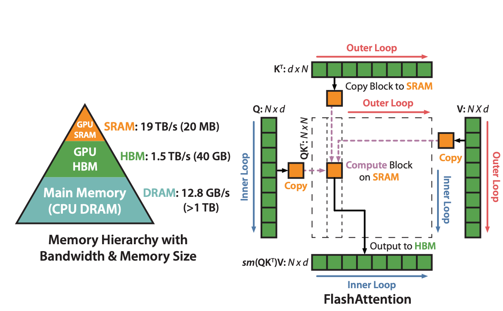

1. 在解决的是什么问题？想让 self-attention 加速
2. 为何成功，标志/准是什么？尝试了独特的角度：让它使用 IO-感知的方法，利用好 GPU 层次结构的显存读写
3. 在前人基础上的关键创新是什么？ 减少 HBM 的读写次数，多用更快的 shared memory。基于 flash attention 还提出了更快的近似算法：block-sparse attention
4. 关键结果有哪些？速度快，因此能允许更长的序列在一些NLP的比赛里分数更高
5. 有哪些局限性？如何优化？
6. 这个工作可能有什么深远的影响？

## 1 介绍
虽然 transformers 越来越大，深，但是使用更长的上下文依然很难，因为自注意力模块核心的时间和显存复杂度都是序列长度的二次方。所以一个核心问题是让attention更快、显存更高效是否能帮助 transformer 模型克服他们在长序列(long sequences)情况下运行时和显存挑战。目前的 GPT3 被限制在了 2k 的长度。而 FLASH 可以长到8k，最长64k。这样还可以用到高分辨率的VIT上。

有很多近似的attention方法想减少计算和显存开销。包括 sparse-approximation， low-rank approximation，以及他们的组合。尽管他们减少到线性或者接近线性序列长度的计算开销，但是很多并没有明显的加速效果，因此使用不广泛。一个主要原因是他们集中在减少 FLOPS（可能跟加速不直接关联），因此忽视了仿存方面(IO)的开销

本文里，我们认为之前没考虑到的一个方法是：让注意力算法对 IO-感知，仔细审计对不同级别快慢不同显存的读写（比如快的 GPU 上的片上  SRAM和相对慢的 GPU带宽显存，或者 HBM，见下图1）。现代的 GPU 上，**计算速度比显存速度要快非常多**，transformer里的大部分操作都是仿存速度为瓶颈。IO-aware 算法对类似内存制约的操作上很关键，即当读取和写入
数据在执行时间上占大头的情况：例如数据库 joins，图片处理，数值线性代数(numerical linear algebra)。但是 Python接口的深度学习框架比如 PyTorch 或者 TF 没有暴露这种显存访问的精细接口。

我们提出的 FA，是一种新的 attention 算法，可以用更少的内存访问来完成一样 的attention运算。目标是避免从 HBM 里读取和写入attention矩阵。这需要：

1. 计算 softmax 规约时，不要访问整个输入
2. backward时，无须fwd过程存储大得到中间attention矩阵

我们用了两个熟知的技术来解决这些挑战：
1. 重建了 attention 的计算过程，把输入切分成了 blocks，遍历了好几轮输入的blocks，因此能增量执行softmax 规约（也叫做 tiling）
2. 存储了fwd过程里的 softmax 规约的因子，可以在 bwd 过程里在片上快速重计算 attention，这样比标准的从 HBM 里读取 attention 矩阵要快。我们在 CUDA 里实现了 FA 来获得更细粒度的内存访问控制，把所有 attention 操作都融合到一个 GPU kernel(matmul, dropout, softmax, mask, matmul)。尽管因为重计算而导致 FLOPS 增加，但是算法依然更快（在 GPT-2上是 7.6倍），使用更少的显存：相比标准的attention，是输入长度的线性，因此 HBM 访问猛降。

我们分析了 IO 复杂度，证明了它需要 O(N^2d^2M^-1) HBM 访问，d是 head dimension，M 是 SRAM 的大小，与之相比标准 attention 是 O(Nd+N^2)。对于典型的 d 和 M，FA 需要的 HBM 访问是多倍的少于 标准 attention 的（最大9倍，见图2）。而且，我们提供了下界的证明，说明没有其他 attention 算法能渐近地改进在所有SRAM大小上的 HBM 访问次数

我们还展示了 FA 可以作为实现潜在的近似 attention 算法的有用原语，因为克服了他们的访存开销。为了作为概念的验证，我们实现了 block-sparse FA，是比 FA 快2-4倍的稀疏 attention 算法，能扩展到 64k 的序列长度。证明了 block-sparse FA 比 FA 的 IO 复杂度要好，是倍数于稀疏率。我们在第五节讨论了更多扩展（attention在多个GPU上，kernel回归，block-sparse 矩阵）。开源了代码

验证了 FA 在模型训练上的加速效果，提高了模型质量，方法是给更长的上下文建模。也 benchmark 了运行时和显存开销

* **更快的模型训练** FA 在 BERT-large（seq len 512）上比 MLPerf 1.1 里的记录快15%，GPT2（seq length 1K）比 HuggingFace 和 Megatron-LM 快3倍，在 long-range arena (seq length 1K-4K)上快2.4倍

* **更高的模型质量** 支持了 16K 的序列长度。Block-sparse FA 支持 64K

* **Benchmarking** Attention 比标准实现，在常见序列长度 128～2K上 快到3倍，能扩展到 64K。长度到了 512 之后，FA 比已有的任何 attention 算法要快而且更节省显存。而长度超过 1K 后，一些近似的 attentioin 方法（比如 Linformer）开始变的更快。另外，block-sparse FA 比任何我们已知的近似方法要快

## 2 背景

### 2.1 硬件性能

**GPU 显存层次**
GPU 显存层次（下图1左）。例如 A100 GPU上，有 40-80G的高带宽显存(High bandwidth memory)，带宽是 1.5-2.0TB/s，芯片上108个 streaming multiprocessors 里的每个里有 192KB的 SRAM，带宽大约是 19TB/s。可见 SRAM 速度比 HBM 高一个数量级，但是大小上却小很多数量级（40G vs 10M）。由于计算速度相对仿存速度要快很多，因此操作的瓶颈越来越多是显存的访问（HBM）。因此利用更快的 SRAM 就很重要。

**性能特性**. 根据 op 的计算和仿存的关系，可以分为计算密集型(compute-bound)和仿存密集型(memory-bound)。通常是通过算术密度(arithmetic intensity)，即每个字节的显存访问上的算数操作次数

1. 计算密集型：有很多算术操作，而仿存很少。典型例子：inner dimension很大的 matrix multiply，有很大channels 的 conv
2. 显存密集型：典型例子包括其他的op：elementwise(activation，dropout)，和规约(sum, softmax, bn, ln)

**Kernel 融合** 最常用的加速显存密集型算子的方法是 kernel fusion：如果对输入有多次op运算，可以从 HBM 里加载一次，而不是每次运算都加载一次。编译器可以自动融合很多 elementwise 运算。但是从模型训练上下文里，中间值依然要写入 HBM，因为 BWD 里需要使用，这降低了简单的 kernel 融合的有效性。

### 2.2 标准的 Attention 实现


给定输入序列 Q、K、V属于 R^(Nxd)，其中N 是序列长度，d是 head的维度，需要计算 attention 的输出 O属于 R^(Nxd):

```
S = Q*K^T 属于 R^(NxN), P = softmax(S)，属于 R^(NxN), O=P*V，属于 R^(Nxd)
```
其中 softmax 是逐行计算的。

标准的实现把矩阵 S 和 P 写到 HBM 里去，需要花费 O(N^2)的显存。通常 N>>d(比如 GPT2里，N=1024，d=64)。其中的一些算子是仿存密集型的（比如 softmax），大量的 HBM 访问导致速度慢。
这个问题还会被其他在 attention 矩阵上进行的挨个元素的操作，比如应用在 S 上的 mask，应用在 P 上的 dropout 给拖慢。因此有很多尝试是想把多个逐个元素访问的操作融合到一起，比如 fusing masking和softmax (ls 里也是这样的)

在3.2节，展示了标准 attention 实现会有与序列长度 N 成二次方关系的 HBM 访问。我们也比较了两者之间FLOPS和HBM 访问的次数

## 3 FA：算法，分析，扩展
我们要展示如何用更少的 HBM 读取/写入来计算一样的attention，而不需要存储巨大的中间矩阵来给 bwd 使用。这让算法既显存高效，速度又快。分析IO复杂度，发现我们的方法需要更少的 HBM 访问。

下面专注在 forward 上的分析；附录 B 包含bwd的细节

### 3.1 使用 Tiling 和 重计算来实现高效的 Attention 算法
主要思路是把 Q、K、V 切分成块，从慢的 HBM 加载到快的 SRAM，然后计算对应的 attention 输出。通过给每个block的输出乘上right normalization因子然后再做加法，可以最终得到准确的值。

**Tiling**: Softmax 和 K 的列是耦合的，所以使用 scaling 分解大的 softmax。为了数值计算稳定，softmax 如下计算：

通过额外记录一些统计关系(m(x), l(x))，可以每次计算一个 softmax。
##  openreview  里的一些回复

尽管利用的技术（tiling & recomputation)都是已知的，但是依然有空间(2-4x)来加速 attentioin。需要使用 softmax decomposition。我们认为有两个原因导致虽然FLOPS增加（重计算），但是加速了：

1. softmax decomposition with scaling 虽然被很多 ML 算法人员熟知，但没被很多系统研究员知道，虽然 operation fusion/memory IOs 减少是系统/编译器社区的常备，但是对算法工程师而言却不熟悉。在 F 里，即需要 softmax decomposition，也需要 operation fusion 来达到加速和节省显存的效果
2. flash attention 里，算法是没变的，所以模型精度不受影响，甚至能提升（因为可以训练更长的序列）


附录 E.5 (NVfuser 1.12, AOT compiler from functorch, and TVM)里添加了自动做op fusion的baseline。Megatron 的比 这些快，而 flash 比他们还快。因为 softmax 被分解为了 local softmax。希望编译器领域的进展可以让未来加速/fusion成为可能。我们也在和编译器研究员一起自动化这些技术

与 Self-Attention Does Not Need O(n^2) Memory 之间的区别？(附录 B.5)。他们聚焦在减少总共的显存需求，利用的通用的 gradient checkpointing 技术，FlashAttention 简化了 backward （B.2, B.4)，获得了加速，节省了显存

与 FLAT 区别：它缺少 softmax decompossion 技术 (L151)，因此需要在整个行（或者多行）上计算 softmax。因此，flat 需要定制的有更大 sram 的硬件来放整个 key 序列，这个在 GPU 上不实用

要想让 automatic fusion 能把 softmax 也 fuse 了，需要先把 softmax 操作改为 decomposed 版本，再走 fusion 过程。希望未来编译器能支持这个特性。

重计算的开销：很快，因为输入都在 SRAM 里（为啥？），因为是作为 backward kernel 里的一部分。图2左侧展示了 pytorch 和 flash 的实现区别：虽然因为重计算多了13%的 FLOPs，但是因为减少了9.1倍的 IO，导致有 5.7倍的加速
F 对 batchsize 变化不敏感。比如 16，32，64上，都是 2-3x 的比 Megatron-LM 要快

MLPerf 里的最新实现是 vendor 里软硬件组花了6个月的实现。但我们的依然比他们的快

FA的实现需要至少一定数量的 SRAM。在 T4 上测试过。其他非 GPU 加速器有比 GPU 更多的 SRAM（比如 TPUv4 有128M SRAM，Graphcore 有 1GB SRAM，而 A100里只有19MB）

## 问题
1. 他们在跑 GPT 等时，用的pytorch？代码有吗？
2. MB15里能用吗？比如最大长度1000*1000 = 1000K


## TODO
1. Long range arena: A benchmark for efficient transformers
2. Efficient transformers: A survey.
3. Data movement is all you need: A case study on optimizing transformers
4. Memory hierarchy design. Computer Architecture: A Quantitative Approach(2003)
5. Roofline: an insightful visual performance model for multicore architectures(2009). E.7 里有
6. E.5 里有与 TVM 的对比

## 参考资料
1. [openreview](https://openreview.net/forum?id=H4DqfPSibmx)
2. [在 PyTorch 里的实现](https://github.com/pytorch/pytorch/pull/84771): 没有用 triton，用的cutblass
3. [GPT or VIT 里的 flashattention 例子](https://github.com/tridao/zoo/blob/main/src/models/gpt2.py)
